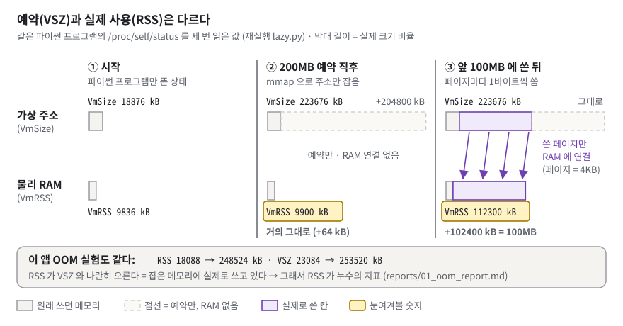
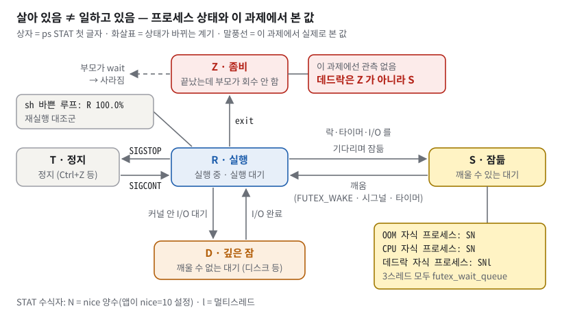
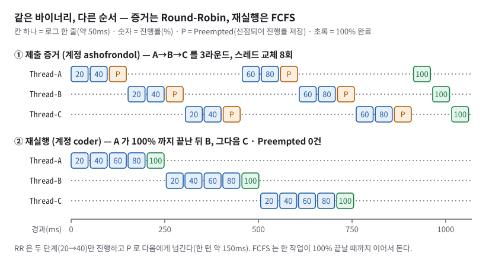

# B1-2 · 컴퓨터가 갑자기 느려지거나 멈췄을 때 원인 찾아 고치기 — 구술 평가 대비 학습 문서

> 응급실에 환자가 실려 왔다고 해 보자. 무작정 심폐소생(재부팅)부터 하면 왜 쓰러졌는지 영영 알 수 없고, 같은 일이 또 일어난다. 의사는 활력징후 모니터(관제 `monitor.sh`), 환자 본인의 말(앱 로그), 검사 장비(`ps`·`top`·`/proc`)의 수치를 모아 진단서를 쓴다. 진단서는 "증상 → 검사 결과 → 진단 → 처치와 경과" 순서다. 이 과제는 그 진단서 쓰기 연습이다.
>
> 정확히 말하면: 이미 빌드된 파이썬 기반 바이너리 `agent-leak-app` 을 root 가 아닌 계정으로 실행하고, 환경변수 세 개(`MEMORY_LIMIT`, `CPU_MAX_OCCUPY`, `MULTI_THREAD_ENABLE`)로 **메모리 누수(OOM)·CPU 과점유·교착상태(Deadlock)** 를 일부러 일으킨다. 앱 내부는 볼 수 없으므로(디컴파일 금지) 관제 로그·앱 로그·`ps`/`top`/`/proc` 출력만으로 원인을 추론해 **GitHub Issue 형식 리포트 3건**(+보너스 스케줄링 분석 1건)으로 남긴다. 저장소의 코드(`src/monitor.sh`, `src/report.sh`, `src/experiments/*.sh`)는 증거를 모으는 도구다. 산출물의 중심은 `reports/` 와 `evidence/` 다.

**읽는 법.**

① 처음이면 §1 부터 끝까지 정독한다(예상 180~210분). ② 평가 전날이면 §1 · §5 · §6 · §7 만 다시 본다. ③ 평가 30분 전이면 §8 만 본다. 낯선 용어는 §3 에서 쉬운 것부터 차례로 정의한다. 급하면 부록 A 용어집을 먼저 본다.

§6 의 접이식 문답은 **질문만 보고 먼저 소리 내어 답해 본 뒤** 펼친다. 펼쳐서 읽기만 하면 평가장에서 입이 열리지 않는다.

**이 문서의 숫자가 어디서 왔는지.** 모든 실행 결과에 출처를 붙였다.

| 표시 | 뜻 |
|---|---|
| **증거** | 저장소 `evidence/` 의 제출본. 2026-08-26 KST, 호스트 `devjsy`(Ubuntu 24.04.4 LTS, Linux 6.8.0-138, 16 vCPU, 62 GiB), 계정 `ashofrondol`(uid 1000). 파일마다 머리에 수집 시각·환경변수·수집 명령·바이너리 md5 가 적혀 있다 |
| **재실행** | 2026-09-23 이 문서를 쓰며 저장소 **복사본**에서 같은 바이너리를 다시 돌린 출력. `md5sum bin/agent-leak-app` → `0fb02e12554328b32e6e1adac861630e`(증거 헤더와 같음). 호스트는 Linux 6.8.0-138 / 16 vCPU / 62 GiB, 계정 `coder`(uid 1000, root 아님) |
| **원문** | 과제 PDF 본문 |
| 🔍 | 이 환경(root·`dmesg`·ufw 없음)에서는 확인할 수 없어 코드와 증거로만 판정한 것 |

증거와 재실행의 숫자는 조금씩 다르다. OOM 생존은 증거 34초, 재실행 33초다. CPU 종료 직전 값은 증거 53.72%(09:07 실행)·53.27%(09:21 실행), 재실행 50.03~55.69% 다. CPU 는 실행마다 생존 시간도 20~40초대로 흔들린다(재실행 다섯 번에 21~43초). 모두 실측이다. "매번 값은 조금 다르지만 패턴은 같다"는 사실 자체가 재현성의 증거다.

## 1. 한눈에 보기

### 1.1 이 과제를 한 문장으로

**비유.** 뚜껑을 열 수 없는 기계(블랙박스)에 다이얼이 세 개 달려 있다. 다이얼을 특정 위치로 돌리면 기계가 고장 난다. 기계 옆의 계기판(관제)과 기계가 스스로 적는 일지(앱 로그)만 보고 "어떤 고장인지, 왜 났는지, 다이얼을 어떻게 돌리면 피하는지"를 보고서로 쓴다.

비유의 한계가 하나 있다. 이 기계는 다이얼 위치를 보고 **고장 시나리오 하나를 고른다.** 다이얼을 조금 더 돌리면 고장이 조금 늦게 오는 것이 아니라, 아예 다른 동작을 한다(§3.2). 이 점을 모르면 Before & After 비교를 잘못 해석한다.

**정확한 정의.** 원문이 요구한 최종 결과물은 "3가지 장애 유형(OOM Crash, CPU Latency, Deadlock) 각각에 대해 작성된 GitHub Issue 형태의 기술 보고서"다. 각 리포트는 "발생 현상 / 재현 경로 및 증거 / 근본 원인 / 조치 내용 / 결과 확인" 다섯 항목을 모두 갖춰야 한다.


*그림 1. 환경변수 세 개로 앱의 장애 시나리오를 고르고, 앱 안을 보지 않은 채 바깥 도구로 관찰한 증거로 리포트를 쓴다.*

그림 1 에서 봐야 할 것은 세 가지다.

- **왼쪽 ① 입력.** 파란 상자 세 개가 장애를 고르는 다이얼이다. 그 아래 작은 상자의 사전 조건(`AGENT_*` 환경변수 5종, `secret.key`, 포트 15034, root 아님)이 하나라도 틀리면 앱은 아예 켜지지 않는다(부트 실패, 종료 코드 1).
- **가운데 ② 블랙박스.** 부트 6단계를 통과하면 Resource Check 가 네 갈래 중 하나를 고른다. 빨간 셋이 장애, 초록 하나가 정상이다. 메모리 누수와 CPU 과점유는 **스스로 끝나며 종료 코드(137, 143)를 남긴다.** 교착상태는 **끝나지 않는다.** 이 차이가 관측 방법을 완전히 바꾼다. 끝나는 장애는 "마지막 로그와 종료 코드"를 보고, 끝나지 않는 장애는 "살아 있는데 진행이 없음"을 증명해야 한다.
- **오른쪽 ③ 관찰.** 보라 점선은 "읽기만 한다"는 뜻이다. 앱 내부를 들여다보지 않고 OS 가 보여 주는 창구(`ps`, `top`, `/proc`)와 앱이 남긴 로그만 쓴다. 아래 줄의 `evidence/` 11개 파일이 리포트 4편의 모든 인용의 출처다.

### 1.2 평가자는 무엇을 보나

체크리스트(`checklists_md/troubleshooting_oom_cpu_deadlock.md`)는 4영역 20문항이다. 이 문서는 20문항을 모두 §6 에 옮겨 두었다.

| 영역 | 문항 수 | 평가자가 확인하는 것 | 대비하는 곳 |
|---|---|---|---|
| 1. 기능 동작 검증 | 8 | OOM·CPU·Deadlock 각각의 "장애 패턴"과 "환경변수 조정 전후 비교"가 로그로 남았는가, 리포트 3건이 Issue 구조인가, PID·타임스탬프·핵심 로그가 증거로 붙었는가 | §5 시연, [§6.1](#61-기능-동작-검증) |
| 2. 구현 구조 설명 | 3 | `monitor.sh` 의 메모리 추적 명령과 추출 방법, CPU 도구와 옵션의 의미 차이, "살아 있지만 멈춤"의 진단 순서 | §3.1·§3.7·§3.12·§4, [§6.2](#62-구현-구조-설명) |
| 3. 핵심 개념 이해 | 4 | 메모리 보호 정책이 프로세스를 죽이는 이유, CPU 과점유 시 종료가 필요한 근거, 상호 배제·순환 대기, 로그로 순환 의존을 추적한 과정 | §3.5·§3.6·§3.8·§3.11, [§6.3](#63-핵심-개념-이해) |
| 4. 확장 사고·트러블슈팅 | 5 | 사전 탐지를 위한 `monitor.sh` 개선, 가장 치명적인 장애, OOM+Deadlock 동시 발생 시 순서, 코드 레벨 개선, 다시 한다면 | §3.12·§7, [§6.4](#64-확장-사고--트러블슈팅) |

**이 학습자가 다른 과제에서 받은 실제 피드백**은 평가자의 성향을 알려 준다. "CHECK 가 실질적으로 어떻게 작동하는지", "인덱싱이 **왜** 인덱싱인지"처럼 **기능이 아니라 메커니즘을 한 칸 아래까지** 묻는다. "상황에 따라 어떤 것을 쓸지"처럼 **대안과 선택 기준**을 묻는다. "자신감 있게 설명했으면"처럼 **결론부터** 말하기를 원한다. "대학생이 갓 짠 코드"처럼 동작과 별개로 **코드 품질**도 지적한다.

이 과제로 옮기면 이런 질문이 나온다. "`CPU_MAX_OCCUPY` 를 80 으로 줬는데 왜 53% 에서 죽나요?" · "`ps` 의 `%CPU` 는 무엇의 평균인가요?" · "`futex_wait_queue` 가 뭔가요?" · "curl 타임아웃은 왜 증거가 아닌가요?" · "137 은 누가 보낸 신호인가요?" 그래서 이 문서의 모든 답은 **첫 문장에 결론 → 근거 숫자 → 파일:줄** 순서다.

### 1.3 30초 자기소개 스크립트

평가가 시작되면 아래를 그대로 말한다. 30초 안팎이다.

> "빌드된 파이썬 바이너리 agent-leak-app 을 일반 계정으로 띄우고, 환경변수 세 개로 메모리 누수·CPU 과점유·교착상태를 일부러 일으켰습니다. 바이너리 안은 열지 않고 바깥 관측만으로 원인을 밝혀, GitHub Issue 형식 리포트 세 건과 보너스 분석 한 건을 썼습니다. 첫째 핵심은 호스트가 아니라 그 프로세스를 PID 로 따로 잰 것입니다. 호스트 메모리가 거의 그대로인 동안 프로세스 RSS 는 250MB 늘었습니다. 둘째 핵심은 변수 하나씩만 바꾼 비교이고, 그래서 CPU 는 올리는 게 아니라 내려야 종료가 사라진다는 것을 찾았습니다."

뒤이어 "모든 인용은 증거 파일의 줄 번호와 바이너리 md5 로 다시 확인할 수 있습니다"를 한 문장 덧붙여도 된다. 숫자(37.4 → 37.8%, 17.7 → 267.7MB)는 평가자가 물을 때 꺼낸다.

## 2. 명세 정독 — 무엇을 요구받았나

### 2.1 요구사항 지도

ID 는 저장소 README 의 `## 0. 과제 명세` 가 붙인 R·D·E·B 체계를 그대로 쓴다. 저장소 내부 ID(`B1-2-P*`, `B1-2-A*`, `B1-2-E-*`)와의 대응표는 `docs/md/요구사항_ID_매핑.md` 에 있고, `tools/check_req_ids.sh` 가 그 표에 없는 ID 가 쓰이면 실패한다. 상태 표시는 ✅ 충족 · ⚠️ 부분 · 🔍 검증 불가다. 표에 나오는 RSS·futex·exit 137 같은 용어는 §3 에서 쉬운 것부터 차례로 풀이한다. 처음 읽을 때는 "무엇을 요구받았나"만 훑고 넘어가도 된다. 표의 **시그니처**는 그 장애임을 알려 주는 고유한 로그 문자열(예: `Memory limit exceeded`)이고, **스윕**은 값 하나를 여러 값으로 바꿔 가며 같은 실험을 반복한 것이다. 표가 넓어 둘째 칸에 원문 요지를 먼저 적고, 화살표(→) 뒤에 쉬운 말과 그런 요구를 하는 이유를 붙였다.

**(1) 사전 준비 R1 — 원문: "조건이 충족되지 않으면 부트 시퀀스에서 자동으로 실패 처리된다."**

| ID | 원문 요지 → 쉬운 말 · 왜 이런 요구를? | 내 구현(파일:줄) | 상태 |
|---|---|---|---|
| `R1-1` | 실행 계정: root가 아닌 일반 사용자<br>→ 관리자 계정으로 돌리지 않는다. 앱이 망가져도 시스템 전체를 못 건드리게(최소 권한) | 계정 생성 `src/03_users_and_groups.sh:27-34`, 실험 전 root 거부 `src/experiments/lib_experiment.sh:535-538` | ✅ 증거 `(uid=1000)`. root 로 돌렸을 때의 거부 메시지는 🔍 |
| `R1-2` | `AGENT_HOME` 필수 환경변수 설정<br>→ 앱 폴더 위치를 환경변수로 준다. 설정을 코드가 아닌 환경으로 주입 | `src/05_env_and_keyfile.sh:34` | ✅ 재실행: 빼면 `[2/6]` 에서 실패(§3.2 표) |
| `R1-3` | `AGENT_PORT` 15034 (고정)<br>→ 포트는 15034 만. 방화벽·관제가 이 번호를 전제 | `src/05_env_and_keyfile.sh:35`, `src/02_firewall_allowlist.sh:32-33` | ✅ 재실행: 8080 → `Port mismatch` |
| `R1-4` | `AGENT_UPLOAD_DIR` = `$AGENT_HOME/upload_files` (디렉터리 존재 필수)<br>→ 업로드 폴더의 경로 규약과 실재 | `src/05_env_and_keyfile.sh:36`, `src/04_directories_and_acl.sh:28-30` | ✅ 재실행: 다르면 `Upload Path Mismatch.` |
| `R1-5` | `AGENT_KEY_PATH` = `$AGENT_HOME/api_keys` (경로 존재 필수)<br>→ 키 폴더. B1-1 은 파일 경로, B1-2 는 폴더 | `src/05_env_and_keyfile.sh:7-9,37` | ✅ 증거 `All required Envs correct` |
| `R1-6` | `AGENT_LOG_DIR` 로그 디렉터리 (존재 + 쓰기 권한)<br>→ 로그 폴더가 있고 쓸 수도 있어야 한다. "있다"와 "쓸 수 있다"는 다른 검사 | 경로 `src/05_env_and_keyfile.sh:38`, 생성·권한 `src/04_directories_and_acl.sh:33` · `:38` · `:44` · `:56-57`(770 + agent-core ACL), 관제 쪽 자체 검사 `src/monitor.sh:145-152` | ✅ 재실행: 555 폴더면 `[5/6]` 에서 `Permission Denied` |
| `R1-7` | `MEMORY_LIMIT` 정수, 50~512 범위 (단위: MB)<br>→ 메모리 한도. 입력 범위 검증 | `src/05_env_and_keyfile.sh:44`(기본 512) | ✅ 재실행: 600 → `too high`, 49 → `too low` |
| `R1-8` | `CPU_MAX_OCCUPY` 정수, 10~100 범위 (단위: %)<br>→ CPU 상한. 입력 범위 검증 | `src/05_env_and_keyfile.sh:45`(기본 10) | ✅ 재실행: 5 → `too low`, `abc` → `Must be integer` |
| `R1-9` | `MULTI_THREAD_ENABLE` true / false (1 / 0, yes / no 허용)<br>→ 멀티스레드 스위치. 불리언 표기의 허용 폭 | `src/05_env_and_keyfile.sh:46`(기본 false) | ✅ 재실행: `1`·`yes` → `True`, `maybe` → `Use True/False` |
| `R1-10` | `secret.key` 존재(위치 `$AGENT_HOME/api_keys/`), 내용: `agent_api_key_test`<br>→ 키 파일의 존재뿐 아니라 내용까지 검증 | `src/05_env_and_keyfile.sh:52-57`(내용 기록, 소유자, 640) | ✅ 재실행: 틀리면 `[3/6]` 에서 실패 |
| `R1-11` | 네트워크: `0.0.0.0:15034` 바인딩 가능<br>→ 모든 인터페이스에서 15034 를 열 수 있어야. 포트 충돌과 바인딩 주소 확인 | 방화벽 `src/02_firewall_allowlist.sh:33`, LISTEN 검사 `src/monitor.sh:57-66`, 주소 캡처 `src/experiments/lib_experiment.sh:256-285` | ⚠️ 제출 `evidence/` 에 주소 캡처가 없다(§7). 재실행 파이프라인은 `0.0.0.0:15034` 를 남긴다(§3.13) |

**(2) 장애 분석 R2~R4.**

| ID | 원문 요지 → 쉬운 말 · 왜 이런 요구를? | 내 구현(파일:줄) | 상태 |
|---|---|---|---|
| `R2-1` | `monitor.sh` 로 대상 프로세스의 물리 메모리 사용량이 시간 경과에 따라 증가하는 패턴 관측<br>→ 그 프로세스의 RSS 시계열. 호스트 전체가 아니라 그 프로세스를 봐야 누수가 보인다 | `src/monitor.sh:110-112,157-158` | ✅ 증거 42.7→242.7MB(monitor.sh 3초 반복), 17.7→267.7MB(파이프라인 3초 샘플) |
| `R2-2` | 메모리 임계치 초과 → MemoryGuard 강제 종료를 나타내는 핵심 로그 식별<br>→ 죽은 이유 한 줄 찾기. "꺼졌다"가 아니라 "누가 왜" | 시그니처 `src/experiments/01_oom.sh:36` | ✅ `Memory limit exceeded` `(275MB >= 256MB)` |
| `R2-3` | `MEMORY_LIMIT` 조정 → 더 오래 생존, Before & After<br>→ 한도를 바꿔 비교. 임시 조치의 효과와 한계 | `src/experiments/01_oom.sh:36-40` | ✅ 256 → 0m34s / 512 → >3m00s, 100 → 13초(스윕) |
| `R3-1` | 시스템 전체 부하가 아닌 특정 프로세스의 CPU 사용률 급상승 구간 식별<br>→ 범인 프로세스의 CPU 를 따로 잰다. 호스트 부하와 구분 | `src/monitor.sh:114-116`, `/proc` 델타 `실험_절차서.md:112` | ✅ `/proc` 델타 1→5%(09:21 보강 실행), 앱 자기보고 5.00→53.72%(09:07 파이프라인) |
| `R3-2` | 종료가 오류가 아닌 과점유 방지 정책(Watchdog)에 따른 보호 조치임을 입증<br>→ 크래시가 아님을 증명. 버그와 정책은 대응이 다르다 | 시그니처 `src/experiments/02_cpu.sh:40` | ✅ `CPU Threshold Violated!` + exit 143, 부트 배너가 미리 경고 |
| `R3-3` | `CPU_MAX_OCCUPY` 조정 → 종료 여부 또는 생존 시간 변화, Before & After<br>→ 상한을 바꿔 비교. 조치 효과 검증 | `src/experiments/02_cpu.sh:42-43` | ✅ 80 → 0m30s / 10 → >3m00s, 스윕 95·80·60·50·10 |
| `R4-1` | 살아 있으나(PID 존재) CPU/메모리 변화 없고 로그 기록도 멈춘 무응답 상태 식별<br>→ 살아 있는데 멈춤. 죽지 않는 장애는 일반 관제가 놓친다 | `src/experiments/lib_experiment.sh:365-382`(freeze 감지), `:299-322`(스냅샷) | ✅ 3스레드 모두 `futex_wait_queue`, 로그 1517 bytes 고정 |
| `R4-2` | 로그의 마지막 기록으로 서로 다른 스레드가 상대 자원을 무한히 기다리는 상태를 논리적으로 증명<br>→ 순환 대기를 추론이 아니라 증거로 증명 | 분석 `reports/03_deadlock_report.md:189-207` | ✅ T1: A 보유·B 대기 / T2: B 보유·A 대기 |
| `R4-3` | `MULTI_THREAD_ENABLE` 조정 → 데드락 재현/회피 비교<br>→ 켜고 끄고 비교. 재현성 = 원인 확증 | `src/experiments/03_deadlock.sh:33,68` | ✅ true → freeze / false → 3m00s 정상 |
| `R4-4` | (권장) 식사하는 철학자, 교착상태 4대 조건 학습<br>→ 개념 공부. 구술 3절과 직결 | `reports/03_deadlock_report.md:209-218` | ✅ 4조건 성립 근거표 |

**(3) 제출물 형식과 증거 최소 요건 D·E.**

| ID | 원문 요지 → 쉬운 말 · 왜 이런 요구를? | 내 구현(파일:줄) | 상태 |
|---|---|---|---|
| `D1` | 3가지 장애 유형 각각 GitHub Issue 형태 기술 보고서<br>→ 리포트 3건, 따로따로. 장애마다 원인·조치가 다르다 | `reports/01_oom_report.md`, `reports/02_cpu_report.md`, `reports/03_deadlock_report.md` | ✅ |
| `D2` | 템플릿 `[Bug] {장애 유형} - {한 줄 요약}` + `## 1.` ~ `## 4.`<br>→ 정해진 제목·절 구조. 읽는 사람이 어디서 무엇을 찾을지 안다 | 절 제목 `reports/01_oom_report.md:11,31,237,262` 등 | ✅ 절 일치 · ⚠️ 제목에 ` - ` 구분자와 유형 라벨이 없다(§7) |
| `E1-1~3` | OOM: monitor.sh 메모리 수치 / 종료 직전·직후 로그 / `MEMORY_LIMIT` 전후 비교(최소 2회 실행)<br>→ 수치·로그·전후 비교. 주장을 숫자로 | `evidence/oom_monitor.log`, `evidence/oom_app.log` | ✅ Before PID 2738539 / After PID 2739609 + 독립 실행 4회 |
| `E2-1` | CPU 사용률 급상승 구간(top / ps /관제) 캡처<br>→ CPU 가 오르는 장면. 과점유의 직접 증거 | `evidence/cpu_top_ps.txt` | ⚠️ `top` 캡처는 `%CPU 0.0`, `ps` 는 누적 평균 3.1→0.7→1.0 이라 급상승이 안 보인다. 상승은 `/proc` 델타와 앱 자기보고에서만 보인다(§7) |
| `E2-2~3` | 종료 로그("WATCHDOG… SIGTERM" 등) / `CPU_MAX_OCCUPY` 전후 비교<br>→ 종료 로그와 전후 비교 | `evidence/cpu_app.log`, `evidence/cpu_monitor.log` | ✅ 문자열은 `CPU Threshold Violated!` |
| `E3-1~4` | PID 존재(`ps -ef \| grep …`) / 정체(`top -H` 또는 `ps -L`) / 마지막 로그("WAITING… BLOCKED") / 스레드·락 대기 추론 근거<br>→ 살아 있음·멈춤·마지막 줄·추론. 데드락 4종 증거 | `evidence/deadlock_ps_top.txt`, `evidence/deadlock_app.log` | ✅ |

저장소 README 0.10 의 자체 판정은 "필수 25개 중 충족 24 / 부분 1"이다(`README.md:416`). 부분 1 은 R1-11 이다. D2 와 E2-1 의 ⚠️ 는 README 가 충족으로 본 것을 이 문서가 더 엄격하게 따로 표시한 것이다(§7).

### 2.2 지켜야 할 제약과 그 이유

원문 "6. 개발 환경"과 "7. 제약 사항"을 그대로 옮기고, 왜 그런 제약을 거는지와 저장소 상태를 붙인다.

- **"로컬 또는 격리된 환경(Docker 컨테이너 등)에서 실행을 권장"** — 이 앱은 일부러 장애를 내고 포트를 연다. 다른 서비스와 섞이면 증거가 오염되고 위험하다. 저장소 상태: 제출 증거는 개발 호스트에서 직접 수집했다. 같은 호스트에 java(RSS 18.6g)·grafana·loki 가 함께 돌았다(`evidence/cpu_top_ps.txt:353-360`). ⚠️ 권장 미준수지만, 리포트가 호스트 지표와 프로세스 지표를 분리해 결론에 영향이 없게 했다.
- **"공유 네트워크 환경에서는 방화벽 설정에 유의"** — 앱이 `0.0.0.0` 에 바인딩하면 외부에서도 닿는다. `src/02_firewall_allowlist.sh:27-33` 이 들어오는 연결을 기본 거부하고 20022/tcp 와 15034/tcp 만 허용한다.
- **"바이너리 디컴파일 및 리버스 엔지니어링 시도 금지"** — 소스를 보면 답이 나온다. 그러면 "바깥에서 관찰한 증거만으로 추론하는 훈련"이 사라진다. 저장소는 이 규칙을 지켰다(`README.md:475`, 역공학 도구 이름 grep 0건). 리포트도 "외부 관측만으로 세운 추론"이라고 한계를 적었다(`reports/02_cpu_report.md:250`). **그래서 이 문서가 말하는 "시나리오 선택 규칙" 같은 것도 전부 "관측으로 세운 규칙"이다.**
- **"`monitor.sh`, `ps`, `top`, `htop`, `pstree`, `kill` 등 리눅스 표준 명령어 및 라이브러리 사용"** — 전용 APM·프로파일러로 우회하지 말고, OS 가 기본으로 주는 관측 창구(`/proc` 와 그 위의 명령)를 이해하라는 뜻이다. 저장소가 쓴 도구는 `ps top free df ss awk stat pgrep kill curl` 과 `/proc` 다.

### 2.3 출력·형식 규칙

**Issue 템플릿(원문 그대로).** 제목과 네 절의 이름을 이대로 쓴다.

```text
[Bug] {장애 유형} - {한 줄 요약}
## 1. Description (현상 설명)
## 2. Evidence & Logs (증거 자료)
## 3. Root Cause Analysis (원인 분석)
## 4. Workaround & Verification (조치 및 검증)
```

**원문 예시 로그와 실제 출력은 다르다.** 원문은 "정답이 아니라 참고 예시"라고 밝힌다. 이 바이너리가 실제로 찍는 문자열(증거·재실행 동일)은 아래 "실제"다. 평가장에서 "예시에 있던 SELF-TERMINATED 는요?"라고 물으면 이 목록으로 답한다.

- **메모리 한도 초과.** 원문 `[CRITICAL] [MemoryGuard] Memory limit exceeded (256MB >= 256MB) / (Recommend Over 256MB)` → 실제 `… Memory limit exceeded (275MB >= 256MB) / (Recommend Over 256MB)`. 25MB 단위로 쌓이므로 256 을 넘는 첫 값이 275 다.
- **자가 종료 선언.** 원문 `[CRITICAL] [MemoryGuard] Self-terminating process 12345 to prevent system instability.` → 실제도 같은 형식이다. 번호는 앱 자식 프로세스의 PID(예: `2738539`, §3.1)다.
- **종료 배너.** 원문 `>>> [SYSTEM] SELF-TERMINATED (Memory Limit Exceeded) <<<` → 실제 **없음**. `reports/01_oom_report.md:27` 이 정정했다.
- **CPU 종료.** 원문 `[SYSTEM] WATCHDOG: INITIATING EMERGENCY ABORT (SIGTERM)` → 실제 **없음**. 대신 `[CRITICAL] [CpuWorker] CPU Threshold Violated! (53.720000000000006%).` 가 찍힌다.
- **교착 대기.** 원문 `WAITING… BLOCKED` → 실제 `[AgentWorker][Worker-Thread-1] WAITING for [Socket_Pool_B]... (Status: BLOCKED)`.
- **관제 한 줄.** 원문 `PROCESS:agent-leak-app CPU:1.2% MEM:5.1% DISK:954G FIREWALL:active` → 이 저장소 형식 `[TS] PID:n SYS_CPU:x% SYS_MEM:y% PROC_CPU:z% PROC_RSS:wMB DISK_USED:d%`(`src/monitor.sh:157`).

**두 가지 로그의 시각 형식.** 앱 로그는 `2026-08-26 09:03:09,155 [CRITICAL] [MemoryGuard] …` 처럼 대괄호 없이 밀리초를 쉼표로 붙인다. `monitor.log` 는 `[2026-08-26 09:02:38] PID:2738539 …` 처럼 대괄호 안에 초까지 쓴다.

### 2.4 보너스 과제

원문 보너스는 "스케줄링 알고리즘 추론"이다. 로그 타임스탬프로 실행 순서와 교체 주기를 패턴화하고, Round-Robin · FCFS · Priority 중 무엇인지 추론하고, 장단점과 적합한 서비스(실시간 웹 서버 vs 배치 서버)를 분석한다.

- ✅ **했다.** `reports/04_scheduling_analysis.md` 가 Round-Robin 으로 결론냈다. 근거는 이벤트 21개 사이 간격 20개가 모두 50~51ms(평균 50.8ms), A→B→C 순환 3라운드(스레드 교체 8회), 로그 한 줄마다 +20%p(한 턴에 두 줄), `Preempted. Progress saved at (40%)` → `Resumed` 다(`evidence/scheduling_workers.log:38-62`). 장단점과 적합 아키텍처는 `reports/04_scheduling_analysis.md:195-223`.
- ⚠️ **환경 의존.** 재실행(계정 `coder`)에서는 같은 바이너리가 `Thread-A` 를 20→40→60→80% → `Task Completed. (100%)` 까지 끝낸 뒤 B, C 로 넘어가는 **FCFS 패턴**을 4회 모두 보였다(`Preempted` 0건). 제출 결론은 "제출 환경의 로그가 보여 준 정책"으로 한정해서 말해야 한다(§3.14, §7).
- 보너스 `report.sh`(관제 로그 통계)는 B1-1 에서 이어 온 것이다. 이 과제에서는 `PROC_*` 컬럼을 읽도록 확장했다(`src/report.sh:45-46,59-67`).

## 3. 배경 개념 — 처음부터 차근차근

이 절은 쉬운 것에서 어려운 것 순서로 15개 개념을 쌓는다. 앞 개념이 뒤 개념의 재료다.

| 묶음 | 개념 | 어디에 쓰이나 |
|---|---|---|
| 기초 | 3.1 프로세스·PID · 3.2 환경변수와 부트 시퀀스 · 3.3 시그널과 종료 코드 | 모든 관측 명령의 대상 지정, 장애 선택, 137·143 해석 |
| 메모리 | 3.4 가상 vs 물리 메모리 · 3.5 힙과 누수 · 3.6 OOM Killer vs MemoryGuard | OOM 케이스(체크리스트 1-1·1-2·2-1·3-1·4-1) |
| CPU | 3.7 CPU 사용률의 세 층위 · 3.8 스케줄러·load·nice | CPU 케이스(1-3·1-4·2-2·3-2) |
| 동시성 | 3.9 프로세스 상태 · 3.10 스레드·락·futex·wchan · 3.11 교착상태 4조건 | Deadlock 케이스(1-5·1-6·2-3·3-3·3-4) |
| 관측·보고 | 3.12 관측과 헬스체크 · 3.13 소켓과 curl · 3.14 스케줄링 알고리즘 · 3.15 증거 기반 리포트 | 4절 확장 질문, 보너스, 리포트 형식(1-7·1-8) |

### 3.1 프로세스·PID·부모와 자식 — 실행 중인 프로그램 한 벌과 그 번호표

**비유로 먼저.** 택배 상자를 뜯는 포장 담당(부모)과 상자 속 물건으로 실제 일을 하는 직원(자식)이 있다. 포장 담당은 상자를 풀어 직원에게 넘기고 옆에서 기다린다. 일의 양을 재려면 직원을 재야지 포장 담당을 재면 안 된다.

비유의 한계: 이 포장 담당은 구경만 하지 않는다. 직원이 끝나면 따라 끝나고, 포장 담당에게 보낸 종료 요청은 직원에게도 전달된다(재실행 관측).

**정확히 말하면.** 먼저 **커널**부터. 커널은 운영체제의 핵심 프로그램이다. 프로세스마다 CPU 시간과 메모리를 나눠 주고, 번호를 붙이고, 시그널을 전한다. 앱은 커널이 허락한 일만 할 수 있다. 이 문서의 대비 "커널이 죽였나, 앱이 스스로 끝냈나"(§3.6)가 이 구분에서 나온다.

**프로세스**는 실행 중인 프로그램 한 벌이다. 자기 메모리 공간과 하나 이상의 실행 흐름을 가진다. **PID**(Process ID)는 커널이 붙인 번호, **PPID** 는 그 프로세스를 띄운 부모의 번호다. 이 바이너리는 **PyInstaller onefile** 형식이다. 파이썬 프로그램과 인터프리터를 실행 파일 하나로 묶은 것으로, 실행하면 **부트로더**(부모)가 압축을 풀고 같은 이름의 자식을 띄운다. 이 문서에서 "앱 자식 프로세스"(줄여서 "자식")는 실제 일을 하는 이 자식을 가리킨다.

**구체적인 숫자로.** 재실행에서 정상 모드 앱을 띄우고 `ps -ef | grep [a]gent-leak-app` 을 치면 두 줄이 나온다.

```text
coder      54345   54330  0 09:50 ?        00:00:00 ./agent-leak-app
coder      54348   54345  1 09:50 ?        00:00:00 ./agent-leak-app
```

54348 의 PPID 가 54345 다. 같은 시각 `top -H` 로 본 54348 의 RES(RSS)는 121280 kB 였다. 부모 쪽은 약 2MB 에 머문다(`src/monitor.sh:49` 주석 "부모 RSS 2.1MB 고정"). 증거에서도 부모 2756204 → 자식 2756210 한 쌍이 보인다(`evidence/deadlock_ps_top.txt:56-57`).

**이 과제에서는.** 모든 관측 명령이 PID 로 대상을 지정한다. 부모를 재면 누수도 CPU 도 안 보인다. 그래서 `monitor.sh` 는 부모를 찾은 뒤 자식으로 갈아탄다.

```bash
APP_PID="$(pgrep -x "${APP_NAME}" | head -n1 || true)"
...
APP_CHILD="$(pgrep -P "${APP_PID}" -x "${APP_NAME}" 2>/dev/null | head -n1 || true)"
[[ -n "${APP_CHILD}" ]] && APP_PID="${APP_CHILD}"
```

`src/monitor.sh:41,51-52` 원문이다(주석 없이 실었다). 한 줄씩 읽으면 이렇다.

1. `:41` 이름이 정확히 `agent-leak-app` 인 프로세스 중 첫 PID(부모)를 잡는다. `|| true` 는 하나도 없어 `pgrep` 이 실패해도 스크립트가 멈추지 않게 한다.
2. `:51` 그 부모의 자식(`-P 부모`) 가운데 같은 이름을 찾는다. `2>/dev/null` 은 오류 메시지를 버린다.
3. `:52` 자식이 있으면(`-n` = 빈 문자열이 아니면) 관측 대상을 자식으로 바꾼다.

자식이 맞다는 증거는 앱 스스로 남긴 로그다. `Self-terminating process 2738539` 의 번호가 관제 줄의 `PID:2738539` 와 같다. 실험 파이프라인도 같은 일을 `_worker_pid`(`src/experiments/lib_experiment.sh:176-185`)가 한다. 자식이 아직 안 떴을 수 있어 최대 5초 기다린다.

**한 칸 아래.** `pgrep -x` 는 프로세스 이름(`/proc/<pid>/comm`, 최대 15자)과 **정확히 같은** 것만 찾는다. `pgrep -f` 는 명령줄 전체를 본다. 그래서 경로나 인자에 `agent-leak-app` 이 들어간 셸·스크립트까지 잡혀, 실험 스크립트가 자기 자신을 죽이는 사고가 실제로 났다(`src/experiments/lib_experiment.sh:214-217` 주석). `pgrep -P <부모>` 는 PPID 로 걸러 자식만 찾는다. 부모와 자식의 관계는 재실행에서 두 번 확인됐다. 자식이 SIGKILL 로 끝나자 셸은 **부모** PID 가 `Killed`(137)로 끝났다고 보고했다. 부모에 SIGTERM 을 보내면 자식까지 정리되고 결과는 143 이었다(신호와 137·143 같은 종료 코드는 §3.3 에서 설명한다).

> [!WARNING]
> **흔한 오해.** "`ps` 에 `./agent-leak-app` 이 두 줄 나오니 앱이 두 번 떴다." → 아니다. 부트로더 부모와 실제 앱 자식 한 쌍이다. 자원은 자식에서만 보인다.

### 3.2 환경변수와 부트 시퀀스 — 이륙 전 점검표, 그리고 "시나리오 고르기"

**비유로 먼저.** 비행기는 이륙 전에 점검표 6항목을 확인한다. 하나라도 FAIL 이면 이륙하지 않고, 어느 항목이 왜 틀렸는지 말한다. 통과하면 조종사가 오늘의 비행 계획(시나리오)을 고른다.

비유의 한계: 점검표는 이륙 순간만 본다. 비행 중에 연료가 새는 것(메모리 누수)은 막지 못한다.

**정확히 말하면.** **환경변수**는 부모 프로세스가 자식에게 물려주는 이름=값 목록이다. `export` 한 셸에서 띄운 프로그램이 그대로 상속받는다. **fail-fast** 는 설정이 틀리면 시작하자마자 이유를 말하고 멈추는 방식이다. 원문이 "조건이 충족되지 않으면 부트 시퀀스에서 자동으로 실패 처리된다"고 한 것이 이것이다.


*그림 2. 부트 6단계 중 하나라도 실패하면 바로 멈추고, 통과하면 세 값을 보고 장애 시나리오 하나를 고른다 — 경계는 256/257, 50/51 이다.*

그림 2 윗부분의 왼쪽 열이 점검표다. 위에서부터 차례로 검사하고, 칸 오른쪽의 빨간 글씨가 그 칸에서 실패했을 때 실제로 찍히는 메시지다. 아랫부분 사다리가 "시나리오 고르기"다. 위에서부터 차례로 묻고, 처음 "예"가 나오는 곳에서 멈춘다.

**구체적인 숫자로.** 재실행에서 조건을 하나씩 틀리게 해 봤다. 전부 종료 코드 1 이다.

| 틀리게 한 것 | 실패 단계 | 실제 메시지 |
|---|---|---|
| `AGENT_HOME` 없음 | `[2/6] Verifying Environment Variables` | `>>> Critical Env 'AGENT_HOME' is missing.` |
| `AGENT_PORT=8080` | `[2/6]` | `>>> Port mismatch (Expected 15034, Got 8080)` |
| `secret.key` 내용 `wrong` | `[3/6] Checking Required Files` | `>>> Invalid Content in secret.key` / `(Expected: 'agent_api_key_test', Found: 'wrong')` |
| 15034 를 다른 프로그램이 점유 | `[4/6] Checking Port Availability` | `>>> Port 15034 is already in use.` |
| 로그 폴더 권한 555 | `[5/6] Verifying Log Permission` | `>>> Permission Denied: User 'coder' cannot write to …` |
| `MEMORY_LIMIT=600` | `[6/6] Verifying Mission Environment` | `>>> MEMORY_LIMIT too high (600MB). Maximum: 512MB` |

실패한 단계 뒤의 칸은 `>>> Skipped due to previous critical failure.` 로 건너뛰고, 마지막에 `System Boot Failed. Process Terminated.` 가 찍힌다.

통과한 뒤의 시나리오 경계도 부트 배너로 확인했다(재실행). `MEMORY_LIMIT=256` 은 `[ WARNING: Recommend Over 256MB ]`, **257 은 `[ OK ]`** 이고 `Scenario Selected: [Healthy System Monitoring]` 이 나온다. `CPU_MAX_OCCUPY=50` 은 `[ OK ]`, **51 은 `[ WARNING: Recommend Under 50% ]`** 다. `MULTI_THREAD_ENABLE` 은 `1`·`yes` 도 `Concurrency: True` 로 받는다.

**이 과제에서는.** 세 다이얼의 의미가 곧 실험 설계다. 저장소는 이 관측 규칙을 코드 주석에 적어 두었다.

```bash
    #   앱은 부팅 시 Resource Check 결과로 "시나리오" 하나를 고른다.
    #     MEMORY_LIMIT <= 256           → 메모리 누수 시나리오 (MemoryWorker 단독)
    #     MEMORY_LIMIT > 256 & CPU > 50 → CPU 과점유 시나리오 (CpuWorker 단독)
    #     둘 다 안전                     → [Healthy System Monitoring]
```

`src/experiments/01_oom.sh:26-29` 다. 데드락 조건(`MULTI_THREAD_ENABLE=true`)까지 합친 요약은 `실험_절차서.md:24-29` 에 있다. 기본값(정상 가동 조합 512 / 10 / false)은 `src/05_env_and_keyfile.sh:44-46` 이 `.bashrc` 에 넣는다.

**한 칸 아래.** 왜 "메모리 → CPU → 스레드" 순서라고 보나? 증거의 두 조합은 메모리와 CPU 의 선후를 보여 준다. `256 + CPU 95` 는 34초에 137(메모리 쪽)로 죽고, `512 + CPU 95` 는 34초에 143(CPU 쪽)으로 죽는다(`evidence/oom_monitor.log:321-330`). 둘 다 위험하면 메모리 쪽이 먼저 뽑힌다는 뜻이다. 스레드가 마지막인 것은 증거에 없어서 재실행(2026-09-23)으로 따로 확인했다. `256 + 10 + true` 는 `[MemoryWorker] Current Heap: 25MB → 50 → 75MB` 로 누수 시나리오가, `512 + 95 + true` 는 `[CpuWorker] Current Load: 5.00% → 12.66%` 로 CPU 시나리오가 돌았다. 두 경우 모두 부트 배너에는 `POTENTIAL DEADLOCK IN CONCURRENT MODE.` 경고가 떴다. 그러니 이 경고는 "스레드 설정이 위험하다"는 뜻일 뿐, 교착상태 시나리오가 뽑혔다는 증거가 아니다. 이 순서는 모두 관측과 모순이 없는 규칙이지 내부 코드를 본 것이 아니다.

또 하나. **cron** 은 정해진 시각마다 명령을 실행하는 리눅스 예약 실행기다. cron 은 `.bashrc` 를 읽지 않으므로 crontab 줄 앞에 환경변수를 직접 붙였다(`src/07_cron_schedule.sh:26`).

> [!WARNING]
> **흔한 오해.** "`MEMORY_LIMIT` 을 올리면 누수가 늦게 터진다." → 257 이상이면 누수 시나리오 자체가 뽑히지 않는다. 512 는 "늦게 죽는 값"이 아니라 "다른 동작을 하는 값"이다. 한도만 올린 순수 효과는 100 → 256(13초 → 34초)에서 본다(§3.6). 또 "부트 실패는 버그"도 틀렸다. 명세대로의 동작이다.

### 3.3 시그널과 종료 코드 — 128 + 신호 번호

**비유로 먼저.** SIGTERM 은 "곧 문을 닫습니다, 퇴근하세요"라는 안내 방송이다. 짐을 챙겨 나갈 시간이 있다. SIGKILL 은 건물 전원을 내리는 것이다. 아무것도 못 하고 꺼진다.

비유의 한계: 안내 방송은 무시하도록 설정할 수도 있다(핸들러). 전원 차단은 막을 방법이 없다.

**정확히 말하면.** **시그널**은 커널이 프로세스에 보내는 짧은 비동기 통지다. SIGTERM(15)은 프로그램이 잡아서 정리 작업을 하거나 무시할 수 있다. SIGKILL(9)은 잡을 수도 무시할 수도 없다. 셸은 자식이 신호 n 으로 끝났으면 **종료 코드를 128 + n** 으로 보여 준다. 스스로 `exit` 한 프로그램은 자기가 정한 값을 남긴다(부트 실패는 1).

**구체적인 숫자로.** 재실행에서 `sleep 100` 을 띄우고 신호를 보냈다.

```text
kill -9  → 137      (128 + 9)
kill -15 → 143      (128 + 15)
kill -l 9 15 → KILL TERM
trap "echo 정리 중...; exit 0" TERM 을 건 bash 에 SIGTERM → "정리 중..." 출력 후 0
```

마지막 줄이 SIGTERM 의 핵심이다. 핸들러가 있으면 정리하고 원하는 코드로 끝날 수 있다. 다만 거꾸로는 성립하지 않는다. 143 은 "SIGTERM 으로 끝났다"는 뜻일 뿐이다. 핸들러가 정리를 마친 뒤 기본 동작으로 되돌려 같은 신호를 다시 올려도 143 이 나온다. 정리를 했는지는 종료 코드가 아니라 로그로 판단한다. 앱에서는 OOM 이 137(`evidence/oom_monitor.log:340`, 100MB probe 원본), CPU 가 143(`evidence/cpu_monitor.log:309`, 60% probe 원본)이었고, 대표 조합 256·80 도 재실행에서 137·143 이었다. 교착상태는 끝나지 않으므로 종료 코드가 없다. 관측을 끝내려고 보낸 SIGTERM 으로 143 이 나왔을 뿐이다.

**이 과제에서는.** 두 숫자만으로 "누가 끝냈나"의 경로가 갈린다. 137 은 MemoryGuard, 143 은 CpuWorker 다. 파이프라인이 앱을 정리할 때는 정중한 순서를 지킨다.

```bash
kill_app() {
    local pid="${1:-}"
    [[ -z "$pid" ]] && return 0
    if app_alive "$pid"; then
        kill "$pid" 2>/dev/null || true
        local i
        for i in 1 2 3 4 5; do app_alive "$pid" || return 0; sleep 1; done
        kill -9 "$pid" 2>/dev/null || true          # 최후의 수단 (SIGKILL)
    fi
```

`src/experiments/lib_experiment.sh:201-209` 원문이다. 신호 번호 없는 `kill` 은 SIGTERM 이다. 그 뒤 1초 간격으로 다섯 번 살아 있는지 보고, 그래도 살아 있으면 `kill -9`(SIGKILL)로 끝낸다. `app_alive` 는 `kill -0` 이다(`:150`). 신호 0 은 아무 일도 하지 않고 "그 PID 가 살아 있고 내가 신호를 보낼 수 있는가"만 검사한다.

**한 칸 아래.** 파이프라인은 Before 의 종료 코드를 로그에 남기지 못한다. 앱을 `( cd …; nohup ./agent-leak-app … & echo $! )` 처럼 **서브셸**(괄호로 띄운 자식 셸) 안에서 백그라운드로 띄우기 때문이다(`src/experiments/lib_experiment.sh:165-169`). 서브셸은 `echo` 직후 끝나므로 앱은 부모를 잃은 고아가 되어 PID 1 에 입양된다. 증거에서 부트로더 부모의 PPID 가 1 로 찍힌 이유다(`evidence/deadlock_ps_top.txt:56`). `wait PID` 는 현재 셸의 자식만 기다릴 수 있으므로 실험 셸은 종료 코드를 받을 수 없다. 137·143 원본은 같은 셸에서 `wait` 한 독립 실행(probe)의 출력에만 있다(§7).

> [!WARNING]
> **흔한 오해.** "137 이면 커널 OOM Killer 가 죽인 것이다." → 137 은 "SIGKILL 로 끝났다"는 사실뿐이다. 누가 보냈는지는 말하지 않는다. 이 과제에서는 종료 직전 앱이 `Self-terminating process …` 를 남겼고 호스트 메모리가 여유였으며, 커널 OOM Killer 의 누적 횟수(`/proc/vmstat` 의 `oom_kill`)도 그대로였으므로 앱의 자가 종료로 읽는다(§3.6).

### 3.4 가상 메모리 vs 물리 메모리 — 예약(VSZ)과 입실(RSS)

**비유로 먼저.** 호텔 예약과 실제 입실은 다르다. 방 200개를 예약해도 손님이 실제로 들어간 방만 청소하고 전기를 쓴다. 호텔 입장에서 "쓰이는 방"은 입실한 방이다.

비유의 한계: 호텔과 달리 커널은 한동안 안 쓰는 방을 창고(스왑)로 잠시 빼기도 한다.

**정확히 말하면.** 각 프로세스는 자기만의 **가상 주소** 공간을 본다. CPU 의 주소 변환 장치(**MMU**, Memory Management Unit)와 커널의 **페이지 테이블**이 가상 주소를 **페이지**(보통 4KB) 단위로 실제 RAM 에 연결한다. 새로 잡은 메모리는 처음 **쓸 때** 물리 페이지가 붙는다. 이것을 **지연 할당**이라 하고, 그 순간 일어나는 사건을 **페이지 폴트**라 한다. **VSZ**(`/proc/<pid>/status` 의 VmSize)는 예약한 가상 크기, **RSS**(Resident Set Size, VmRSS)는 지금 RAM 에 올라와 있는 크기다.


*그림 3. 200MB 를 예약해도 RSS 는 그대로이고, 실제로 쓴 100MB 만큼만 RSS 가 오른다 — RSS 가 누수의 지표인 이유다.*

**구체적인 숫자로.** **mmap** 은 "주소 영역을 예약해 달라"고 커널에 부탁하는 창구(**시스템 콜**, 자세히는 §3.10) 가운데 하나다. 파이썬으로 `mmap` 200MB 를 예약한 뒤, 앞 100MB 에 4096바이트 간격으로 1바이트씩 쓰는 실험을 재실행했다. 그림 3 의 세 칸이 그 값이다.

| 단계 | VmSize | VmRSS |
|---|---|---|
| ① 시작 | 18876 kB | 9836 kB |
| ② 200MB 예약 직후 | 223676 kB (+204800) | 9900 kB (거의 그대로) |
| ③ 앞 100MB 에 쓴 뒤 | 223676 kB | 112300 kB (+102400) |

204800 kB = 200 × 1024, 102400 kB = 100 × 1024 다. 100MB 를 4KB 페이지로 나누면 25600 페이지이고, 페이지마다 한 번씩 페이지 폴트가 나서 물리 페이지가 붙었다. 직접 해 보려면 아래 13줄이면 된다.

```python
import mmap
def show(label):
    for line in open('/proc/self/status'):
        if line.startswith(('VmSize', 'VmRSS')):
            print(label, line.split()[0], line.split()[1], 'kB')
show('① 시작')
# 200MB 를 예약만 한다
m = mmap.mmap(-1, 200 * 1024 * 1024)
show('② 예약 직후')
# 앞 100MB 에, 4KB 페이지마다 1바이트씩 쓴다
for off in range(0, 100 * 1024 * 1024, 4096):
    m[off] = 1
show('③ 쓴 뒤')
```

이 스크립트를 두 번 재실행하니 VmSize 는 두 번 모두 `18876 → 223676 → 223676` kB, VmRSS 는 `9952 → 10016 → 112416`, `9904 → 9968 → 112368` kB 였다. RSS 시작값은 실행마다 수십 kB 씩 다르지만, 증가폭은 매번 예약 +64 kB, 쓰기 +102400 kB 로 같다.

**이 과제에서는.** 명세 R2-1 은 "**물리** 메모리 사용량"을 관측하라고 했다. 그래서 `monitor.sh` 는 RSS 를 PID 로 읽는다.

```bash
PROC_RSS_KB="$(ps -o rss= -p "${APP_PID}" 2>/dev/null | awk 'NR==1 {gsub(/[^0-9]/,""); print}')"
[[ -z "${PROC_RSS_KB}" ]] && PROC_RSS_KB="0"
PROC_RSS="$(awk -v k="${PROC_RSS_KB}" 'BEGIN {printf "%.1f", k/1024}')"
```

`src/monitor.sh:110-112` 원문이다.

1. `:110` `ps -o rss=` 는 RSS 열만, 머리줄 없이(`=` 뒤가 비어 있으면 머리줄 이름이 빈칸) 찍는다. 단위는 kB 다. `awk` 는 첫 줄에서 숫자가 아닌 글자(공백)를 지운다.
2. `:111` 프로세스가 사라져 값이 비면 0 으로 채운다(이것이 §7.2 의 "조용한 기본값"이다).
3. `:112` kB 를 1024 로 나눠 소수 한 자리 MB 로 만든다.

증거에서 이 앱의 `ps` 는 `RSS 18088 → 248524 kB`, `VSZ 23084 → 253520 kB` 로 **나란히** 늘었다(`reports/01_oom_report.md:176-182`). 예약만 했다면 RSS 는 제자리였을 것이다. 둘이 함께 늘었다는 것은 새로 잡은 메모리에 실제로 쓰고 있다는 뜻이다.

**한 칸 아래.** RSS 에는 공유 라이브러리 페이지도 들어간다. "이 프로세스만의 증가"를 보려면 `/proc/<pid>/smaps_rollup` 의 **Private_Dirty**(이 프로세스만 쓰고 수정한 페이지)나 **Pss_Anon**(파일과 무관한 익명 메모리)을 본다. 증거에서 Private_Dirty 는 33992 → 136344 → 238760 kB 로 늘었고, 파일 매핑 Pss_File 은 7098 → 7098 → 7100 kB 로 그대로였다(`evidence/oom_ps_top.txt:299-348`). 늘어난 것은 전부 이 프로세스만의 익명 메모리다.

그 익명 메모리는 주소 공간의 어디에 있었을까? 프로세스의 가상 주소 공간은 낮은 주소부터 대략 이렇게 나뉜다. **코드(text)** → **데이터**(전역 변수) → **[heap]**(`brk` 시스템 콜로 위로 늘리는 전통적인 힙) → … → 공유 라이브러리와 **익명 mmap 영역** → 맨 위 **[stack]**(지역 변수와 함수 호출 정보가 쌓였다가 함수가 끝나면 사라지는 곳). `/proc/<pid>/maps` 가 이 지도를 한 줄에 한 영역씩 보여 준다. 재실행(`MEMORY_LIMIT=256`)에서 앱 자식 프로세스의 `/proc/<pid>/smaps` 를 영역별로 쟀다.

| 경과 | `[heap]` Rss | 이름 없는 익명 영역 Rss 합 | `[stack]` Rss | Pss_Anon |
|---|---|---|---|---|
| 3초 | 2180 kB | 30856 kB | 52 kB | 33892 kB |
| 15초 | 2180 kB | 133272 kB | 52 kB | 136308 kB |
| 27초 | 2180 kB | 235688 kB | 52 kB | 238724 kB |

`[heap]` 은 주소 범위(`2211c000-2235d000`)까지 그대로였다. 증가분은 전부 이름 없는 익명 mmap 영역에 있었다. 앱 로그가 말하는 "Heap" 은 "실행 중에 받아 쓴 동적 메모리"라는 넓은 뜻이다. 큰 덩어리는 보통 `[heap]` 을 늘리지 않고 `mmap` 으로 새 익명 영역을 받는다. C 라이브러리(glibc)의 `malloc` 은 기본값으로 128KB 이상의 요청을 `mmap` 으로 처리하고, 25MB 씩 쌓인 이 앱의 증가분도 그렇게 잡혔다. 이 실행은 27초 뒤 `Self-terminating` 을 남기고 137 로 끝났다.

> [!WARNING]
> **흔한 오해.** "VSZ 가 크면 메모리를 많이 쓴다." → VSZ 는 예약이다. 실제 사용은 RSS 다. 또 "`%MEM` 이 누수 지표다." → `%MEM` 은 RSS ÷ 호스트 RAM 이다. 62 GiB 호스트에서는 250MB 누수도 0.4% 로 보인다(`reports/01_oom_report.md:196`).

### 3.5 힙과 메모리 누수 — 치우지 않는 책상

**비유로 먼저.** 다 본 서류를 버리지 않고 책상에 계속 쌓는다. 처음엔 괜찮지만 언젠가 책상이 넘친다.

비유의 한계: 파이썬 같은 언어에서는 치우는 일을 **GC**(가비지 컬렉터)가 대신한다. 하지만 "아직 쓰는 중"이라는 표시(참조)가 남은 서류는 GC 도 버리지 못한다. 누수는 그 표시를 사람이 떼지 않아서 생긴다.

**정확히 말하면.** **힙**은 프로그램이 실행 중에 필요할 때 받아 쓰는 동적 메모리 영역이다. **메모리 누수**는 더 쓰지 않는 데이터가 참조가 남아 회수되지 않고 쌓이는 상태다. 증상은 두 가지가 함께 나타난다. 메모리는 시간에 비례해 **단조 증가**하고, CPU 는 평탄하다.

**구체적인 숫자로.** 앱 자기보고 `Current Heap` 은 3초마다 정확히 25MB 씩 올랐다(25, 50, …, 275MB, `evidence/oom_app.log:63-73`). OS 쪽 숫자도 같은 폭이다. 재실행에서 앱 자식 프로세스의 `ps rss` 를 3초마다 찍었다.

```text
t3 44244   t6 69848   t9 95452   t12 121056   t15 146660
t18 172264  t21 197868  t24 223472  t27 249076  t30 274680   (kB, STAT 은 내내 SN)
```

이웃한 값의 차이가 모두 25604 kB 다. 25MB 는 25600 kB 이고, 4 kB(한 페이지) 차이는 할당자 몫이다. **차이가 일정하다 = 선형 증가**다. 같은 시간 CPU 는 거의 안 썼다. 증거 `top` 의 `TIME+` 는 27초 동안 `0:00.15` 였다(`reports/01_oom_report.md:186`). 계산 폭주가 아니라 메모리만 쌓이는 모양이다.

**이 과제에서는.** 앱 내부 코드는 볼 수 없다. 누수라는 결론은 세 관측을 합쳐 낸 것이다. ① RSS 와 heap 이 같은 기울기로 단조 증가 ② CPU 평탄 ③ 증가분이 전부 Private_Dirty 익명 페이지(§3.4). 리포트의 원인표가 이 매핑을 그대로 적었다(`reports/01_oom_report.md:241-247`).

**한 칸 아래.** CPython 은 **참조 카운트**(객체를 가리키는 곳의 수가 0 이 되면 즉시 해제)와 순환 참조를 치우는 GC 를 함께 쓴다. 전역 리스트에 계속 `append` 하면 카운트가 0 이 되지 않으므로 영원히 산다. 해제된 메모리가 OS 로 꼭 돌아가는 것도 아니다(할당자가 붙잡아 둘 수 있다). 다만 이 앱의 정상 모드는 525MB 에서 캐시를 비울 때 RSS 가 실제로 줄었다. 증거 After 구간 `PROC_RSS:518.0MB` → 3초 뒤 `17.9MB` 다(`evidence/oom_monitor.log:257-258`).

> [!WARNING]
> **흔한 오해.** "GC 가 있는 언어는 누수가 없다." → 참조가 남으면 GC 는 못 치운다. 또 "누수가 있으면 곧 죽는다." → 한도가 크면 늦게 드러날 뿐이다. 증거 호스트의 여유 메모리 약 39 GiB(`top` 의 `avail Mem 39717.6` MiB, `evidence/cpu_top_ps.txt:52`)를 이 속도(분당 500MB)로 다 쓰려면 약 80분이 걸린다. 그래서 절대값이 아니라 **기울기**를 봐야 한다(§6.4 체크리스트 4-1).

### 3.6 OOM Killer(커널) vs MemoryGuard(앱) — 누가 끄는가

**비유로 먼저.** 건물 전체 정전을 막으려고 관리실이 차단기 하나를 내리는 것이 커널의 OOM Killer 다. 방 주인이 자기 전기 한도를 넘으면 스스로 끄고 "한도 초과로 껐음" 쪽지를 남기는 것이 앱의 MemoryGuard 다.

비유의 한계: 관리실은 아무 방이나 끄지 않는다. 점수를 매겨 가장 큰 방을 고른다.

**정확히 말하면.** **OOM**(Out Of Memory)은 메모리가 모자란 상태다. 커널 **OOM Killer** 는 RAM 과 스왑이 바닥나 더 줄 페이지가 없을 때 개입한다. 프로세스마다 점수(`oom_score`: 메모리 점유 비중에 `oom_score_adj` −1000~1000 을 더한 값)를 매기고, 가장 높은 프로세스에 SIGKILL 을 보낸 뒤 커널 로그(`dmesg`)에 `Out of memory: Killed process …` 를 남긴다. 희생자는 누수의 주인이 아닐 수도 있다. 반면 **MemoryGuard** 는 이 앱이 자기 heap 을 `MEMORY_LIMIT` 과 비교해, 넘으면 CRITICAL 두 줄을 남기고 스스로 끝나는 정책이다.


*그림 4. 프로세스 RSS 는 앱의 heap 과 같은 기울기(3초에 25MB)로 올라 275MB 에서 MemoryGuard 가 끊었지만, 호스트 메모리 사용률은 0.4%p 만 움직였다. 512 에서는 525MB 마다 비우고 다시 쌓는다.*

그림 4 왼쪽에서 보라 점(OS 가 잰 RSS)과 파란 계단(앱이 보고한 heap)은 약 18MB 간격을 두고 평행하게 오른다. 18MB 는 앱이 처음부터 쓰던 기본 메모리다. 보라 선이 8→11초 구간에서만 가파른 것은 누수가 빨라져서가 아니다. 관제 샘플 간격(평균 3.3초)이 앱의 증가 주기(약 3.02초)보다 조금 길어, 25MB 증가 두 번이 한 간격(67.7 → 117.7MB)에 들어갔다(`evidence/oom_monitor.log:229-230`). 빨간 X 는 heap 이 처음으로 256 이상이 된 샘플이다. 아래 상자의 호스트 사용률은 같은 30초 동안 거의 움직이지 않았다. 오른쪽 초록 톱니는 한도를 512 로 올렸을 때의 모양이다. 이것은 "더 늦게 죽는" 모양이 아니라 "비우고 다시 쌓는" 정상 모드다.

**구체적인 숫자로.** 앱은 3초마다 heap 을 보고하고 그때 한도와 비교한다. 250MB 샘플(09:03:06)에서는 살아 있고, 275MB 샘플(09:03:09,155)에서 끝났다. 그래서 생존 시간은 대략 이렇게 계산된다.

생존 ≈ ⌈MEMORY_LIMIT ÷ 25⌉ × 3초 + 부팅 1~2초

⌈ ⌉ 는 올림이다. 256 ÷ 25 = 10.24 를 올리면 11, 곧 11번째 샘플(275MB)에서 끝난다.

| 한도 | 한도 이상이 되는 첫 heap | 계산 | 실측 |
|---|---|---|---|
| 100MB | 100MB (4번째 샘플) | 4 × 3 = 12초 + 1 | 13초, 로그 `(100MB >= 100MB)`, exit 137 |
| 256MB | 275MB (11번째 샘플) | 11 × 3 = 33초 + 1 | 34초(증거), 33초(재실행), exit 137 |

`evidence/oom_monitor.log:309-313` 의 스윕표가 이 숫자들이다. 한도만 100 → 256 으로 올렸을 때 누수 속도는 같고 생존만 13초 → 34초(2.6배)로 늘었다. 이것이 "임시 조치"의 순수 효과다. 512 는 이 식이 적용되지 않는다. 257 이상은 누수 시나리오가 뽑히지 않기 때문이다(§3.2).

**이 과제에서는.** 체크리스트 1-1 과 3-1 의 핵심이 이 구분이다. 종료 직전 로그가 증거다.

```text
2026-08-26 09:03:09,155 [INFO] [MemoryWorker] Current Heap: 275MB
2026-08-26 09:03:09,155 [CRITICAL] [MemoryGuard] Memory limit exceeded (275MB >= 256MB) / (Recommend Over 256MB)
2026-08-26 09:03:09,155 [CRITICAL] [MemoryGuard] Self-terminating process 2738539 to prevent system instability.
```

`evidence/oom_app.log:73-75` 다. 앱이 "왜, 누구를" 끝내는지 스스로 적었다. 이 PID 는 관제가 보던 자식 PID 와 같다. 호스트 메모리는 37% 대로 여유였다. 그래서 커널이 아니라 앱의 자가 종료다. 리포트의 원인 분석이 같은 논리다(`reports/01_oom_report.md:254`).

**한 칸 아래.** 앱이 굳이 스스로 끝내는 이유는 세 가지다. ① **피해를 자기 하나로 한정한다.** 커널 OOM Killer 까지 가면 호스트 전체가 스왑과 **쓰래싱**(페이지를 디스크와 RAM 사이로 계속 옮기느라 모두가 느려지는 상태)을 겪고, 희생자가 DB 나 sshd 일 수도 있다. ② **원인을 남긴다.** 커널이 죽이면 앱 로그에는 아무것도 없다. ③ **재시작하면 깨끗해진다.** 누수는 기다려도 회복되지 않으므로, 빨리 끝내고 다시 띄우는 편이 예측 가능하다(fail-fast). OS 수준에서 같은 일을 강제하려면 cgroup v2 의 `memory.max` 를 쓴다. 그 그룹 안의 메모리만 한도를 넘으면 그 그룹 안에서만 OOM kill 이 일어난다. `dmesg` 확인은 증거 수집 때 하지 않았고(`reports/01_oom_report.md:254`), 재실행 환경에서도 `dmesg: read kernel buffer failed: Operation not permitted` 로 읽을 수 없었다. 대신 일반 계정도 읽을 수 있는 `/proc/vmstat` 의 `oom_kill`(커널 OOM Killer 가 프로세스를 죽인 누적 횟수)을 봤다. 재실행에서 `MEMORY_LIMIT=256` 앱이 137 로 끝나는 동안 `oom_kill 0` → `oom_kill 0` 이었고, 자기 cgroup 의 `memory.events` 도 `oom_kill 0` 이었다. 커널은 개입하지 않았다. 제출 증거 시점의 값은 남아 있지 않다 🔍.

> [!WARNING]
> **흔한 오해.** "OOM 이면 무조건 커널이 죽인 것이다." → 이 과제의 OOM 은 앱이 스스로 끝낸 것이다. 또 "MemoryGuard 는 SIGTERM 으로 끈다." → 실측 종료 코드는 137(SIGKILL 경로)이다. SIGTERM(143)은 CPU 쪽이다.

### 3.7 CPU 사용률의 세 층위 — 누가 잰 숫자인가

**비유로 먼저.** 오늘 운동을 얼마나 했는지 묻는 방법이 세 가지 있다. 본인 일기(앱 자기보고), 손목의 스마트워치(OS 가 잰 프로세스 CPU), 체육관 전체 혼잡도(호스트 CPU). 셋은 다른 것을 잰다.

비유의 한계: 스마트워치 값도 "평생 평균"(`ps`)과 "지난 1초"(`/proc` 델타)와 "방금 0.2초"(`top -bn1`)가 다르다.

**정확히 말하면.** **%CPU** = CPU 를 쓴 시간 ÷ 벽시계 시간 × 100 이다. **1코어 = 100%** 가 기준이라 16코어 호스트에서 한 프로세스는 이론상 1600% 까지 갈 수 있다. 도구마다 "어느 구간의 평균인가"가 다르다.

| 도구·옵션 | 무엇을 재나 | 코드·증거 |
|---|---|---|
| `top -bn1` 의 `%Cpu(s)` 줄, `100 − id` | 호스트 전체 CPU. `-b` 는 배치 모드(파이프로 넘길 수 있게 화면 제어 없이 출력), `-n1` 은 한 화면만 | `src/monitor.sh:96` |
| `ps -o pcpu= -p PID` | 그 프로세스의 **시작 이후 누적 평균**(총 CPU 시간 ÷ 살아 있던 시간). 순간값이 아니다 | `src/monitor.sh:114-116` |
| `top -bn1 -p PID` 의 프로세스 줄 | top 이 시작하며 두 번 읽은 **아주 짧은 구간**(재실행에서 `top -bn1` 한 번이 0.21초)의 %CPU. 누적 평균이 아니다 | `evidence/cpu_top_ps.txt:119,129` |
| `top -b -n 2 -d 1 -p PID` 의 **두 번째** 화면 | 정확히 직전 1초 구간의 %CPU | `evidence/cpu_top_ps.txt:353`(시스템 전체를 `-o %CPU` 로 본 것) |
| `top -H` / `ps -L -o lwp,pcpu,stat,wchan` | **스레드 단위** CPU·상태·대기 위치 | `src/experiments/lib_experiment.sh:308-312` |
| `/proc/<pid>/stat` 14·15번째 필드를 1초 간격으로 차분 | 구간 %CPU. utime(사용자 코드)·stime(커널 코드) 시간이 **clock tick** 단위로 쌓인다 | `실험_절차서.md:112` |

clock tick 은 커널이 CPU 시간을 세는 눈금이다(proc(5)). `getconf CLK_TCK` 가 100 이면 1초에 100눈금, 1 tick = 10ms 다. 흔히 jiffy 라고 부르지만, 커널 내부의 jiffy(1/HZ 초)와 꼭 같지는 않다.

셋째 줄은 틀리기 쉽다. `top -bn1` 의 첫 화면은 누적 평균도 아니고 "비교할 값이 없는 화면"도 아니다. top 은 시작하자마자 한 번 읽고, 약 0.2초 뒤 한 번 더 읽어 그 사이 늘어난 CPU 시간으로 첫 화면을 만든다. 재실행에서 3초 바쁘게 돌다 잠든 파이썬 프로세스를 1초 뒤에 보니 `ps` 는 74.8%(누적 평균), `top -bn1` 은 0.0 이었다. 반대로 5초 쉬다 방금 2초째 바쁘게 도는 프로세스는 `ps` 28.5%, `top -bn1` 90.9 였다. 증거에도 같은 09:08:40 에 `ps` 0.8, `top -bn1` 10.0 이 찍혀 있다(`evidence/cpu_top_ps.txt:119,129`).


*그림 5. 09:21 보강 실행에서 앱이 보고한 부하는 50% 를 넘는 순간 종료됐지만, OS 가 잰 이 프로세스의 CPU 는 최대 5%, 호스트 전체는 추세가 없었다.*

그림 5 는 증거 중 `/proc` 델타를 재려고 **따로 띄운 09:21 실행**(자식 PID 2768654, `CPU_MAX_OCCUPY=80`)의 세 숫자를 겹친 것이다. 이 실행은 53.27% 에서 끝났다. §5.3 의 파이프라인 Before 실행(09:07, PID 2747669)은 53.72% 에서 끝났으니 다른 실행이다. 오른쪽 상자만 그 09:07 실행의 `top` 값이다. 주황 선이 앱이 스스로 계산한 부하, 보라 막대가 OS 가 잰 그 프로세스의 CPU, 회색 선이 호스트 전체다. 주황 선만 50 을 넘었다. 종료선은 설정값 80(회색 점선)이 아니라 50(빨간 점선)이다.

**구체적인 숫자로.** 증거 `/proc` 델타 표의 한 줄을 손으로 따라가 보자(`evidence/cpu_top_ps.txt:336`). 09:21:51 에 `utime+stime` 이 29 → 34 로 5 늘었다. 5 tick × 10ms = 50ms 를 1초 동안 썼으니 5.0% 다. 같은 시각 앱 로그는 `Current Load: 49.08%` 였다. 재실행에서도 같은 모양이다. 델타는 3초에 한 번만 0 이 아니었고, 그 값이 `1 → 1 → 2 → 3 → 3 → 5` 로 늘었다. 이어서 `Current Load: 50.50%` → `CPU Threshold Violated! (50.5%).` → exit 143 이었다.

`ps` 의 누적 평균은 이렇게 움직인다. 데드락 자식 프로세스의 누적 CPU 시간은 0.04초에서 멈췄다(스레드로 나누면 메인 0.04초, 워커 스레드 둘은 0초다, §3.10). 경과가 1.25초면 0.04 ÷ 1.25 = 3.2%, 76초면 0.05%(표시는 0.0)다. 분모만 커지므로 값이 저절로 줄어든다.

대조군도 있다. 재실행에서 진짜 바쁜 루프 `sh -c 'while :; do :; done'` 를 `top` 으로 보면 `R 100.0`, `TIME+ 0:01.21 → 0:02.21` 이었다. 1초에 CPU 시간 1초, 곧 한 코어를 꽉 쓴 모습이다. 이 앱은 그런 모습을 한 번도 보이지 않았다.

**이 과제에서는.** `monitor.sh` 는 cron 으로 한 번 실행되고 끝난다. 코드는 순간값 대신 누적 평균을 기록하고, 그 이유를 주석에 적었다.

```bash
# PROC_CPU : ps 의 %CPU 는 "프로세스 시작 이후 누적 평균" 이다. 1회성 cron 관제에서는
#            순간값을 얻을 수단이 없어(top -bn1 도 첫 샘플은 동일하게 누적값) 누적 평균을 기록한다.
...
PROC_CPU="$(ps -o pcpu= -p "${APP_PID}" 2>/dev/null | awk 'NR==1 {gsub(/[^0-9.]/,""); print}')"
```

`src/monitor.sh:107-108,114` 다. **주의: 이 주석의 괄호 부분은 사실과 다르다.** 위에서 본 대로 `top -bn1` 의 첫 화면은 누적값이 아니다(`evidence/cpu_top_ps.txt:119` 의 `ps` 0.8 과 `:129` 의 `top` 10.0 이 같은 시각). 또 한 번 실행하는 안에서도 `/proc/<pid>/stat` 을 1초 간격으로 두 번 읽으면 구간 %CPU 를 낼 수 있다. 누적 평균을 고른 이유는 "관제 1회 실행을 1초 늘리지 않고 `ps` 한 줄로 끝내려고"라고 말하는 것이 정확하다(§7.2). 그래서 CPU 리포트는 `/proc` 델타를 따로 쟀다(`실험_절차서.md:112` 의 한 줄 루프 `awk '{print $14+$15}' /proc/$PID/stat`).

**한 칸 아래.** 앱의 `Current Load` 는 OS 사용률이 아니라 **앱 내부 회계**다. CpuWorker 는 3초에 한 번 수십 ms 를 몰아서 쓰고, 그 양이 조금씩 늘어난다. 방향은 OS 측정과 같지만 크기는 열 배 가까이 다르다. 종료를 결정하는 50% 선도 이 내부 값에 걸려 있다. 그래서 CPU 리포트의 결론은 "시스템을 마비시킨 폭주"가 아니라 "앱이 스스로 정한 정책선을 넘어 선제 차단"이다(`reports/02_cpu_report.md:259-262`).

> [!WARNING]
> **흔한 오해.** "`top -bn1` 은 누적 평균이다" 또는 "`top -bn1` 한 번이면 지금 이 순간의 CPU 다." → 둘 다 아니다. 첫 화면은 top 이 시작하며 잰 약 0.2초 구간의 값이다. 구간이 너무 짧아, 3초에 한 번 수십 ms 쓰는 이 앱은 그 순간에 걸리면 10.0, 안 걸리면 0.0 으로 튄다. 1초 구간값은 `-d 1 -n 2` 의 두 번째 화면이나 `/proc` 델타로 본다. 또 "CPU 100% = 시스템 마비" → 16코어 중 1코어다.

### 3.8 스케줄러·load average·nice — 과점유가 지연을 만드는 원리

**비유로 먼저.** 마트 계산대(코어) 앞에 손님(실행할 일)이 줄을 선다. 한 손님이 계산을 오래 끌면 뒤 손님 모두가 기다린다. 공정한 계산원은 "지금까지 덜 계산받은 손님 먼저"를 원칙으로 삼는다.

비유의 한계: 계산대가 16개면 한 손님이 하나를 독점해도 나머지 15개는 돈다. 그래서 "몇 %"보다 "줄이 얼마나 긴가"가 중요하다.

**정확히 말하면.** **스케줄러**는 실행 가능한(R) 태스크에 CPU 시간을 나눠 주는 커널 부분이다. 리눅스는 태스크마다 "지금까지 CPU 를 얼마나 받았나"를 가중치로 보정해 적어 둔다. 이것이 **vruntime**(virtual runtime)이고, 이 값이 작은(덜 받은) 태스크를 먼저 올린다. 커널 6.6 부터 기본 알고리즘이 **CFS**(Completely Fair Scheduler, 완전 공정 스케줄러)에서 **EEVDF**(Earliest Eligible Virtual Deadline First, 자격 있는 태스크 중 가상 마감이 가장 이른 것 먼저)로 바뀌었지만, 가중치와 vruntime 개념은 그대로다.

**nice**(−20~19)는 그 가중치를 정한다. nice 0 은 1024, nice 10 은 110 이다. 같은 1초를 써도 nice 10 태스크의 vruntime 은 약 9배(1024 ÷ 110) 빨리 늘어서 덜 뽑힌다.

**load average** 는 R(실행 중이거나 실행 대기)과 D(디스크 등 끊을 수 없는 대기) 상태 태스크 수를 1·5·15분 동안 평균 낸 값이다. 최근 값에 더 큰 무게를 두는 평균(지수이동평균)이라, 부하가 바뀌면 1분 값이 먼저 움직인다. 코어 수와 비교해서 읽는다.

**구체적인 숫자로.** 증거 CPU 케이스의 `top` 첫 줄은 이렇다.

```text
09:07:42  load average: 0.23, 0.51, 0.75    %Cpu(s): … 99.4 id
09:08:09  load average: 0.28, 0.49, 0.73    %Cpu(s): … 98.1 id
```

`evidence/cpu_top_ps.txt:48,50,76,78` 이다. 16코어에서 0.28 은 거의 빈 상태다. 앱은 부팅하자마자 `[SafetyGuard] Process priority lowered (nice=10).` 을 남겼고(`evidence/cpu_app.log:54`), `top` 에서 `PR 30 NI 10` 으로 보인다. 일반 태스크의 PR 은 20 + nice 다. nice 10 태스크가 nice 0 태스크와 한 코어를 두고 경쟁하면 110 ÷ (1024 + 110) ≈ 9.7% 만 받는다.

**이 과제에서는.** 체크리스트 3-2 "CPU 과점유 시 단일 프로세스를 종료하는 것이 왜 필요한가"의 근거가 이 원리다. CPU 를 꽉 쓰는 태스크가 늘면 런큐(실행 대기 줄)가 길어지고, 다른 작업의 응답 지연이 커지고, load 가 오른다. SSH 나 관제 같은 관리 경로까지 느려지면 사람이 개입할 창구가 좁아진다. 다만 이 실험에서는 그 단계까지 가지 않았다. 앱이 먼저 멈췄고, 스스로 nice 10 도 걸어 두었다(`reports/02_cpu_report.md:252-257`).

**한 칸 아래.** CPU 를 계속 쓰는 태스크는 받은 시간 조각을 끝까지 쓰고 빼앗긴다. 이것이 `nonvoluntary_ctxt_switches`(강제 문맥 교환)다. I/O 나 sleep 을 하는 태스크는 스스로 내놓는다. 이것이 `voluntary_ctxt_switches` 다. 두 카운터는 `/proc/<pid>/status` 에 있다. 과점유 태스크는 앞의 값이, 대기 위주 태스크는 뒤의 값이 커진다.

> [!WARNING]
> **흔한 오해.** "load 1.0 은 과부하다." → 1코어면 꽉 참, 16코어면 한가하다. 코어 수로 나눠 읽는다. 또 "load 는 CPU% 다." → load 는 줄 길이, %CPU 는 사용 시간 비율이다. D 상태(디스크 대기)도 load 에 들어가서, CPU 가 놀아도 load 가 높을 수 있다.

### 3.9 프로세스 상태 코드 — 살아 있음 ≠ 일하고 있음

**비유로 먼저.** 사무실 직원 상태판을 떠올리자. R 은 일하는 중이거나 바로 다음 차례, S 는 호출 대기(부르면 온다), D 는 금고 문이 닫히길 기다리는 중(불러도 못 온다), T 는 일시정지, Z 는 퇴근했는데 서류 정리가 안 돼 명단에만 남은 사람이다.

비유의 한계: 상태판은 순간 사진이다. 아주 짧게 일하고 쉬기를 반복하면 대부분 S 로만 찍힌다.

**정확히 말하면.** `ps` 의 STAT 첫 글자가 상태다. 뒤에 수식자가 붙는다. `N` 은 nice 가 양수(낮은 우선순위), `l` 은 멀티스레드, `s` 는 세션 리더, `<` 는 높은 우선순위다. **좀비(Z)** 는 이미 종료했는데 부모가 종료 상태를 거둬 가지(`wait`) 않아 프로세스 표에 이름만 남은 항목이다.


*그림 6. 세 장애의 앱 자식 프로세스는 모두 S(잠든 상태)로 보였다 — 데드락도 좀비(Z)가 아니라 락을 기다리며 잠든 S 다.*

그림 6 의 노란 S 가 이 과제의 주인공이다. 세 장애 모두 앱 자식 프로세스가 S 였다. R 옆의 `R 100.0%` 는 비교용 바쁜 루프다. 위쪽 빨간 Z 에는 "관측 없음"이 붙어 있다. 데드락을 "좀비"라고 부르는 것이 왜 틀렸는지 보여 준다.

**구체적인 숫자로.**

| 대상 | STAT | 출처 |
|---|---|---|
| OOM 자식 프로세스 | `SN` (스레드 1개) | 재실행 1초 샘플, 증거 `reports/01_oom_report.md:178` |
| CPU 자식 프로세스 | `SN`, `top` 의 S 열도 내내 `S` | `evidence/cpu_top_ps.txt:45`, 재실행 `/proc` 델타 표 |
| 데드락 자식 프로세스 | `SNl` + `Threads: 3 total, 0 running, 3 sleeping` | `evidence/deadlock_ps_top.txt:61,65` |
| 바쁜 루프(대조군) | `R`, `%CPU 100.0` | 재실행 |

**이 과제에서는.** 데드락 진단의 첫 질문 "도는 중인가, 자는 중인가"를 STAT 이 답한다. 파이프라인 스냅샷이 `ps -p PID -o pid,stat,etime,cmd` 를 남긴다(`src/experiments/lib_experiment.sh:305-306`). `etime`(경과 시간)이 1분이 넘는데 STAT 이 S 이고 누적 CPU 시간 `TIME` 이 0 이면, 무한 루프(R 이고 TIME 이 는다)는 아니다.

**한 칸 아래.** 락 대기는 **깨울 수 있는** 대기(S)다. 시그널이 오면 대기에서 깨어나 처리한다. 그래서 데드락 프로세스도 `kill`(SIGTERM)로 끝난다. 재실행에서 관측을 끝내려 보낸 SIGTERM 에 143 으로 끝났다. D 는 커널 안에서 디스크 I/O 등을 기다리는 **깨울 수 없는** 대기라 SIGKILL 도 곧바로 먹지 않을 수 있다. 리눅스 커널은 사용자 공간 락의 데드락을 자동으로 탐지하지 않는다. 그래서 바깥에서 사람이나 관제가 알아채야 한다.

> [!WARNING]
> **흔한 오해.** "데드락 프로세스는 좀비다." → 좀비는 **이미 끝난** 프로세스다. 데드락은 살아 있고 잠들어 있다(S). 저장소의 보조 문서 `docs/md/이론_지식.md:791` 과 `:911` 이 "좀비"라고 쓴 것은 틀린 용어다(§7).

### 3.10 스레드·락·futex·wchan — 커널이 어디서 재웠나

**비유로 먼저.** 화장실 열쇠가 하나뿐이다. 열쇠가 걸려 있으면 바로 가져가 쓴다. 누가 쓰고 있으면 문 앞 대기 명단에 이름을 적고 잠든다. 쓰던 사람이 나오며 "다음 분!" 하고 깨워 줘야 일어난다.

비유의 한계: 줄이 없으면 명단을 거치지 않고 바로 열쇠를 가져간다. 이 "대부분은 명단 없이"가 futex 가 빠른 이유다.

**정확히 말하면.** **스레드**는 한 프로세스 안에서 메모리를 공유하며 따로 도는 실행 흐름이다. 리눅스는 스레드마다 **LWP**(Light-Weight Process) 번호를 붙인다. `ps -L` 의 LWP 열이 그것이다. 교착상태 실험(`true`)과 그 대조군(`false`)에서 이 앱의 자식 프로세스에는 스레드가 셋 있다. 다른 둘이 끝나기를 기다리는 **메인 스레드** 하나와, 실제 일을 맡은 **워커 스레드** 둘이다. 이 문서에서 "워커 스레드"는 이 둘을 가리킨다.

**락**(**뮤텍스**)은 여러 스레드가 함께 쓰는 데이터를 고치는 코드 구간(**임계구역**)에 한 번에 한 스레드만 들어가게 하는 자물쇠다.

앱 코드가 도는 영역을 **사용자 공간**, 커널 코드가 도는 영역을 **커널 공간**이라 한다. 앱이 커널에 일을 부탁하는 정해진 창구가 **시스템 콜**이다(예: `mmap`, `futex`, `select`). 시스템 콜은 커널로 넘어갔다 돌아와야 해서 보통 함수 호출보다 비싸다. **원자적 연산**은 "값을 확인하고 바꾸기"를 누구도 끼어들 수 없게 한 번에 끝내는 CPU 명령이다. **futex**(Fast Userspace muTEX)는 이 둘을 조합한 리눅스 락의 바탕이다. 경합이 없으면 사용자 공간에서 원자적 연산 한 번으로 끝나고, 경합이 있을 때만 `futex(FUTEX_WAIT)` 시스템 콜로 커널 대기 큐에 들어가 잠든다. 열쇠를 가진 쪽이 `FUTEX_WAKE` 로 깨운다.

**wchan**(wait channel)은 스레드가 잠든 커널 함수 이름이다. 커널 6.8 에서 futex 대기는 `futex_wait_queue`(예전 커널은 `futex_wait_queue_me`)로 보인다. `do_select` 는 select 계열 시스템 콜 안에서 타이머나 입출력을 기다린다는 뜻이다.


*그림 7. 데드락이든 정상이든 스레드는 3개이고 메인은 조인 대기로 futex 에 있다 — 워커가 futex 에 묶여 시간이 멈췄는지가 판별 기준이다.*

그림 7 에서 회색 메인 행은 양쪽이 똑같다. 메인은 두 워커 스레드가 끝나기를 기다리는 **조인**(join) 대기라 정상일 때도 futex 에 있고 카운터가 안 는다. 판별은 노란 워커 행에서 갈린다. 왼쪽은 워커까지 futex 에 묶여 TIME+ 와 문맥 교환이 멈췄고, 오른쪽은 워커가 `do_select` 로 타이머를 기다리며 일하는 중이라 둘 다 늘었다.

**구체적인 숫자로.**

| | 교착상태(`true`) | 정상(`false`) |
|---|---|---|
| `ps -L` WCHAN | 3개 모두 `futex_wait_queue` | `futex_wait_queue` 1 + `do_select` 2 |
| `top -H` TIME+ | `0:00.04 / 0:00.00 / 0:00.00` | `0:00.05 / 0:00.79 / 0:00.47` |
| 스레드별 `voluntary_ctxt_switches`, 30초 간격(재실행) | `10/10/10 → 10/10/10` | `24/9/14 → 24/19/44` |
| 앱 로그 크기(재실행) | 1517 bytes 고정 | 2542 → 4288 bytes |

WCHAN·TIME+ 는 증거 `evidence/deadlock_ps_top.txt:71-79`(true)와 `:114-122`(false)다. 문맥 교환 카운터는 재실행 `/proc/<pid>/task/<tid>/status` 값이다. 이 문서를 쓰며 한 번 더 돌린 데드락에서도 `12/16/14` 가 15초 뒤 `12/16/14` 로 그대로였다.

앱과 무관하게 같은 현상이 나는지도 확인했다. 파이썬 `threading.Lock` 두 개를 두 스레드가 반대 순서로 잡는 14줄 스크립트다.

```python
import threading, time
A, B = threading.Lock(), threading.Lock()
def t1():
    with A:
        print("T1: A 획득", flush=True); time.sleep(1)
        print("T1: B 대기", flush=True)
        with B: pass
def t2():
    with B:
        print("T2: B 획득", flush=True); time.sleep(1)
        print("T2: A 대기", flush=True)
        with A: pass
x, y = threading.Thread(target=t1), threading.Thread(target=t2)
x.start(); y.start(); x.join(); y.join()
```

재실행하면 네 줄을 찍고 멈춘다. 2초 뒤 `ps -L -p <PID> -o lwp,stat,wchan:25,comm` 은 이렇다.

```text
T1: A 획득 / T2: B 획득 / T1: B 대기 / T2: A 대기
    LWP STAT WCHAN                     COMMAND
 428540 Sl   futex_wait_queue          python3
 428542 Sl   futex_wait_queue          Thread-1 (t1)
 428543 Sl   futex_wait_queue          Thread-2 (t2)
```

agent-leak-app 과 같은 시그니처다(nice 를 안 걸어서 `N` 만 없다). 파이썬 락도 결국 futex 위에서 잠든다.

**이 과제에서는.** 파이프라인 스냅샷이 스레드별 대기 위치를 남긴다.

```bash
        echo "##### ps -L -p $pid -o lwp,pcpu,stat,wchan:25,cmd #####"
        ps -L -p "$pid" -o lwp,pcpu,stat,wchan:25,cmd 2>/dev/null || true
```

`src/experiments/lib_experiment.sh:311-312` 다. `-L` 은 스레드마다 한 줄, `wchan:25` 는 wchan 열을 25자 폭으로 넓힌다(기본 폭이면 함수 이름이 잘린다). 판정용 검사는 `src/experiments/03_deadlock.sh:51` 의 `grep -q futex` 인데, 이것은 "**하나라도** futex 인가"만 본다(§7).

**한 칸 아래.** `/proc/<pid>/status` 의 `voluntary_ctxt_switches` 는 **메인 스레드 하나**의 값이다. 정상 모드에서도 메인은 조인 대기라 이 값이 고정된다(재실행 24 → 24). 그러니 이 한 줄만 보고 "깨어난 적도 없다"고 말하면 정상도 데드락처럼 보인다. 스레드별 값(`/proc/<pid>/task/<tid>/status`)을 봐야 판별력이 생긴다. 리포트가 이 부분을 과장한 것은 §7 에서 다룬다.

> [!WARNING]
> **흔한 오해.** "wchan 이 futex 이면 데드락이다." → 정상 프로그램의 메인 스레드도 futex 에 있다. **모든** 스레드가 futex 이고, TIME+·로그·스레드별 카운터가 **모두 멈춰야** 한다.

### 3.11 교착상태 4조건과 자원 할당 그래프 — 서로의 열쇠를 쥐고 기다리기

**비유로 먼저.** 두 사람이 각자 열쇠를 하나씩 들고 있다. 문을 열려면 두 열쇠가 다 필요하다. A 는 B 에게 "네 열쇠 먼저 줘", B 는 A 에게 "네 것 먼저 줘"라며 둘 다 자기 것을 놓지 않는다. 영원히 문은 안 열린다. 고전 비유인 **식사하는 철학자** 도 같다. 원탁에 철학자 다섯, 포크 다섯. 모두 왼쪽 포크를 먼저 집으면 아무도 오른쪽 포크를 집지 못한다.

비유의 한계: 사람은 "내가 양보하지"라고 마음을 바꿀 수 있다. 락은 코드가 정한 순서대로만 움직인다.

**정확히 말하면.** **교착상태**(Deadlock)는 스레드들이 서로 상대가 쥔 자원을 기다리며 모두 멈춘 상태다. 네 조건(Coffman 조건)이 **동시에** 성립해야 생긴다.

1. **상호 배제** — 자원은 한 번에 한 스레드만 쥔다.
2. **점유 대기** — 하나를 쥔 채로 다른 것을 더 요청한다.
3. **비선점** — 남이 쥔 자원을 강제로 빼앗을 수 없다.
4. **순환 대기** — 기다림이 원을 이룬다.

**자원 할당 그래프**는 이 관계를 화살표로 그린 것이다. 스레드 → 기다리는 자원, 자원 → 그것을 쥔 스레드. 자원마다 하나씩만 있을 때 그래프에 **사이클**이 있으면 곧 교착상태다.


*그림 8. Worker-Thread-1 은 A 를 쥐고 B 를, Worker-Thread-2 는 B 를 쥐고 A 를 기다려 고리가 닫혔다 — 네 조건이 모두 성립한 교착상태다.*

그림 8 에서 초록 실선(쥐고 있음)과 빨간 점선(기다림)을 한 방향으로 따라가 보자. T1 → B → T2 → A → T1 로 출발점에 돌아온다. 이 닫힌 고리가 ④ 순환 대기다. 맨 위 메인 스레드에서 내려오는 회색 점선은 "두 워커가 끝나기를 기다림"(조인)이다. 메인은 고리의 일부가 아니지만 워커가 안 끝나니 같이 멈춘다.

**구체적인 숫자로.** 앱 로그 마지막 부분(증거)을 시각 순으로 줄였다.

```text
09:12:57,952  Worker-Thread-1  LOCK ACQUIRED: [Shared_Memory_A]. (Holding...)
09:12:57,952  Worker-Thread-2  LOCK ACQUIRED: [Socket_Pool_B]. (Holding...)
09:12:59,955  Worker-Thread-2  Need resource [Shared_Memory_A] to write logs.
09:12:59,955  Worker-Thread-2  WAITING for [Shared_Memory_A]... (Status: BLOCKED)
09:12:59,963  Worker-Thread-1  Need resource [Socket_Pool_B] to finish job.
09:12:59,963  Worker-Thread-1  WAITING for [Socket_Pool_B]... (Status: BLOCKED)
(이후 한 줄도 없음)
```

원문은 `evidence/deadlock_app.log:86-94` 다. 락을 쥔 지 약 2초 뒤 두 번째 락을 요구했다. 둘 다 "쥔 채로 오래 걸리는 일"을 하다가 서로의 것을 청했다. 재실행 4회도 모두 로그 1517 bytes 에서 멈췄다. 다만 마지막 두 줄의 순서(T1 이 먼저냐 T2 가 먼저냐)는 실행마다 달랐다. 두 스레드가 거의 동시에 요구하므로 순서는 스케줄링 타이밍에 달렸다.

**이 과제에서는.** 네 조건이 로그에서 각각 어디로 보이는지 리포트가 표로 정리했다(`reports/03_deadlock_report.md:209-218`).

| 조건 | 이 사례에서 | 근거 |
|---|---|---|
| ① 상호 배제 | A, B 모두 한 번에 한 스레드 | `LOCK ACQUIRED … (Holding...)` 뒤 상대가 `BLOCKED`, 부팅 로그 `CAUTION: Strict resource locking is enabled.` |
| ② 점유 대기 | 쥔 채로 하나 더 요청 | `Need resource …` 가 보유 상태에서 나옴 |
| ③ 비선점 | 아무도 뺏지 않음 | 210초 뒤에도 그대로, 자가 복구 0 |
| ④ 순환 대기 | T1 → B → T2 → A → T1 | 위 마지막 줄들 |

커널 쪽 확증은 `ps -L` 의 세 스레드 모두 `futex_wait_queue` 다(§3.10).

**한 칸 아래.** 교착상태를 다루는 방법은 세 갈래다. **예방**은 조건 하나를 구조적으로 깨는 것이다. 가장 싼 것은 **락 획득 순서 통일**(모두 A 먼저)로 ④ 를 없애는 것이다. **회피**는 은행원 알고리즘처럼 안전할 때만 자원을 주는 것인데, 미리 최대 요구량을 알아야 해서 실무에서는 드물다. **탐지·복구**는 그래프에서 사이클을 찾아(DFS 등) 희생자를 끝내거나 되돌리는 것이다. 리눅스 커널은 사용자 공간 락에 대해 이것을 해 주지 않는다.

> [!WARNING]
> **흔한 오해.** "`MULTI_THREAD_ENABLE=false` 는 상호 배제를 없앤 것이다." → 락의 성질(상호 배제)은 그대로다. 교차로 락을 잡는 트랜잭션 시나리오가 뽑히지 않으니 ②·④ 가 성립할 기회가 없는 것이다. 또 `false` 에서도 스레드는 3개다(§3.10). "멀티스레드 자체가 없어진다"는 서술(`docs/md/이론_지식.md:772`)은 부정확하다.

### 3.12 관측: 시스템 지표 vs 프로세스 지표, 샘플링, 헬스체크 — 무엇을 얼마나 자주 보나

**비유로 먼저.** 건물 전체 전력계로는 방 하나가 전기를 두 배로 쓰는지 알 수 없다. 방별 계량기가 필요하다. 1분마다 도는 경비원은 30초 만에 끝나는 사건을 못 본다. 가게 문이 열려 있다고 안에서 점원이 일하고 있는 것도 아니다.

비유의 한계: 계량기를 너무 자주 보면 경비원 자신이 일거리가 된다(관제 비용).

**정확히 말하면.** **시스템 지표**(`SYS_*`)는 호스트 전체의 합, **프로세스 지표**(`PROC_*`)는 PID 로 지정한 한 프로세스의 값이다. **샘플링 주기**보다 짧은 사건은 추세로 잡히지 않는다. **헬스체크**는 두 종류다. **생존** 검사는 프로세스와 포트가 있는지 본다. **진행성** 검사는 일이 실제로 전진하는지 본다.


*그림 9. "살아 있나 → 도나 → 진행하나 → 무엇을 기다리나 → 누가 누구를" 순서로 가설을 지우고, curl 처럼 정상에서도 같은 결과가 나오는 지표는 버린다.*

그림 9 는 "살아 있지만 멈춤"을 진단하는 순서다(체크리스트 2-3). 위의 질문일수록 싸고 넓다. 한 질문이 가설 하나를 지운다. PID 가 없으면 크래시 쪽(137/143 경로)으로 간다. R 이고 TIME 이 늘면 무한 루프다. 로그가 전진하면 느린 것이지 멈춘 것이 아니다. 전 스레드가 futex 이고 TIME+ 가 정지했으면 락 대기다. 마지막으로 로그의 보유·대기가 원을 이루면 교착상태로 확정한다. 오른쪽 ⑥ 대조군과 왼쪽 아래 회색 점선 상자는 "이 지표가 정말 판별력이 있나"를 확인하는 장치다.

**구체적인 숫자로.** 세 장애에서 시스템 지표와 프로세스 지표가 얼마나 다르게 말했는지 보자.

| 장애 | 시스템 지표 | 프로세스 지표 | 출처 |
|---|---|---|---|
| OOM | `SYS_MEM` 37.4% → 37.8% | `PROC_RSS` 17.7 → 267.7MB | `evidence/oom_monitor.log:227-236` |
| CPU | `SYS_CPU` 1.1~7.4% 무추세, load 0.23 → 0.28 | `/proc` 델타 1 → 5%(09:21 보강 실행), 앱 보고 5.00 → 53.72%(09:07 파이프라인) | `reports/02_cpu_report.md:91-93` |
| Deadlock | 변화 없음 | `PROC_RSS` 17.6 → 17.7MB 고정, 로그 1517 bytes 고정 | `evidence/deadlock_monitor.log:192-215` |

샘플링 주기도 결과를 바꾼다. CPU 케이스는 30초 만에 끝나므로 cron 1분 관제로는 "다음 수집 때 프로세스가 사라짐"만 보인다(`reports/02_cpu_report.md:92`). 그래서 실험 중에는 `while :; do bash src/monitor.sh; sleep 3; done` 로 3초 간격으로 돌렸다(`evidence/oom_monitor.log:18-24`).

생존 헬스체크의 한계는 데드락에서 드러난다. 증거에서 데드락 중인 앱에 `monitor.sh` 를 돌리면 `Checking process 'agent-leak-app'... [OK] (PID: 2756210)`, `Checking port 15034... [OK]`, `(monitor.sh exit=0)` 이다(`evidence/deadlock_monitor.log:60-77`). 이 문서를 쓰며 재실행해도 `[OK]`, `monitor_exit=0` 이었다. 관제는 이 장애를 "정상"으로 본다.

**이 과제에서는.** `monitor.sh` 의 경고는 네 가지뿐이다.

```bash
awk -v v="${SYS_CPU}" -v t="${CPU_THRESHOLD}" 'BEGIN {exit !(v+0 > t+0)}' \
    && echo "[WARNING] SYS CPU threshold exceeded (${SYS_CPU}% > ${CPU_THRESHOLD}%)"
awk -v v="${SYS_MEM}" -v t="${MEM_THRESHOLD}" 'BEGIN {exit !(v+0 > t+0)}' \
    && echo "[WARNING] SYS MEM threshold exceeded (${SYS_MEM}% > ${MEM_THRESHOLD}%)"
...
```

`src/monitor.sh:133-140` 의 앞 네 줄이다(뒤 네 줄은 PROC_CPU, DISK 를 같은 모양으로 검사한다). `awk … 'BEGIN {exit !(v+0 > t+0)}'` 는 소수 비교를 위한 관용구다. 초과면 종료 코드 0 이 되어 `&&` 뒤의 경고가 찍힌다. 여기에 **`PROC_RSS` 경고가 없다.** 그리고 `MEM_THRESHOLD=10`(`src/monitor.sh:21`)이 호스트 전체값에 걸려 있어 늘 울린다(재실행 `SYS MEM threshold exceeded (30.7% > 10%)`). 누수는 못 잡고 경보만 피로해지는 구조다. 체크리스트 4-1 의 출발점이 이것이다.

진행성 검사는 파이프라인에만 있다.

```bash
        cur="$(stat -c '%s:%Y' "$APP_LOG" 2>/dev/null || echo "x")"
        if [[ "$cur" == "$prev" ]]; then
            stable=$(( stable + SAMPLE_INTERVAL ))
        else
            stable=0; prev="$cur"
        fi
        (( stable >= FREEZE_SECS )) && return 0
```

`src/experiments/lib_experiment.sh:372-378` 원문이다. `stat -c '%s:%Y'` 는 로그 파일의 "크기:수정 시각(초)"을 한 문자열로 만든다. 직전 값과 같으면 멈춘 시간(`stable`)에 샘플 간격을 더하고, 바뀌면 0 으로 되돌린다. 멈춘 시간이 기준을 넘으면 0 을 반환해 freeze 로 판정한다. `FREEZE_SECS` 기본값은 60초(`:58`), `QUICK=1` 이면 20초다(`:67`).

**한 칸 아래.** 관제 주기를 짧게 하면 비용이 생긴다. `monitor.sh` 는 한 번 돌 때마다 `ps`·`top`·`free`·`df` 를 새 프로세스로 띄운다. 수 초 간격은 괜찮지만 1초 이하로 내리면 관제 자체가 부하가 된다. 그때는 `/proc` 를 직접 읽거나 계속 떠 있는 수집기(Prometheus 의 exporter 같은 것)로 옮긴다.

> [!WARNING]
> **흔한 오해.** "포트가 열려 있으면 서비스는 정상이다." → 데드락 중에도 포트는 LISTEN 이다. 생존 검사만으로는 "살아 있는데 일 안 함"을 못 잡는다.

### 3.13 소켓 LISTEN, 0.0.0.0, 백로그 — curl 이 붙는데 왜 대답이 없나

**비유로 먼저.** 가게 문이 열려 있고 손님이 들어와 대기석에 앉았다. 그런데 점원이 한 번도 "어서 오세요"를 하지 않는다. 손님은 문 안에 들어왔지만 주문을 못 한다. `0.0.0.0` 은 가게의 모든 출입문을 연 것, `127.0.0.1` 은 직원 전용 뒷문만 연 것이다.

**정확히 말하면.** 서버 프로그램은 `bind(주소:포트)` → `listen(백로그)` → `accept()` → `recv()` 순서로 연결을 받는다. 클라이언트와 서버가 "연결할까?"·"좋아"·"그럼 시작" 세 번 인사해 연결을 여는 절차(**3-way handshake**)는 앱이 아니라 커널이 대신 해 주고, 완성된 연결은 accept 큐에 쌓인다. **백로그**는 그 큐의 길이다. 앱이 `accept` 나 `recv` 를 하지 않으면 클라이언트는 "연결됨"까지 간 뒤 응답을 영원히 못 받는다.

**구체적인 숫자로.** 재실행, **정상 모드**에서 확인한 것이다.

```text
$ ss -tlnp | grep 15034
LISTEN 0      1            0.0.0.0:15034      0.0.0.0:*    users:(("agent-leak-app",pid=54348,fd=4))
$ curl -sv --max-time 3 http://127.0.0.1:15034/
* Request completely sent off
* Operation timed out after 3001 milliseconds with 0 bytes received
curl_exit=28
$ ss -tan | grep 15034
LISTEN     1      1            0.0.0.0:15034       0.0.0.0:*
CLOSE-WAIT 80     0          127.0.0.1:15034     127.0.0.1:57536
```

첫 줄의 `0.0.0.0:15034` 가 명세 R1-11 의 "0.0.0.0:15034 바인딩"이고, 백로그는 1 이다. curl 은 요청을 다 보냈지만 3초 동안 0바이트를 받고 끝났다(종료 코드 28 = 시간 초과).

마지막 `ss -tan` 은 `grep` 이 머리줄을 지워서 숫자가 어느 열인지 안 보인다. 열 순서는 `State  Recv-Q  Send-Q  Local Address:Port  Peer Address:Port` 다. LISTEN 줄의 Recv-Q 는 accept 를 기다리는 연결 수, Send-Q 는 백로그 길이다. 연결 줄의 Recv-Q 는 도착했지만 앱이 아직 안 읽은 바이트 수다. 그러니 `LISTEN 1 1` 은 백로그 1 짜리 큐에서 연결 1개가 accept 를 기다린다는 뜻이다. 아직 꽉 찬 것은 아니다. 리눅스는 백로그보다 하나 더(백로그 + 1개)까지 받아 두기 때문이다. 재실행에서 백로그 1 인 소켓에 네 번 접속해 보니 두 번째까지는 연결되고(Recv-Q 1 → 2) 세 번째부터 시간 초과였다. **CLOSE-WAIT** 는 상대(curl)가 3초 뒤 포기하고 먼저 연결을 닫았는데, 이쪽(앱)은 아직 닫지 않은 상태다. 거기에 Recv-Q 80, 곧 curl 이 보낸 요청 80바이트가 아무도 읽지 않은 채 남아 있다. **정상 모드인데도** 앱은 이 포트로 대답하지 않는다.


*그림 10. 연결은 커널이 대신 맺어 accept 큐에 넣어 두지만 앱이 꺼내 읽지 않는다 — 정상 모드에서도 curl 은 3초 뒤 0바이트로 끝나므로 판별력이 없다.*

그림 10 의 ①② 는 커널이 하는 일이고, ③ 이 앱의 몫이다. 빨간 ✕ 자리에서 흐름이 끊긴다. 아래 두 상자는 위 재실행 출력의 숫자를 그대로 옮긴 것이다.

**이 과제에서는.** 그래서 데드락 판정에서 curl 을 뺐다. 증거에서도 Before(true)와 After(false) 모두 `timeout, 0 bytes` 였다(`evidence/deadlock_monitor.log:295`). 코드에도 이유를 적었다(`src/experiments/03_deadlock.sh:100-104`). 바인딩 주소를 남기는 스냅샷은 커밋 `be8f15f` 에서 추가됐다.

```bash
            ss)      out="$(ss -tlnp 2>/dev/null | grep ":${AGENT_PORT}" || true)" ;;
```

`src/experiments/lib_experiment.sh:264` 다. `-t` TCP, `-l` LISTEN 만, `-n` 숫자로(이름 풀이 안 함), `-p` 소유 프로세스까지 보여 준다. 앱이 막 떠서 아직 bind 전일 수 있어 최대 8초 기다린다(`:262-270`). `monitor.sh` 의 포트 검사(`src/monitor.sh:57-58`)는 `ss -tlnH` 로 포트 번호만 본다. 주소(0.0.0.0 인지 127.0.0.1 인지)는 구분하지 않는다.

**한 칸 아래.** `0.0.0.0` 에 바인딩하면 외부 인터페이스로도 열린다. 그러면 방화벽이 유일한 문이 된다. `src/02_firewall_allowlist.sh:33` 이 `ufw allow 15034/tcp` 를 넣는 이유다. 포트가 이미 쓰이면 bind 가 `EADDRINUSE` 로 실패하고, 앱은 `[4/6] … Port 15034 is already in use.` 로 알려 준다(재실행에서 실제로 겪었다).

> [!WARNING]
> **흔한 오해.** "curl 이 타임아웃이면 앱이 멈춘 것이다." → 이 앱은 원래 이 포트로 응답하지 않는다. **대조군(정상 모드)에서도 같은 결과가 나오는 지표는 판별력이 없다.**

### 3.14 CPU 스케줄링 알고리즘(보너스) — FCFS · Round-Robin · Priority

**비유로 먼저.** **FCFS**(First-Come First-Served)는 은행 창구다. 앞사람 일이 끝나야 다음 사람. **Round-Robin**(RR)은 놀이기구다. 한 바퀴씩 타고 줄 뒤로 가서 다시 선다. **Priority** 는 VIP 먼저다.

비유의 한계: 로그의 `Thread-A/B/C` 는 OS 스레드가 아니다. 앱 안의 디스패처가 돌리는 논리적 작업이다. `top -H` 로는 3개 스레드(메인 + 워커 스레드 2)만 보이고 `TIME+` 도 서로 다르다(`reports/04_scheduling_analysis.md:127`).

**정확히 말하면.** FCFS 는 도착 순서대로 끝까지 실행한다(중간에 끊지 않음). RR 은 정해진 시간 조각(**퀀텀**)만큼 실행하고 상태를 저장한 뒤 다음으로 넘기며 순환한다. Priority 는 우선순위가 높은 것부터 실행하며, 낮은 쪽이 영영 못 받는 **기아**가 생길 수 있다.

**구체적인 숫자로.** 증거(제출 환경)의 로그는 이렇다.

```text
09:18:11,331 [Thread-A] Task Started. Calculating... (20%)
09:18:11,382 [Thread-A] Calculating... (40%)
09:18:11,433 [Thread-A] Preempted. Progress saved at (40%)
09:18:11,483 [Thread-B] Task Started. Calculating... (20%)
…
09:18:11,788 [Thread-A] Resumed. Calculating... (60%)
```

`evidence/scheduling_workers.log:41-50` 이다. 21개 이벤트 사이 간격 20개가 모두 50~51ms(평균 50.8ms)다. 순서는 A→B→C 를 3라운드 돌며 스레드가 8번 바뀌고, 진행률은 로그 한 줄마다 +20%p(한 턴에 두 줄, 20→40 / 60→80 / 100)다(`evidence/scheduling_workers.log:176-201`). 100% 도 A → B → C 순으로 51ms 간격이다. 끝까지 독점하지 않으니 FCFS 가 아니고, 턴 수·진행폭이 같으니 Priority 도 아니다. 그래서 RR 이다(`reports/04_scheduling_analysis.md:156-191`).

그런데 재실행(계정 `coder`, 같은 바이너리)에서는 달랐다.

```text
10:03:20,376 [Thread-A] Task Started. Calculating... (20%)
10:03:20,427 [Thread-A] Calculating... (40%)
10:03:20,477 [Thread-A] Calculating... (60%)
10:03:20,528 [Thread-A] Calculating... (80%)
10:03:20,578 [Thread-A] Task Completed. (100%)
10:03:20,629 [Thread-B] Task Started. Calculating... (20%)
```

A 가 100% 까지 끝난 뒤에 B 가 시작한다. **FCFS 패턴**이다. 4회 모두 같았고 `Preempted` 는 0건이었다. 간격은 똑같이 약 50ms 다. 2026-09-23 13:54 에 한 번 더 돌린 재실행도 A 다섯 줄(20→100%) 뒤 B, C 순서였다.


*그림 11. 같은 바이너리인데 제출 증거는 두 단계마다 넘기는 Round-Robin, 재실행은 끝날 때까지 이어 도는 FCFS 모양이다.*

그림 11 에서 주황 P 칸이 있는지가 두 정책을 가른다. 위 묶음은 P 로 끊기며 세 스레드가 번갈아 나오고, 아래 묶음은 P 없이 한 줄씩 끝까지 간다. 위 묶음은 `evidence/scheduling_workers.log:178-198` 의 경과 시각, 아래 묶음은 13:54 재실행의 시각을 그대로 썼다.

**이 과제에서는.** 보너스 파이프라인은 정상 모드 로그에서 워커 태그 줄을 모은다(`src/experiments/04_scheduling.sh:50`). 판정은 "서로 다른 태그가 2종 이상이면 PASS"다(`:62-64`). 패턴이 RR 인지 FCFS 인지는 보지 않는다. 그래서 재실행에서도 `Scheduling PASS … (RR 추론 입력 확보)` 가 찍혔다(§7).

**한 칸 아래.** 퀀텀이 짧으면 응답성이 좋아지지만 교체(문맥 교환) 비용이 늘고, 길면 FCFS 에 가까워진다. 새 요청이 빨리 CPU 를 받아야 하는 실시간 웹 서버에는 RR 계열이, 전체 처리량과 적은 교체 비용이 중요한 배치 서버에는 FCFS 계열이 맞는다(`reports/04_scheduling_analysis.md:195-223`). 왜 환경에 따라 정책이 달라지는지는 바이너리 내부라서 확인하지 않았다. 리버스 엔지니어링 금지 때문이다.

> [!WARNING]
> **흔한 오해.** "리눅스 커널 스케줄러가 RR 이라는 것을 알아냈다." → 추론한 것은 앱 **내부 디스패처**의 정책이다. 커널 스케줄러(EEVDF/CFS)와는 다른 층이다.

### 3.15 증거 기반 트러블슈팅과 Issue 리포트 — 진단서 쓰는 법

**비유로 먼저.** 의사의 진단서는 주증상 → 검사 결과(수치·사진) → 진단(왜 그런지) → 처치와 경과(처치 전후 비교) 순서다. 검사 결과 없이 "아마 이거"라고 쓰지 않는다.

**정확히 말하면.** GitHub **Issue** 는 버그나 작업을 기록하는 게시물이다. 이 과제의 Issue 는 현상 → 증거 → 원인 → 조치의 인과 사슬이다. 세 가지 실험 원칙이 사슬을 튼튼하게 한다. **단일 변수 실험**(하나만 바꾸고 나머지 고정), **대조군**(정상 상태에서 같은 지표가 어떻게 나오는지), **재현성**(같은 조건을 반복하면 같은 시그니처). 원문 목표의 **육하원칙**(누가·언제·어디서·무엇을·어떻게·왜)은 리포트 머리말과 §1·§3 에 나뉘어 들어간다.

**구체적인 숫자로.** 단일 변수 원칙을 어기면 결론이 틀어진다. OOM 의 After 를 `MEMORY_LIMIT=512 CPU_MAX_OCCUPY=95` 로 잡으면 34초에 exit **143** 으로 죽는다. Before(256+95)도 34초 exit **137** 이다. 생존 시간만 보면 "조치 효과 0"이지만, 실제로는 죽인 주체가 MemoryGuard 에서 CpuWorker 로 바뀌었다(`evidence/oom_monitor.log:321-330`). 대조군의 효과는 curl 사례다. 정상 모드에서도 타임아웃한다는 것을 보고 데드락 근거에서 뺐다(`reports/03_deadlock_report.md:25`).

**이 과제에서는.** 리포트 머리말이 육하원칙의 절반을 맡는다.

```text
# [Bug] agent-leak-app 실행 34초 경과 시 MemoryGuard 정책에 의한 강제 종료
> 라벨: `bug`, `priority/high`, `area/memory`
> 담당: agent-dev
> 환경: Ubuntu 24.04.4 LTS / Linux 6.8.0-138-generic x86_64 / 16 vCPU / 62 GiB RAM, `ashofrondol`(uid=1000, root 아님) 계정
> 실험 환경변수: `MEMORY_LIMIT=256` / `CPU_MAX_OCCUPY=10` / `MULTI_THREAD_ENABLE=false`
> 측정 구간: 2026-08-26 09:02:35 ~ 09:06:13 …
```

`reports/01_oom_report.md:1-7` 이다. 누가(계정·담당), 어디서(환경), 언제(측정 구간), 무엇을(제목), 어떻게(환경변수)가 여기 있고, 왜는 §3 원인 분석이다. 본문의 모든 인용 아래에 `> 원본: evidence/파일 Lxx-yy` 가 붙는다. 이슈 템플릿은 `.github/ISSUE_TEMPLATE/bug_report.md` 와 `analysis_report.md` 에 있다.

**한 칸 아래.** 증거의 출처를 고정하는 장치가 두 개 있다. ① 증거 파일 머리의 바이너리 md5(`evidence/oom_monitor.log:8`). 같은 바이너리를 다시 돌리면 같은 문자열·종료 코드·주기(25MB/3초, 1517 bytes)가 나온다. ② 수집 명령을 헤더에 그대로 적었다(`evidence/oom_monitor.log:18-24`). 그리고 원칙 하나. **증거가 말하는 것 이상을 주장하지 않는다.** CPU 케이스를 "시스템 마비"가 아니라 "정책선 선제 차단"으로 적은 것이 그 예다.

> [!WARNING]
> **흔한 오해.** "재부팅하면 해결된다." → 원문 첫 문단이 바로 이것을 경고한다. "로그 없이 재부팅부터 하면 원인이 묻히고, 같은 장애가 두 번, 세 번 반복됩니다."

## 4. 내 코드 투어

### 4.1 폴더·파일 지도

코드는 두 층이다. **관제**(`src/monitor.sh`, `src/report.sh`)는 B1-1 에서 이어 온 운영용 스크립트이고, **실험 파이프라인**(`src/experiments/`)은 장애를 재현하고 증거를 모으는 이 과제 전용 도구다. `src/01~07_*.sh` 는 서버 설정(B1-1 인프라)이다.

| 경로 | 줄 수 | 책임 한 줄 |
|---|---|---|
| `src/monitor.sh` | 179 | 관제 1회: 헬스체크(프로세스·포트) → 방화벽 확인 → `SYS_*`·`PROC_*` 수집 → 임계 경고 → `monitor.log` 한 줄 추가 → 10MB 로테이션 |
| `src/report.sh` | 103 | `monitor.log` 구간 통계(평균·최대·최소·도달 시각, `PROC_*` 포함). awk 한 덩어리 |
| `src/experiments/lib_experiment.sh` | 644 | 실험 공통 라이브러리: 설정·지표·앱 생명주기·스냅샷·관측 루프·판정·요약·사전 점검·중단 정리 |
| `src/experiments/00_run_experiments.sh` | 100 | 오케스트레이터 `all\|oom\|cpu\|deadlock\|scheduling\|selftest` |
| `src/experiments/01_oom.sh` | 49 | OOM: `MEMORY_LIMIT` 256 → 512 (CPU 10 고정) |
| `src/experiments/02_cpu.sh` | 53 | CPU: `CPU_MAX_OCCUPY` 80 → 10 (하향) |
| `src/experiments/03_deadlock.sh` | 122 | Deadlock: `MULTI_THREAD_ENABLE` true → false, freeze 판정 |
| `src/experiments/04_scheduling.sh` | 78 | 보너스: 정상 모드 워커 로그 + `top -H` 수집 |
| `src/01~07_*.sh`, `src/00_run_all.sh` | 45~82 | SSH 20022·root 로그인 차단, UFW, 계정·그룹, 폴더·ACL, 환경변수·`secret.key`, 배포, cron |
| `src/archive_logs.sh` | 48 | B1-1 로그 보관: 7일 지난 `*.log` 를 gzip 으로 묶어 archive 로 옮기고, 30일 지난 묶음은 지운다. `06` 이 배치하고 `07` 이 매일 03:10 cron 에 건다. 장애 실험에는 쓰이지 않는다 |
| `reports/01~04_*.md` | 361/352/321/240 | Issue 형식 리포트 4편 |
| `evidence/` | 11개 파일 | 제출 실측 증거(2026-08-26). 앱 로그 `*_app.log` · 관제 `*_monitor.log` · OS 스냅샷 `*_ps_top.txt` 세 축 + 스케줄링 2개 |
| `evidence_live/` | README 만 | 파이프라인 재실행 기본 출력 폴더(내용물은 `.gitignore`) |
| `실험_절차서.md` | 225 | 손으로 재현하는 절차, 환경변수 조합, 관측 명령 |
| `tools/check_req_ids.sh` | 75 | 저장소에 쓰인 `B1-2-*` ID 가 매핑표에 모두 있는지 검사(없으면 exit 1) |
| `verify_orbstack.sh`, `demo.sh` | 596 / 228 | macOS + OrbStack 전용 자동 검증·시연 드라이버. 리눅스에서 `demo.sh` 는 `⚠ 이 스크립트는 macOS 전용이다. 현재 OS: Linux`, `verify_orbstack.sh` 는 `✗ orb CLI not found. Install OrbStack first.` 를 찍고 exit 1(재실행) |
| `docs/md/*.md` | — | 이론·용어집·평가 문항·ID 매핑. 일부 낡은 서술이 남아 있다(§7) |

파일 끝의 `if [[ "${BASH_SOURCE[0]}" == "${0}" ]]` 가드(`src/experiments/01_oom.sh:44`)가 구조의 요점이다. 파일을 직접 실행하면 단독 파이프라인이 돌고, 오케스트레이터가 `source` 로 읽으면 함수 정의만 가져간다(`src/experiments/00_run_experiments.sh:59-63`). 파이썬의 `if __name__ == "__main__":` 과 같은 역할이다.

### 4.2 핵심 시나리오 따라가기

대표 시나리오는 `bash src/experiments/00_run_experiments.sh oom` 한 번이다. 입력 명령 하나가 어떤 함수를 어떤 순서로 거쳐 증거 파일 세 개와 PASS 한 줄이 되는지 따라간다.

![위에서 아래로 일곱 단계가 이어지는 흐름도. 1 00_run_experiments.sh oom 에서 preflight, 2 experiment_oom 에서 _terminating_experiment, 3 Before 로 MEMORY_LIMIT=256 을 eval 한 뒤 launch_app, _confirm_pid, _worker_pid, _snapshot_bind_addr, 4 3초마다 반복하는 _watch_terminating 영역 안에서 kill -0, 시그니처 grep, _sample_to, _snapshot_terminating, 시그니처 발견 시 빨간 화살표로 빠져나감, 5 _snapshot_gone 과 _append_app_evidence, 6 After 로 512 를 같은 흐름으로 반복하고 Before×1.5 까지 생존하면 초록 화살표, 7 판정 후 _record 와 print_summary. 오른쪽 보라 상자 세 개 oom_monitor.log, oom_app.log, oom_ps_top.txt 에 점선으로 기록되고, 맨 아래 초록 상자에 PASS Before 0m33s → After >0m49s 생존 이 있다.](study_assets/12-oom-pipeline-sequence.svg)
*그림 12. OOM 파이프라인은 Before(256)와 After(512)를 같은 함수 흐름으로 돌리고, 3초마다 샘플을 증거 파일에 남긴 뒤 생존 시간을 비교해 PASS 를 낸다.*

그림 12 의 번호를 따라 코드를 읽는다.

1. **사전 점검.** 오케스트레이터가 lib 과 01~04 를 `source` 하고 `main` 이 `preflight "run"` 을 부른다(`src/experiments/00_run_experiments.sh:77`). `preflight`(`src/experiments/lib_experiment.sh:531`)는 root 면 즉시 거부하고(`:535-538`), `AGENT_HOME`·로그 폴더 쓰기·바이너리·필수 도구·포트 15034 가 비었는지·증거 폴더를 확인한다.
2. **OOM 실험 진입.** `experiment_oom`(`src/experiments/01_oom.sh:19`)은 인자만 채워 공통 코어 `_terminating_experiment`(`src/experiments/lib_experiment.sh:388`)를 부른다. 인자는 시그니처 `self-terminat|limit exceeded`, 증거 파일 이름 셋, Before 환경 `MEMORY_LIMIT=256 CPU_MAX_OCCUPY=10 MULTI_THREAD_ENABLE=false`, After 환경 `MEMORY_LIMIT=512 …`, Before 제한 시간이다(`src/experiments/01_oom.sh:36-40`). CPU 실험도 같은 코어를 쓴다. 둘 다 "조이면 스스로 끝나는" 모양이기 때문이다.
3. **Before 기동.** 증거 파일을 비우고(`:395`) `eval "$before_env"` 로 환경변수를 export 한다(`:400`). 남은 앱을 정리하고(`:401`) `launch_app`(`:160`)으로 띄운다. `_confirm_pid`(`:188`)가 PID 를 확인하고 `_worker_pid`(`:176`)가 자식으로 내려간다(§3.1). `_snapshot_bind_addr`(`:256`)가 `ss -tlnp` 로 바인딩 주소를 남긴다.
4. **관측 루프.** `_watch_terminating`(`:345`)이 반복한다. `kill -0` 으로 살아 있는지 보고, 죽었으면 0 을 반환한다. 앱 로그에 시그니처가 보이면 2초 기다렸다가 0 을 반환한다. 아니면 `_sample_to`(`:137`)로 `monitor.sh` 와 같은 형식의 한 줄을 `oom_monitor.log` 에 추가하고, 몇 번에 한 번 `_snapshot_terminating`(`:239`)으로 `ps`·`top` 을 `oom_ps_top.txt` 에 붙인다. 생존 시간은 bash 내장 변수 `SECONDS` 로 잰다.
5. **Before 뒷정리.** `[ERROR] Application process not running.` 한 줄을 남기고(`:412`), `_snapshot_gone`(`:288`)으로 종료 직후 흔적을, `_append_app_evidence`(`:327`)로 부트 출력과 앱 로그를 `oom_app.log` 에 붙인다.
6. **After.** 512 로 같은 흐름을 반복한다. 다만 끝까지 기다리지 않는다. `stop_after = Before 생존 × 15 / 10`(`:440`), 곧 Before 의 1.5배까지 살아 있으면 2 를 반환하고 멈춘다.
7. **판정.** Before 의 반환이 0(프로세스 소멸 또는 시그니처 발견)이고 After 가 1.5배를 버텼으면 PASS 다(`:469-473`). 주의할 점이 있다. `_watch_terminating` 은 시그니처만 보고도 2초 뒤 0 을 돌려준다(`:351-352`). 그 뒤에도 앱이 살아 있으면 `:411` 에서 파이프라인이 직접 `kill_app` 으로 끝내는데, 이 경우도 "자가 종료"로 센다(§7.2). `_record`(`:489`)가 결과를 모으고 `print_summary`(`:491`)가 표를 찍는다. FAIL 이 하나라도 있으면 `print_summary` 가 1 을 반환한다(`:520-522`).

`_watch_terminating` 의 핵심은 짧다.

```bash
    while :; do
        app_alive "$pid" || return 0
        if grep -qiE "$signature" "$APP_LOG" 2>/dev/null; then
            sleep 2; return 0
        fi
        _sample_to "$pid" "$mon"
        (( tick % SNAPSHOT_EVERY == 0 )) && _snapshot_terminating "$pid" "$psf"
        tick=$(( tick + 1 ))
        (( stop_after > 0 && SECONDS >= stop_after )) && return 2
        (( SECONDS >= timeout )) && return 1
        sleep "$SAMPLE_INTERVAL"
    done
```

`src/experiments/lib_experiment.sh:349-360` 원문이다. 위에서부터 읽으면 이렇다. 프로세스가 사라졌으면 0. 앱 로그에서 시그니처가 보이면(`grep -qiE` = 조용히, 대소문자 무시, 확장 정규식) 2초 쉬고 0. 아니면 관제 한 줄을 남기고, `SNAPSHOT_EVERY` 번에 한 번 스냅샷을 붙인다. After 에서 목표 시간을 넘기면 2, 전체 제한 시간을 넘기면 1. 반환값 세 개(0 종료 감지 / 2 생존 / 1 시간 초과)가 판정의 재료다(`:343` 주석).

**실제 출력(재실행, `SAMPLE_INTERVAL=3 OOM_BEFORE_TIMEOUT=120`).**

```text
  ▶ 환경: export MEMORY_LIMIT=256 CPU_MAX_OCCUPY=10 MULTI_THREAD_ENABLE=false
  ▶ PID=72523 → 'self-terminat|limit exceeded' 시그니처 대기 (최대 2m00s)
[2026-09-23 09:58:28] PID:72523 SYS_CPU:7.8% SYS_MEM:30.2% PROC_CPU:3.2% PROC_RSS:18.3MB DISK_USED:25%
[2026-09-23 09:58:31] PID:72523 SYS_CPU:1.2% SYS_MEM:30.2% PROC_CPU:1.2% PROC_RSS:43.3MB DISK_USED:25%
…
[2026-09-23 09:58:58] PID:72523 SYS_CPU:2.4% SYS_MEM:30.6% PROC_CPU:0.5% PROC_RSS:268.4MB DISK_USED:25%
  [INFO] Before 종료 감지 — 생존 0m33s, 시그니처=yes
  ▶ PID=73734 → Before×1.5 = 0m49s 생존 시 PASS (cap 6m06s)
…
  [INFO] After: 0m49s 경과까지 생존 → 임계치 상향 효과 확인
  [PASS] OOM 파이프라인 — Before 0m33s → After >0m49s 생존 [시그니처 확인]
```

같은 방식으로 CPU 는 `Before 0m30s → After >0m45s 생존 [시그니처 확인]`, Deadlock(`QUICK=1`)은 `Before 데드락 / After 정상(로그 전진, PID 생존; curl=TIMEOUT 은 판별력 없음), wchan futex=yes` 로 PASS 였다.

**두 번째 시나리오: 관제 1회(`bash src/monitor.sh`).** 흐름은 한 줄로 요약된다. PID 찾기(`src/monitor.sh:41`) → 자식 보정(`:51-52`) → 포트 LISTEN(`:57-66`) → 방화벽 확인, 경고만(`:80-89`) → 수집(`:96-119`) → 화면 출력(`:122-127`) → 경고(`:133-140`) → 로그 폴더 검사(`:145-152`) → 한 줄 추가(`:157-158`) → 10MB 로테이션(`:166-177`) → exit 0. 프로세스나 포트가 없으면 그 자리에서 `exit 1` 이다. 재실행(정상 모드)의 화면은 이렇다.

```text
[HEALTH CHECK]
Checking process 'agent-leak-app'... [OK] (PID: 54348)
Checking port 15034... [OK]

[WARNING] Firewall is not active.
[RESOURCE MONITORING]
SYS  CPU Usage : 1.2%
SYS  MEM Usage : 30.7%
PROC CPU (avg) : 1.0%   (PID 54348)
PROC RSS       : 118.4 MB (PID 54348)
DISK Used      : 25%

[WARNING] SYS MEM threshold exceeded (30.7% > 10%)
```

추가된 줄은 `[2026-09-23 09:51:08] PID:54348 SYS_CPU:1.2% SYS_MEM:30.7% PROC_CPU:1.0% PROC_RSS:118.4MB DISK_USED:25%` 이다. 방화벽 경고는 재실행 환경에 ufw 가 없어서 나온 것이다(증거 환경에는 없다).

**세 번째 시나리오: 데드락 파이프라인.** `03_deadlock.sh` 는 OOM·CPU 와 모양이 다르다. 끝나지 않는 장애라 "종료 감지" 대신 "freeze 감지" 루프 `_watch_freeze`(`src/experiments/lib_experiment.sh:365`)를 쓴다(§3.12). freeze 가 잡히면 `_snapshot_deadlock`(`:299`)이 `ps -ef`, `ps -p … stat,etime`, `top -H -bn1`, `ps -L … wchan:25`, `curl -v` 를 한꺼번에 남긴다. After(false)는 검증 구간 동안 freeze 가 없고 PID 가 살아 있으면 PASS 다(`src/experiments/03_deadlock.sh:99-105`).

### 4.3 설계 결정과 이유

| 결정 | 대안 | 왜 이걸 골랐나 | 대가(트레이드오프) |
|---|---|---|---|
| 관제 한 줄에 `SYS_*` 와 `PROC_*` 를 함께 기록(`src/monitor.sh:157`) | 호스트 지표만(초판) / 프로세스 지표만 | 명세가 "특정 프로세스"를 요구하고, 동시에 "호스트는 멀쩡했다"는 대조가 필요하다 | 컬럼이 늘어 파서 세 곳(`report.sh`, `_sample_to`, `verify_orbstack.sh`)을 같이 맞춰야 한다(`src/monitor.sh:156` 주석) |
| `PROC_CPU` 를 `ps %CPU`(누적 평균)로 기록 | `monitor.sh` 안에서 `/proc/<pid>/stat` 을 1초 간격으로 두 번 읽어 구간값 계산 | `ps` 한 줄이 가장 싸고, 관제 1회 실행에 1초 대기를 더하지 않는다. 다만 주석(`:107-108`)이 든 이유 "top -bn1 도 누적값"은 틀렸다(§3.7) | 짧은 스파이크를 못 본다 → CPU 리포트는 `/proc` 델타를 따로 쟀다 |
| 관측 대상을 PyInstaller **자식** PID 로 보정 | 부모 PID 그대로 | 부모는 2MB 스텁이라 워크로드가 안 보이고, 앱 로그의 PID 도 자식이다 | 자식이 늦게 뜨면 최대 5초 대기. 구조가 바뀌면 다시 확인해야 한다 |
| `pgrep -x`(이름 정확 일치) | `pgrep -f`(명령줄 전체) | `-f` 가 자기 셸까지 잡아 스스로를 죽인 사고가 실제로 났다 | 이름이 15자를 넘거나 바뀌면 못 찾는다 |
| 실험마다 **변수 하나만** 바꾸고 나머지는 안전값 고정 | 원문 예시처럼 After 에서 값을 올리기만 | 두 변수를 바꾸면 사망 원인 자체가 바뀐다(512+95 → 143) | 안전값을 찾는 스윕이 먼저 필요했다 |
| CPU 조치를 **하향**(80 → 10) | 상향(80 → 95) | 종료선이 고정 50% 라 상향 효과가 0 임을 실측했다(아래 ②) | 원문 예시("올려서 생존")와 달라 보여 설명이 필요하다 |
| 데드락 판정 = 로그 크기+mtime 정지 + PID 생존 | curl 무응답 | curl 은 정상 모드에서도 타임아웃한다(대조군) | 로그를 원래 드물게 쓰는 앱이면 오탐한다 → `FREEZE_SECS` 조정 필요 |
| 제출 `evidence/` 와 재실행 `evidence_live/` 분리(아래 ①) | 같은 폴더 덮어쓰기 | 리포트가 줄 번호로 인용하므로 실수로 덮어쓰면 인용이 전부 깨진다 | 새 실행의 개선(바인딩 주소 캡처 등)이 제출 증거에 자동 반영되지 않는다 |
| 자동화는 Bash 만 | 파이썬 수집기 | 과제 제약(표준 명령어)과 B1-1 과의 연속성 | awk 파싱이 길고, 테스트 프레임워크가 없다 |
| 요구사항 ID 규칙을 검사 스크립트로(`tools/check_req_ids.sh`) | 규칙을 문서에만 | 규칙은 문서가 아니라 검사에 있어야 지켜진다 | 스크립트 유지 비용 |

① 폴더 분리는 `src/experiments/lib_experiment.sh:46-49`, ② CPU 하향의 근거 주석은 `src/experiments/02_cpu.sh:28-39` 에 있다.

### 4.4 어떻게 검증했나

**자동화 단위 테스트는 없다.** pytest·bats 같은 테스트 파일은 0개다. 검증은 아래 방법으로 했고, 전부 이 문서를 쓰며 복사본에서 다시 돌렸다(2026-09-23).

> [!WARNING]
> `tools/check_req_ids.sh` 는 저장소의 모든 `.md` 를 읽는다. 이 STUDY.md 도 대상이다. 그래서 이 문서에는 가짜 ID 를 그대로 적지 않았다. 적는 순간 검사가 `← STUDY.md` 를 찍고 exit 1 로 실패한다(실제로 겪었다). "규칙은 문서가 아니라 검사에 있다"는 설계가 작동하는 예다.

| 검증 | 명령 | 실제 결과 |
|---|---|---|
| 셸 문법 | `bash -n` 을 모든 `.sh` 에 | `syntax OK: 20 files` |
| 요구사항 ID 매핑 | `bash tools/check_req_ids.sh` | `✓ 요구사항 ID 25개 전부 매핑표에 정의돼 있다` `(docs/md/요구사항_ID_매핑.md)` exit 0 |
| 같은 검사를 일부러 깨기 | 매핑표에 없는 가짜 ID(`B1-2-P` 뒤에 숫자 99 를 붙인 것)를 넣은 파일 `reports/zz_fake.md` 를 만들고 다시 실행 | `✗ 매핑표에 정의가 없는 ID` / (그 가짜 ID) / `← reports/zz_fake.md` exit 1 |
| 파이프라인 selftest | `bash src/experiments/00_run_experiments.sh selftest` | `[PASS] 비-root 계정: coder` … `[PASS] 포트 15034 비어 있음 …` … `[PASS] Self-test 완료 — 위 계획대로 실행 준비됨` exit 0 |
| OOM·CPU·Deadlock 파이프라인 | `… 00_run_experiments.sh oom` 등 | 세 개 모두 PASS(§4.2) |
| 개별 실행 | 앱을 직접 띄우고 `ps`·`/proc` 샘플 | OOM 256 → 33초·137, CPU 80 → 20~40초대(21~43초)·143, MT=true → 1517 bytes 에서 정지 |
| 부트 실패 목록 | 조건을 하나씩 틀리게 | §3.2 표의 여섯 경우 모두 exit 1 |
| 바이너리 동일성 | `md5sum bin/agent-leak-app` | `0fb02e12554328b32e6e1adac861630e` (증거 헤더와 같음) |

제출 증거는 이 파이프라인을 `EVIDENCE_DIR="$PWD/evidence" SAMPLE_INTERVAL=3 …` 로 돌리고, 별도 셸에서 `monitor.sh` 를 3초 간격으로 반복해 모았다(`evidence/oom_monitor.log:18-24`). 거기에 파라미터 스윕(값 하나씩 바꾼 독립 실행)과 보강 캡처(`smaps_rollup`, `/proc` 델타, 30/120/210초 반복)를 더했다.

검수 기록도 있다. 2026-08-26 첫 검수에서 초판 `evidence/` 가 원문 예시 수치를 옮겨 적은 것으로 판정돼 "불충족(중대)"을 받았다(`review/feedback.md`). 같은 날 `monitor.sh` 에 `PROC_*` 컬럼을 넣고 증거를 전량 실측으로 교체했다(커밋 `25f696e`). 2026-08-27 재검수는 "통과 기준 충족(경미 지적 있음)"이었다(`review/review_all.md`). 검수자는 바이너리를 20회 넘게 다시 돌려 OOM 137(32~34초), CPU 143(24~37초), Deadlock 1517 bytes 고정을 독립 확인했다.

### 4.5 주석 없이 읽기 연습

평가자는 주석을 가린 원문을 읽게 할 수 있다. 아래 세 조각을 먼저 소리 내어 읽어 본 뒤 풀이를 펼친다.

```bash
SYS_CPU="$(top -bn1 | awk -F'[ ,]+' '/Cpu\(s\)/ {for(i=1;i<=NF;i++) if ($i ~ /id$/) {print 100 - $(i-1); exit}}')"
```

<details>
<summary><b>풀이</b> — `src/monitor.sh:96`</summary>

`top -bn1` 로 한 화면을 찍어 `awk` 로 넘긴다. `-F'[ ,]+'` 는 "공백이나 쉼표가 하나 이상 이어진 곳"을 칸 나누는 기준으로 쓴다. `/Cpu\(s\)/` 는 `%Cpu(s):  1.2 us,  4.3 sy, … 94.4 id, …` 줄만 고른다. `for` 문이 칸을 훑다가 `id` 로 끝나는 칸을 만나면 바로 앞 칸(`$(i-1)`, 여기서는 94.4)을 100 에서 뺀다. 그 값이 호스트 CPU 사용률이고, `exit` 로 첫 줄만 처리하고 끝낸다.

</details>

```bash
    (
        cd "$AGENT_HOME" || exit 1
        nohup "./${APP_BIN}" > "$out" 2>&1 &
        echo "$!"
    )
```

<details>
<summary><b>풀이</b> — `src/experiments/lib_experiment.sh:165-169`</summary>

`( … )` 는 서브셸이다. 안에서 `cd` 해도 이 함수를 부른 셸의 현재 폴더는 바뀌지 않는다. `|| exit 1` 은 `cd` 가 실패하면 서브셸만 끝낸다. `nohup` 은 터미널이 닫혀 끊김 신호(SIGHUP)가 와도 앱이 죽지 않게 한다. `> "$out" 2>&1` 은 표준 출력을 파일로 보내고, 표준 오류(2번)도 표준 출력(1번)과 같은 곳으로 보낸다. 끝의 `&` 는 백그라운드 실행, `$!` 는 방금 백그라운드로 띄운 프로세스의 PID 다. 서브셸이 `echo` 뒤 끝나므로 앱은 PID 1 에 입양된다(§3.3).

</details>

```bash
ps -ef | grep [a]gent-leak-app
ps -ef | grep -v grep | grep -E "agent|(^|[^0-9])${pid}([^0-9]|$)" || echo "# (매칭 없음)"
```

<details>
<summary><b>풀이</b> — §3.1 의 명령, `src/experiments/lib_experiment.sh:303`</summary>

첫 줄의 `[a]gent-leak-app` 은 grep 이 자기 자신을 결과에 섞지 않게 하는 관용구다. 패턴 `[a]gent-leak-app` 은 문자열 `agent-leak-app` 과 맞는다. 하지만 grep 명령줄에 적힌 글자는 `[a]gent-leak-app` 이라서 패턴에 걸리지 않는다. 둘째 줄은 같은 목적을 `grep -v grep`(grep 이 들어간 줄 빼기)으로 이루고, `agent` 가 들어간 줄이나 PID 가 따로 떨어진 숫자로 들어간 줄을 고른다. `agent` 라는 조건이 너무 넓어 무관한 프로그램의 줄까지 잡혔다(§7.2).

</details>

## 5. 시연 리허설 — 평가장에서 그대로

**전제.** 라이브 재현은 케이스마다 30초~1분 넘게 걸리고 포트 15034 를 점유한다. 그래서 순서를 정해 둔다. **① 증거 파일을 열어 보여 준다(몇 초) → ② 시간이 되면 한 케이스만 라이브로 돌린다.** `demo.sh`·`verify_orbstack.sh` 는 macOS + OrbStack 전용이라 리눅스에서는 쓸 수 없다(`demo.sh:57-58`).

### 5.0 준비 (라이브용)

저장소 복사본에서 샌드박스를 만든다. 원본 저장소에서 돌리면 로그 파일이 섞인다.

```bash
cp -r codyssey_B1-2 /tmp/b12 && cd /tmp/b12
mkdir -p sb/app/upload_files sb/app/api_keys sb/logs
# git 에는 실행 권한 없이(100644) 저장돼 있어 chmod 가 필요하다
cp bin/agent-leak-app sb/app/ && chmod +x sb/app/agent-leak-app
echo agent_api_key_test > sb/app/api_keys/secret.key
export AGENT_HOME=$PWD/sb/app AGENT_PORT=15034 AGENT_UPLOAD_DIR=$PWD/sb/app/upload_files \
       AGENT_KEY_PATH=$PWD/sb/app/api_keys AGENT_LOG_DIR=$PWD/sb/logs
# 15034 가 점유돼 있으면 [4/6] 에서 부트 실패한다
ss -tlnp | grep 15034 || echo "15034 free"
```

`chmod +x` 를 빼먹으면 `Permission denied` 로 실행조차 안 된다(재실행에서 실제로 겪었다). 설치 스크립트는 `install -m 0750` 으로 권한을 준다(`src/06_deploy_app_and_scripts.sh:12` 주석).

### 5.1 [OOM] 선형 증가 → 강제 종료 (체크리스트 1-1)

**① 증거.** PID 로 관제 줄을 골라 `PROC_RSS` 숫자만 뽑는다(`실험_절차서.md:63` 의 명령).

```text
$ grep "PID:2738539" evidence/oom_monitor.log | awk -F'PROC_RSS:' '{print $2}' | awk -F'MB' '{print $1}' | paste -sd' '
42.7 67.7 92.7 117.7 142.7 167.7 192.7 217.7 242.7 0.0 17.7 42.7 67.7 117.7 142.7 167.7 192.7 217.7 242.7 267.7
$ sed -n 73,75p evidence/oom_app.log
2026-08-26 09:03:09,155 [INFO] [MemoryWorker] Current Heap: 275MB
2026-08-26 09:03:09,155 [CRITICAL] [MemoryGuard] Memory limit exceeded (275MB >= 256MB) / (Recommend Over 256MB)
2026-08-26 09:03:09,155 [CRITICAL] [MemoryGuard] Self-terminating process 2738539 to prevent system instability.
```

앞 10개는 `monitor.sh` 를 3초 간격으로 돌린 줄, 뒤 10개는 파이프라인의 3초 샘플이다. 앞 묶음 끝의 `0.0` 은 프로세스가 사라진 뒤 `ps` 가 빈 값을 줘서 채운 기본값이다(`src/monitor.sh:111`). 회수된 메모리가 아니다.

뒤 묶음의 `67.7 117.7` 만 50MB 가 뛰었다. 누수가 빨라진 것이 아니다. 파이프라인 샘플 간격(`sleep 3` + 수집 시간, 평균 3.3초)이 앱의 증가 주기(약 3.02초, `evidence/oom_app.log:63-73`)보다 조금 길어서, 25MB 증가 두 번이 한 간격에 들어갔다. 앞 묶음(42.7 → 242.7)은 8번 모두 +25MB 다.

**② 라이브.** 터미널 둘을 쓴다.

```bash
# 터미널 1
cd $AGENT_HOME && MEMORY_LIMIT=256 CPU_MAX_OCCUPY=10 MULTI_THREAD_ENABLE=false ./agent-leak-app; echo "exit=$?"
# 터미널 2 (몇 초 뒤)
P=$(pgrep -x agent-leak-app | head -1); W=$(pgrep -P $P -x agent-leak-app)
while kill -0 $W 2>/dev/null; do ps -o rss=,vsz=,stat= -p $W; sleep 3; done
```

재실행 결과. 터미널 1 에 배너 `[ MEMORY ] Limit: 256MB [ WARNING: Recommend Over 256MB ]` 가 뜨고, `Current Heap: 25MB` … `275MB` 뒤 CRITICAL 두 줄, 셸의 `Killed`, `exit=137` 이 나왔다. 터미널 2 의 RSS 는 `44244 → 69848 → 95452 → … → 274680` kB 로 3초마다 25604 kB 씩 올랐고 STAT 은 내내 `SN` 이었다. 약 33초 걸린다.

**말할 문장.** "앱의 heap 이 3초에 정확히 25MB 씩 늘었고, 대상 프로세스의 RSS 도 같은 기울기로 17.7MB 에서 267.7MB 까지 올랐습니다. 같은 구간 호스트 메모리는 37.4%에서 37.8%로 거의 안 변했습니다. heap 이 275MB 로 한도 256 을 처음 넘은 샘플에서 MemoryGuard 가 종료했고, 종료 코드 137 은 SIGKILL 경로입니다."

### 5.2 [OOM] MEMORY_LIMIT Before & After (체크리스트 1-2)

**① 증거.**

```text
$ sed -n 307,313p evidence/oom_monitor.log
### MEMORY_LIMIT 스윕 — CPU_MAX_OCCUPY=10, MULTI_THREAD_ENABLE=false 로 고정 (단일 변수)

  MEMORY_LIMIT   생존시간   종료코드   종료 로그 / 관측
  ------------   --------   --------   -------------------------------------------------------
       100MB        13초      137      [MemoryGuard] Memory limit exceeded (100MB >= 100MB)
       256MB        34초      137      [MemoryGuard] Memory limit exceeded (275MB >= 256MB)
       512MB     >180초      (생존)    관측 상한까지 종료 없음. heap 이 25→525MB 를 3회 순환하며
```

After 배너는 `sed -n 117,124p evidence/oom_app.log` 로 보여 준다. `[ MEMORY ] Limit: 512MB [ OK ]` 뒤에 `>>> Scenario Selected: [Healthy System Monitoring]` 이 있다. 비우기 장면은 `sed -n 209,213p evidence/oom_app.log` 다. `Memory Usage Reached Limit (525MB). Starting cleanup...` → `>>> [SYSTEM] MEMORY RECOVERED (Cache Cleared) <<<`.

**② 라이브(선택).** `MEMORY_LIMIT=512` 로 같은 명령을 돌린다. 증거에서는 09:03:11 기동 → 09:04:14 에 525MB 비우기였으니 약 1분 기다리면 같은 두 줄이 보인다.

**말할 문장.** "Before 256 은 34초에 137 로 끝났고, After 512 는 3분 관측 동안 끝나지 않았습니다. 다만 512 는 '늦게 죽는 값'이 아니라 누수 시나리오가 아예 뽑히지 않는 값이라, 한도만 올린 순수 효과는 100에서 256으로 올렸을 때 13초에서 34초로 늘어난 것으로 보였습니다. 두 실험 모두 CPU 는 10, 멀티스레드는 false 로 고정했습니다."

### 5.3 [CPU] 임계 초과 → 종료 (체크리스트 1-3)

**① 증거.**

```text
$ sed -n 67,78p evidence/cpu_app.log
2026-08-26 09:07:43,264 [INFO] [CpuWorker] Started. Maximum CPU Limit: 80%
2026-08-26 09:07:43,265 [INFO] [CpuWorker] Current Load: 5.00%
2026-08-26 09:07:46,380 [INFO] [CpuWorker] Current Load: 8.98%
…
2026-08-26 09:08:08,173 [INFO] [CpuWorker] Current Load: 47.33%
2026-08-26 09:08:11,284 [INFO] [CpuWorker] Current Load: 53.72%
2026-08-26 09:08:11,385 [CRITICAL] [CpuWorker] CPU Threshold Violated! (53.720000000000006%).
```

종료 2초 전(09:08:09) OS 쪽 `top` 은 `S   0.0   0.0   0:00.28` 이다(`evidence/cpu_top_ps.txt:83`). 기동 직후(09:07:42) `0:00.04` 에서 27초 동안 CPU 시간이 0.24초 늘었을 뿐이다. 1초 델타 표는 `sed -n 303,338p evidence/cpu_top_ps.txt` 로 보여 준다. 이 표는 같은 설정으로 따로 띄운 09:21 실행이라는 점을 함께 말한다(§3.7).

**② 라이브.**

```bash
cd $AGENT_HOME && MEMORY_LIMIT=512 CPU_MAX_OCCUPY=80 MULTI_THREAD_ENABLE=false ./agent-leak-app; echo "exit=$?"
# 다른 터미널: 1초마다 누적 CPU 시간(tick, utime+stime)을 찍는다
P=$(pgrep -x agent-leak-app | head -1); W=$(pgrep -P $P -x agent-leak-app)
while kill -0 $W 2>/dev/null; do awk '{print $14+$15}' /proc/$W/stat; sleep 1; done
```

재실행 결과. 배너 `[ CPU ] Limit: 80% [ WARNING: Recommend Under 50% ]`, 부하는 `5.00% → 8.40 → 15.91 → 19.04 → 26.87 → 34.53 → 43.04 → 50.50%`, 곧바로 `[CRITICAL] [CpuWorker] CPU Threshold Violated! (50.5%).`, 셸의 `Terminated`, `exit=143`. 1초 델타는 `0 0 1 0 0 1 0 0 2 0 0 3 0 0 3 0 0 5` 였다. 3초에 한 번만 CPU 를 쓰고, 그 양이 1 → 5 tick(10 → 50ms)으로 늘었다.

실행마다 숫자는 흔들린다. 2026-09-23 재실행 다섯 번의 생존 시간은 21·27·33·43·43초였고, 트립 값은 50.03~55.69% 였다. 라이브에서 **40초 넘게 걸리거나 55% 를 넘어도 정상**이다. "50 을 넘은 첫 샘플에서 끝난다"는 패턴만 같으면 된다.

**말할 문장.** "앱이 보고한 부하가 3초마다 계단식으로 올라 50%를 넘는 첫 샘플에서 CpuWorker 가 종료했고, 종료 코드는 SIGTERM 경로인 143 입니다. 종료선은 설정한 80이 아니라 고정 50%입니다. 같은 설정의 다른 실행에서 OS 로 재 보니 이 프로세스 CPU 는 1초 구간 최대 5%였습니다. 그래서 시스템 마비가 아니라 앱 정책에 의한 선제 차단입니다."

### 5.4 [CPU] CPU_MAX_OCCUPY Before & After (체크리스트 1-4)

**① 증거.**

```text
$ sed -n 286,292p evidence/cpu_monitor.log
  CPU_MAX_OCCUPY   생존시간   종료코드   트립 시점의 [CpuWorker] Current Load   부팅 배너
  --------------   --------   --------   ------------------------------------   ------------------------
        95%          34초       143      58.93%                                 [ WARNING: Under 50% ]
        80%          30초       143      53.72%                                 [ WARNING: Under 50% ]
        60%          43초       143      57.39%                                 [ WARNING: Under 50% ]
        50%       >122초       (생존)    트립 없음 (Peak reached → cooldown 순환)  [ OK ]
        10%       >180초       (생존)    트립 없음 (Peak reached → cooldown 18회)  [ OK ]
```

표의 **트립**은 종료선을 넘어 보호 장치가 발동한 순간이다. After 로그는 `sed -n 156,168p evidence/cpu_app.log` 다. `Started. Maximum CPU Limit: 10%` → `Peak reached (10.00%). Starting cooldown...` → `Cooldown complete (5.00%). Resuming load increase...` 가 반복된다.

**말할 문장.** "올려서 95 로 두면 34초로 효과가 없고, 세 사망 케이스의 트립 지점이 모두 50% 바로 위(53~59%)입니다. 내려서 10 으로 두면 부하가 10%에서 식었다 다시 오르며 종료가 사라졌습니다. 경계는 50(OK)과 51(WARNING) 사이라는 것을 부트 배너로 확인했습니다."

### 5.5 [Deadlock] 살아 있으나 멈춤 (체크리스트 1-5)

**① 증거.** `sed -n 56,79p evidence/deadlock_ps_top.txt` 한 번에 세 가지가 다 보인다.

```text
ashofro+ 2756204       1  0 09:12 ?        00:00:00 ./agent-leak-app
ashofro+ 2756210 2756204  0 09:12 ?        00:00:00 ./agent-leak-app
2756210 SNl        01:16 ./agent-leak-app
Threads:   3 total,   0 running,   3 sleeping,   0 stopped,   0 zombie
2756210 ashofro+  30  10  171572  18080   9696 S   0.0   0.0   0:00.04 agent-l+
2756386 ashofro+  30  10  171572  18080   9696 S   0.0   0.0   0:00.00 agent-l+
2756387 ashofro+  30  10  171572  18080   9696 S   0.0   0.0   0:00.00 agent-l+
2756210  0.0 SNl  futex_wait_queue          ./agent-leak-app
2756386  0.0 SNl  futex_wait_queue          ./agent-leak-app
2756387  0.0 SNl  futex_wait_queue          ./agent-leak-app
```

(가독성을 위해 헤더와 빈 줄을 뺐다.) 부모 2756204 의 PPID 가 1 인 것은 파이프라인이 서브셸로 띄웠기 때문이다(§3.3).

시간이 흘러도 그대로인 것은 **같은 조건으로 따로 한 번 더 띄운 실행**(PID 2774062, 09:24 기동)의 30·120·210초 반복 캡처로 보인다. `grep -n "1517 bytes" evidence/deadlock_ps_top.txt` → 164·190·216번 줄이 모두 `1517 bytes, mtime=2026-08-26 09:24:32.637860249 +0900` 이다. 위 09:12 실행과 시각이 다른 이유다. 두 실행 모두 1517 bytes 에서 멈췄다는 것 자체가 재현성의 증거다.

**② 라이브.**

```bash
cd $AGENT_HOME && MEMORY_LIMIT=512 CPU_MAX_OCCUPY=10 MULTI_THREAD_ENABLE=true ./agent-leak-app &
# 20초쯤 뒤
P=$(pgrep -x agent-leak-app | head -1); W=$(pgrep -P $P -x agent-leak-app)
ps -L -p $W -o lwp,pcpu,stat,wchan:25,time,cmd
for t in /proc/$W/task/*; do echo "$(basename $t) $(grep '^voluntary_ctxt' $t/status)"; done
stat -c '%s bytes, mtime=%y' $AGENT_LOG_DIR/agent_app.log
bash /tmp/b12/src/monitor.sh; echo "monitor_exit=$?"
```

재실행 결과(이 문서를 쓰며 돌린 것).

```text
    LWP %CPU STAT WCHAN                         TIME CMD
 161022  0.2 SNl  futex_wait_queue          00:00:00 ./agent-leak-app
 161336  0.0 SNl  futex_wait_queue          00:00:00 ./agent-leak-app
 161337  0.0 SNl  futex_wait_queue          00:00:00 ./agent-leak-app
161022 voluntary_ctxt_switches:	12
161336 voluntary_ctxt_switches:	16
161337 voluntary_ctxt_switches:	14
1517 bytes, mtime=2026-09-23 10:45:09.460960933 +0000
Checking process 'agent-leak-app'... [OK] (PID: 161022)
Checking port 15034... [OK]
monitor_exit=0
```

15초 뒤 같은 명령을 다시 쳐도 카운터 `12/16/14` 와 로그 `1517 bytes`·mtime 이 그대로였다. `curl --max-time 3` 은 `curl_exit=28`(시간 초과)이었다. 끝낼 때는 `kill $P` 한다.

**말할 문장.** "PID 는 있고 상태는 S 입니다. 세 스레드가 전부 커널의 futex 대기 큐에서 잠들어 있고, CPU 시간·로그 크기와 수정 시각·스레드별 문맥 교환 횟수가 모두 멈췄습니다. 그런데 monitor.sh 는 프로세스와 포트가 있으니 OK 로 통과합니다. 이 장애가 가장 조용한 이유입니다."

### 5.6 [Deadlock] MULTI_THREAD_ENABLE 재현/회피 (체크리스트 1-6)

**① 증거.** `sed -n 278,295p evidence/deadlock_monitor.log` 가 비교표다. 핵심 줄만 옮긴다.

```text
  지표                          Before (true)                    After (false)
  PID 생존                      생존 (관측 3m00s 내내)            생존 (관측 3m00s 내내)
  앱 로그                       09:13:00 이후 완전 정지            끝까지 계속 전진
  PROC_RSS                      17.7MB 에서 76초간 불변            17.6 → 417.9MB 로 증가
  ps -L WCHAN                   3스레드 전부 futex_wait_queue      futex_wait_queue 1 + do_select 2
  top -H TIME+                  0:00.04 / 0:00.00 / 0:00.00        0:00.05 / 0:00.79 / 0:00.47
  curl 127.0.0.1:15034          timeout, 0 bytes                   timeout, 0 bytes  ← 판별력 없음
```

**② 라이브(선택).** `MULTI_THREAD_ENABLE=false` 로 5.5 의 명령을 그대로 친다. 재실행에서는 메인 `futex_wait_queue` + 워커 2개 `do_select` 였고, 30초 사이 스레드별 카운터가 `24/9/14 → 24/19/44`, 로그가 `2542 → 4288 bytes` 로 늘었다.

**말할 문장.** "true 는 부팅 약 9초 뒤 멈췄고 false 는 3분 내내 정상이었습니다. 스레드 수는 둘 다 3개입니다. 다른 것은 무엇을 기다리느냐와 시간이 흐르느냐입니다."

### 5.7 [Format] Issue 구조 (체크리스트 1-7)

```text
$ grep -n "^## " reports/01_oom_report.md reports/02_cpu_report.md reports/03_deadlock_report.md
reports/01_oom_report.md:11:## 1. Description (현상 설명)
reports/01_oom_report.md:31:## 2. Evidence & Logs (증거 자료)
reports/01_oom_report.md:237:## 3. Root Cause Analysis (원인 분석)
reports/01_oom_report.md:262:## 4. Workaround & Verification (조치 및 검증)
reports/01_oom_report.md:357:## 5. 첨부 / 참조
… (02: 11/31/211/265/348, 03: 11/29/187/233/317 로 같은 구조)
```

이어서 `head -7 reports/01_oom_report.md` 로 제목과 머리말(라벨·담당·환경·실험 환경변수·측정 구간)을 보여 준다. GitHub 의 Issue #1~#4 를 열어 보이려면 먼저 "최신본은 저장소 `reports/` 입니다"라고 말한다(Issue 본문이 초판이다, §7).

### 5.8 [Evidence] PID·타임스탬프·핵심 메시지 (체크리스트 1-8)

```bash
sed -n 1,8p evidence/oom_monitor.log     # 수집 시각·호스트·계정·바이너리 md5
md5sum bin/agent-leak-app                # 0fb02e12554328b32e6e1adac861630e — 헤더와 같다
grep -c "원본:" reports/01_oom_report.md # 15 (02 는 12, 03 은 10)
```

세 리포트의 대표 증거는 다음과 같다.

| 리포트 | PID | 시각(08-26) | 핵심 메시지 |
|---|---|---|---|
| OOM | 2738539 | `09:03:09,155` | `Memory limit exceeded (275MB >= 256MB)` |
| CPU | 2747669 | `09:08:11,385` | `CPU Threshold Violated! (53.720000000000006%)` |
| Deadlock | 2756210 | `09:12:59,963` | `WAITING for [Socket_Pool_B]... (Status: BLOCKED)` |

위치는 `reports/01_oom_report.md:15-18`, `reports/02_cpu_report.md:15-18`, `reports/03_deadlock_report.md:113-128` 이다.

**말할 문장.** "모든 인용 아래에 증거 파일 이름과 줄 번호가 붙어 있고, 증거 파일 머리에 바이너리 md5 가 적혀 있어 같은 바이너리로 누구나 다시 확인할 수 있습니다. 스크린샷 대신 텍스트 로그 발췌를 썼습니다. 원문이 로그·명령어 출력·스크린샷 등을 모두 증거로 인정합니다."

## 6. 구술 문답 — 체크리스트 전 문항 + 꼬리 질문

질문만 보고 먼저 소리 내어 답해 본 뒤 펼친다. 각 답은 **결론 → 근거 숫자 → 파일:줄** 순서다. "말로 하는 답"은 대부분 30초 분량이고, 4절처럼 의견과 순서를 묻는 문항은 1분 분량이다.

### 6.1 기능 동작 검증

<details>
<summary><b>Q6.1-1</b> [OOM] 메모리 사용량이 선형적으로 증가하다가 프로세스가 강제 종료되는 패턴이 로그에 기록되어 있나요? <sub>체크리스트 1-1</sub></summary>

**핵심 한 줄.** 네. 앱의 heap 이 3초마다 25MB 씩, 대상 프로세스 RSS 도 같은 기울기로 17.7MB → 267.7MB 로 오르다가, heap 275MB ≥ 한도 256MB 인 첫 샘플에서 MemoryGuard 가 종료했습니다(생존 34초, exit 137).

**말로 하는 답 (30초).**
> "네, 기록돼 있습니다. 앱 로그의 Current Heap 은 25MB 에서 275MB 까지 3초마다 정확히 25MB 씩 올랐고, 관제 로그의 PROC_RSS 도 같은 기울기로 17.7MB 에서 267.7MB 가 됐습니다. 증가 폭이 매번 같으니 선형입니다. 275MB 가 한도 256 을 처음 넘은 순간 MemoryGuard 가 'Memory limit exceeded' 와 'Self-terminating process' 두 줄을 남기고 종료했고, 종료 코드는 137 이었습니다. 같은 30초 동안 호스트 메모리는 37.4%에서 37.8%로 거의 안 움직였기 때문에, 근거는 호스트 지표가 아니라 프로세스 RSS 입니다."

**보여 줄 것.** `evidence/oom_monitor.log:227-237` — 파이프라인 3초 샘플 17.7 → 267.7MB 와 `[ERROR] Application process not running.` / `evidence/oom_app.log:63-75` — heap 25 → 275MB 와 CRITICAL 두 줄 / `src/monitor.sh:110-112` — RSS 를 읽는 코드. 137 의 원본 위치: 대표 조합 256/10 의 종료 코드는 파이프라인 구조상 제출 증거에 없다. 같은 시그니처를 남긴 probe 원본 `evidence/oom_monitor.log:340,348`(100/10, 256/95)과 재실행으로 보인다(§7.1 ④). 시연은 §5.1.

**꼬리 질문.**
- **Q.** 왜 `SYS_MEM` 이 아니라 `PROC_RSS` 인가요? → **A.** `free` 는 호스트 전체 합입니다. 62 GiB 에서 250MB 는 0.4%p 라 노이즈에 묻힙니다. PID 를 지정해 읽어야 누수가 보입니다. `src/monitor.sh:100-101` 주석이 같은 설명입니다.
- **Q.** 커널 OOM Killer 가 죽인 것 아닌가요? → **A.** 앱이 종료 직전 `Self-terminating process 2738539` 를 스스로 남겼고, 그 번호가 관제가 보던 자식 PID 와 같으며, 호스트 메모리는 37% 대로 여유였습니다. 커널이 죽였다면 앱 로그 없이 커널 로그에만 흔적이 남습니다. `dmesg` 는 권한이 없어 못 봤지만, 일반 계정도 읽을 수 있는 `/proc/vmstat` 의 `oom_kill` 카운터가 재실행 전후 0 그대로였습니다(Q6.5-13).
- **Q.** 종료 직후 `PROC_RSS:0.0MB` 는 메모리가 반환된 건가요? → **A.** 아닙니다. 프로세스가 사라져 `ps` 가 빈 값을 주자 스크립트가 0 으로 채운 값입니다(`src/monitor.sh:111`). 약점이라 §7 에 적어 두었습니다.
- **Q.** 67.7 → 117.7 은 한 번에 50MB 가 뛰었는데요? → **A.** 샘플 간격(`sleep 3` + 수집 시간, 평균 3.3초)이 앱의 증가 주기 3.02초보다 조금 길어서, 25MB 두 단계가 한 샘플 간격에 잡힌 것입니다. 앱 로그의 heap 은 그 구간에도 3초마다 25MB 씩 늘었습니다(`evidence/oom_monitor.log:229-230`, `evidence/oom_app.log:65-66`).
- **Q.** 34초는 얼마나 정확한가요? → **A.** 3초 간격 샘플로 잰 값이라 ±3초입니다. 앱 로그로 재면 `Agent listening`(09:02:36,900)부터 `Self-terminating`(09:03:09,155)까지 32.3초입니다(`evidence/oom_app.log:51,75`).

</details>

<details>
<summary><b>Q6.1-2</b> [OOM] 환경변수(`MEMORY_LIMIT`) 조정 후 프로세스 생존 시간이 늘어난 Before & After 비교 결과가 있나요? <sub>체크리스트 1-2</sub></summary>

**핵심 한 줄.** 있습니다. Before 256 → 0m34s·exit 137, After 512 → 3분 관측 동안 종료 없음. 다만 512 는 누수 시나리오가 뽑히지 않는 값이라, 한도만 올린 순수 효과는 100 → 256 에서 13초 → 34초로 보였습니다.

**말로 하는 답 (30초).**
> "있습니다. CPU 는 10, 멀티스레드는 false 로 고정하고 MEMORY_LIMIT 하나만 바꿨습니다. 256 에서는 34초 만에 exit 137 로 끝났고, 512 에서는 3분 관측 동안 끝나지 않았습니다. 512 에서는 heap 이 525MB 에 닿으면 캐시를 비우고 다시 쌓는 톱니 모양이었습니다. 그런데 512 는 부팅 배너가 OK 로 바뀌고 정상 시나리오가 선택되는 값이라, '한도만 올리면 얼마나 오래 사나'는 따로 스윕했습니다. 100 에서 256 으로 올리면 누수 속도는 같고 생존이 13초에서 34초로 2.6배 늘었습니다."

**보여 줄 것.** `evidence/oom_monitor.log:309-313` — 스윕표 / `evidence/oom_app.log:117-124` — After 배너 `[ OK ]` 와 `Scenario Selected: [Healthy System Monitoring]` / `evidence/oom_app.log:209-213` — 525MB 비우기 / 코드 `src/experiments/01_oom.sh:36-40`. 시연은 §5.2.

**꼬리 질문.**
- **Q.** 512 로 올린 것이 해결인가요? → **A.** 아닙니다. 누수 속도는 그대로이고 앱이 다른 시나리오를 고른 것뿐입니다. 근본 해결은 참조를 놓지 않는 코드를 고치는 것입니다(Q6.4-4).
- **Q.** 원문의 "최소 2회 실행"은 어떻게 만족했나요? → **A.** Before 와 After 가 서로 다른 PID(2738539 / 2739609)의 별도 실행이고, 값을 바꾼 독립 실행 4회가 더 있습니다(`evidence/oom_monitor.log:337-367`).
- **Q.** After 를 512 + CPU 95 로 잡으면 어떻게 되나요? → **A.** 34초에 exit 143 으로 죽습니다. 죽인 주체가 MemoryGuard 에서 CpuWorker 로 바뀝니다. 생존 시간만 보면 "효과 0"으로 오독합니다(`evidence/oom_monitor.log:321-330`). 그래서 CPU 를 10 으로 고정했습니다.
- **Q.** 경계값은 어디인가요? → **A.** 부트 배너로 확인했습니다. 256 은 WARNING, 257 은 OK 이고 정상 시나리오가 선택됩니다.

</details>

<details>
<summary><b>Q6.1-3</b> [CPU] CPU 사용률이 임계치를 초과하여 프로세스가 종료되는 패턴이 로그에 기록되어 있나요? <sub>체크리스트 1-3</sub></summary>

**핵심 한 줄.** 네. `CPU_MAX_OCCUPY=80` 에서 앱이 보고한 부하가 3초마다 5.00% → 53.72% 로 계단식으로 오르다가, 50% 를 넘은 첫 샘플 101ms 뒤 `CPU Threshold Violated!` 를 남기고 30초 만에 exit 143 으로 종료했습니다.

**말로 하는 답 (30초).**
> "네. CpuWorker 의 Current Load 가 3초마다 5.00, 8.98, 15.43 … 47.33, 53.72 퍼센트로 올랐고, 53.72 가 찍힌 지 101밀리초 뒤 'CPU Threshold Violated!' 가 나오고 프로세스가 끝났습니다. 생존 30초, 종료 코드 143, SIGTERM 경로입니다. 주의할 점은 임계치가 설정한 80 이 아니라 고정 50% 라는 것입니다. 부트 배너가 'Recommend Under 50%' 로 미리 알려 줍니다. 그리고 이 상승은 앱 내부 회계입니다. 같은 설정으로 따로 잰 실행에서 OS 로 잰 이 프로세스의 CPU 는 1초 구간 최대 5% 였습니다."

**보여 줄 것.** `evidence/cpu_app.log:67-78` — 부하 계열과 CRITICAL / `evidence/cpu_app.log:61` — 배너 `[ WARNING: Recommend Under 50% ]` / `evidence/cpu_top_ps.txt:303-338` — `/proc` 델타 표(09:21 보강 실행) / 코드 `src/experiments/02_cpu.sh:40`. 143 의 원본 위치: 80 의 종료 코드는 제출 증거에 없다. 60·95 probe 원본 `evidence/cpu_monitor.log:309,325` 와 재실행으로 보인다(§7.1 ④). 시연은 §5.3.

**꼬리 질문.**
- **Q.** 임계치를 80 으로 줬는데 왜 53% 에서 죽나요? → **A.** 종료선은 `CPU_MAX_OCCUPY` 가 아니라 고정 50% 입니다. 95·80·60 세 값의 트립 지점이 58.93·53.72·57.39% 로 모두 50 바로 위였습니다(`evidence/cpu_monitor.log:286-292`). 직전 샘플까지 남은 80 실행은 47.33 → 53.72 로, 50 을 처음 넘은 샘플에서 끝났습니다(`evidence/cpu_app.log:76-77`). `CPU_MAX_OCCUPY` 는 워커가 올리려는 목표 상한으로 보입니다.
- **Q.** 원문 예시의 `WATCHDOG … EMERGENCY ABORT (SIGTERM)` 는 어디 있나요? → **A.** 이 바이너리는 그 문자열을 찍지 않습니다. 주석(`#`)을 뺀 앱 출력에서 0건입니다. 파일 머리의 설명 주석 한 줄(`evidence/cpu_app.log:32`)에만 그 단어가 있습니다. 리포트가 실측으로 정정했습니다(`reports/02_cpu_report.md:27`).
- **Q.** 143 이 왜 SIGTERM 인가요? → **A.** 셸은 신호 n 으로 끝난 프로세스의 종료 코드를 128+n 으로 보여 줍니다. SIGTERM 은 15 라서 143 입니다. `sleep` 에 `kill -15` 를 보내 143 이 나오는 것도 확인했습니다.

</details>

<details>
<summary><b>Q6.1-4</b> [CPU] 환경변수(`CPU_MAX_OCCUPY`) 조정 후 프로세스 종료 여부/생존 시간이 변화한 Before & After 비교 결과가 있나요? <sub>체크리스트 1-4</sub></summary>

**핵심 한 줄.** 있습니다. Before 80 → 0m30s·exit 143, After 10 → 3분 관측 동안 종료 없음. 올리는 방향(80 → 95)은 34초로 효과가 없어서, 유효한 조치는 **하향**입니다.

**말로 하는 답 (30초).**
> "있습니다. 메모리 512, 멀티스레드 false 로 고정하고 CPU_MAX_OCCUPY 만 바꿨습니다. 80 은 30초에 143 으로 끝났고, 10 으로 내리니 3분 동안 끝나지 않았습니다. 로그를 보면 부하가 10% 에 닿으면 'Peak reached' 로 식히고 5% 에서 'Cooldown complete' 후 다시 오르는 순환을 합니다. 처음에는 올리면 오래 살 거라 생각했는데, 95 로 올리면 34초로 효과가 없었습니다. 종료선이 고정 50% 라서, 50 이하로 내려야 과점유 시나리오 자체가 사라집니다. 50 은 OK, 51 은 WARNING 인 것을 부트 배너로 확인했습니다."

**보여 줄 것.** `evidence/cpu_monitor.log:286-292` — 스윕표 / `evidence/cpu_monitor.log:309` — 60 의 원본 `exit_code=143` / `evidence/cpu_app.log:156-168` — Peak/Cooldown 순환 / 코드 `src/experiments/02_cpu.sh:42-43`. 시연은 §5.4.

**꼬리 질문.**
- **Q.** 하향이 근본 해결인가요? → **A.** 아닙니다. 과점유 시나리오가 뽑히지 않게 피한 것입니다. 근본은 워커에 부하 상한과 양보를 넣거나, cgroup `cpu.max` 같은 바깥 상한을 거는 것입니다(Q6.4-4).
- **Q.** 경계가 50 과 51 사이라는 것을 어떻게 아나요? → **A.** 제출 증거로는 50(122초 생존)과 60(43초 사망) 사이까지였고, 재실행에서 부트 배너로 50 은 `[ OK ]`, 51 은 `[ WARNING: Recommend Under 50% ]` 인 것을 확인했습니다.
- **Q.** After 에서 `PROC_RSS` 가 518MB 까지 오른 건 부작용인가요? → **A.** 아닙니다. 정상 시나리오에서는 MemoryWorker 도 같이 돌고, 525MB 에서 캐시를 비우는 정상 주기입니다(`reports/02_cpu_report.md:314`).

</details>

<details>
<summary><b>Q6.1-5</b> [Deadlock] 프로세스가 살아있으나(PID 존재) CPU/메모리 변화 없이 로그가 멈춘 상태를 식별했나요? <sub>체크리스트 1-5</sub></summary>

**핵심 한 줄.** 네. PID 생존(`SNl`, 같은 조건의 두 번째 실행에서 210초 뒤에도 `kill -0` 성공), 자원 정지(RSS 17.7MB 고정, 3스레드 `TIME+` 정지, 전부 `futex_wait_queue`), 로그 정지(1517 bytes, mtime 나노초까지 동일) 세 조건을 동시에 보였습니다.

**말로 하는 답 (30초).**
> "네. 세 가지를 동시에 확인했습니다. 첫째, 살아 있습니다. ps -ef 에 부모와 자식 PID 가 있고 상태는 SNl 이었고, 같은 조건으로 한 번 더 띄운 실행에서도 210초 뒤 kill -0 이 성공했습니다. 둘째, 자원이 안 변합니다. RSS 는 17.7MB 로 고정이고, top -H 로 본 세 스레드의 TIME+ 가 0.04, 0, 0 초에서 멈췄으며, ps -L 로 보면 세 스레드 모두 futex_wait_queue 에서 잠들어 있습니다. 셋째, 로그가 멈췄습니다. 마지막 줄이 'WAITING for Socket_Pool_B, Status: BLOCKED' 이고, 두 번째 실행에서 30초·120초·210초에 잰 파일 크기가 1517 바이트, 수정 시각이 나노초까지 같았습니다."

**보여 줄 것.** `evidence/deadlock_ps_top.txt:56-79` — 부모·자식, `SNl 01:16`, `top -H`, `ps -L` / `evidence/deadlock_ps_top.txt:143-226` — 두 번째 실행(PID 2774062)의 30·120·210초 반복 캡처, `ALIVE`, 수동 kill / `evidence/deadlock_app.log:91-94` — 마지막 줄들 / 자동 판정 `src/experiments/lib_experiment.sh:365-382`. 시연은 §5.5.

**꼬리 질문.**
- **Q.** "느린 것"과 "멈춘 것"을 무엇으로 가르나요? → **A.** 세 가지가 **전진하는가**로 가릅니다. 스레드별 `TIME+`, 로그 크기와 mtime, 스레드별 문맥 교환 카운터(`/proc/<pid>/task/<tid>/status`)입니다. `%CPU 0` 만으로는 부족합니다. 정상 대기도 0 에 가깝기 때문입니다.
- **Q.** curl 이 타임아웃이면 무응답의 증거 아닌가요? → **A.** 판별력이 없습니다. 정상 모드에서도 15034 는 LISTEN 만 하고 응답하지 않아서 똑같이 `Operation timed out after 3001 milliseconds with 0 bytes received` 로 끝났습니다. 대조군에서도 같은 값이 나오는 지표는 버렸습니다.
- **Q.** 상태가 S 인데 왜 `kill` 이 먹나요? → **A.** S 는 깨울 수 있는 대기입니다. futex 대기 중에도 시그널이 오면 깨어나 처리합니다. 재실행에서 SIGTERM 으로 143 이 나왔습니다. D(깨울 수 없는 대기)였다면 즉시 안 먹을 수 있습니다.

</details>

<details>
<summary><b>Q6.1-6</b> [Deadlock] 환경변수(`MULTI_THREAD_ENABLE`) 조정 후 데드락 재현/회피 비교 결과가 있나요? <sub>체크리스트 1-6</sub></summary>

**핵심 한 줄.** 있습니다. `true` → 부팅 약 9초 뒤 멈춤(3스레드 전부 futex), `false` → 3분 정상(futex 1 + do_select 2, `TIME+` 전진). 스레드 수는 둘 다 3개이고, 판별 기준은 "무엇을 기다리나 + 시간이 흐르나"입니다.

**말로 하는 답 (30초).**
> "있습니다. 메모리 512, CPU 10 으로 고정하고 MULTI_THREAD_ENABLE 만 바꿨습니다. true 는 배너가 'POTENTIAL DEADLOCK IN CONCURRENT MODE' 경고를 띄우고 부팅 약 9초 뒤 로그가 멈췄습니다. false 는 3분 내내 로그가 전진했습니다. 흥미로운 점은 false 에서도 스레드가 3개라는 것입니다. 차이는 대기 위치입니다. true 는 세 스레드가 전부 futex_wait_queue 이고 TIME+ 가 멈췄고, false 는 메인만 futex 이고 워커 두 개는 do_select 에서 타이머를 기다리며 TIME+ 가 0.79초, 0.47초로 늘었습니다."

**보여 줄 것.** `evidence/deadlock_monitor.log:278-295` — 비교표 / `evidence/deadlock_ps_top.txt:114-122` — After 의 `top -H` 와 `ps -L` / `evidence/deadlock_app.log:61-63` — Before 배너 / 코드 `src/experiments/03_deadlock.sh:33,68`. 시연은 §5.6.

**꼬리 질문.**
- **Q.** `false` 는 근본 해결인가요? → **A.** 아닙니다. 동시 처리 기능을 끈 후퇴입니다. 근본은 락 획득 순서 통일이나 타임아웃 락입니다(Q6.4-4).
- **Q.** `false` 인데 스레드가 3개면 여전히 멀티스레드 아닌가요? → **A.** 맞습니다. 그래서 "멀티스레드가 없어져서"가 아니라 "락을 교차로 잡는 트랜잭션 시나리오가 뽑히지 않아서"가 정확한 설명입니다.
- **Q.** 한 번만 재현한 것 아닌가요? → **A.** 제출 증거에 두 번(파이프라인 실행과 30·120·210초 보강 캡처 실행), 재실행에서 네 번 더 했고 모두 1517 bytes 에서 멈췄습니다.

</details>

<details>
<summary><b>Q6.1-7</b> [Format] 3건의 리포트 모두 GitHub Issue 구조(현상 → 증거 → 원인 → 조치)를 갖추고 있나요? <sub>체크리스트 1-7</sub></summary>

**핵심 한 줄.** 네. 세 파일 모두 `## 1. Description (현상 설명)` / `## 2. Evidence & Logs (증거 자료)` / `## 3. Root Cause Analysis (원인 분석)` / `## 4. Workaround & Verification (조치 및 검증)` / `## 5. 첨부 / 참조` 구조이고, 제목은 `# [Bug] …`, 머리말에 라벨·담당·환경·실험 환경변수·측정 구간이 있습니다.

**말로 하는 답 (30초).**
> "네. 세 리포트 모두 원문 템플릿의 네 절 제목을 그대로 쓰고, 참조 절을 하나 더 붙였습니다. 제목은 대괄호 Bug 로 시작하고, 머리말에 라벨·담당·실행 환경·실험 환경변수·측정 구간을 적어 육하원칙 중 누가·언제·어디서·어떻게를 먼저 밝혔습니다. 현상 절에는 발생 시각과 재현 횟수, 증거 절에는 관제·앱 로그·ps/top 출력, 원인 절에는 관측 사실과 원인을 짝지은 표와 OS 동작 원리, 조치 절에는 Before & After 표와 근본 해결 제안이 있습니다. 이슈·PR 템플릿도 .github 폴더에 있습니다."

**보여 줄 것.** `grep -n "^## " reports/0[123]*.md` 출력(§5.7) / `reports/01_oom_report.md:1-7` 머리말 / `.github/ISSUE_TEMPLATE/bug_report.md`.

**꼬리 질문.**
- **Q.** 제목이 원문 `[Bug] {장애 유형} - {한 줄 요약}` 형식인가요? → **A.** `[Bug]` 와 한 줄 요약은 있지만 ` - ` 구분자와 유형 표기가 없습니다. 원문이 "세부 내용은 자유롭게"라고 해서 허용 범위로 봤지만, 지적하시면 `[Bug] OOM - 실행 34초 후 MemoryGuard 강제 종료` 로 맞추겠습니다.
- **Q.** GitHub 에 실제로 올렸나요? → **A.** Issue #1~#4 와 이를 닫는 PR 이 있습니다. 다만 Issue 본문은 실측 전 초판이라 저장소 `reports/` 가 최신본입니다. 제출 채널을 동기화하지 못한 것은 약점으로 인정합니다(§7).
- **Q.** 네 번째 리포트는 구조가 왜 다르죠? → **A.** 보너스 스케줄링 분석이라 `[Analysis]` 제목과 분석 개요 → 증거 → 패턴 분석 → 장단점 → 한계 → 첨부 구조입니다. 원문 보너스 예시가 그 형식입니다.

</details>

<details>
<summary><b>Q6.1-8</b> [Evidence] 리포트에 `PID`, 로그 타임스탬프, 핵심 로그 메시지가 포함된 증거(스크린샷 또는 로그 발췌)가 첨부되어 있나요? <sub>체크리스트 1-8</sub></summary>

**핵심 한 줄.** 네. OOM(PID 2738539, `09:03:09,155`, `Memory limit exceeded (275MB >= 256MB)`), CPU(2747669, `09:08:11,385`, `CPU Threshold Violated!`), Deadlock(2756210, `09:12:59,963`, `WAITING for [Socket_Pool_B]... (Status: BLOCKED)`)이 원문 그대로 발췌돼 있고, 모든 인용 아래에 증거 파일과 줄 번호가 붙어 있습니다.

**말로 하는 답 (30초).**
> "네. 세 리포트 모두 현상 절 첫머리에 PID 와 밀리초 타임스탬프가 붙은 핵심 로그를 원문 그대로 실었습니다. 인용마다 '원본: evidence 파일 몇 번째 줄'을 달았고, OOM 리포트에만 그런 표시가 15곳 있습니다. 증거는 앱 로그, 관제 로그, ps·top 스냅샷의 세 축으로 나눠 11개 파일로 남겼고, 파일마다 머리에 수집 시각·호스트·계정·수집 명령·바이너리 md5 를 적었습니다. 스크린샷 대신 텍스트 로그 발췌를 썼는데, 원문이 '로그/명령어 출력/스크린샷 등 객관적 증거'를 모두 인정합니다."

**보여 줄 것.** `reports/01_oom_report.md:15-18` / `reports/02_cpu_report.md:15-18` / `reports/03_deadlock_report.md:113-128` / `evidence/oom_monitor.log:1-32` 헤더 / `md5sum bin/agent-leak-app`. 시연은 §5.8.

**꼬리 질문.**
- **Q.** 이 증거가 진짜 실측인지 어떻게 믿나요? → **A.** 헤더의 md5 가 저장소 바이너리와 같고, 같은 바이너리를 다시 돌리면 같은 문자열·종료 코드·주기(25MB/3초, 1517 bytes)가 나옵니다. 저도 다시 돌려 확인했고, 검수자도 20회 넘게 독립 재현했습니다.
- **Q.** 증거를 손으로 편집했나요? → **A.** 한 곳 있습니다. 데드락 보강 캡처에서 수집 스크립트 자기 명령줄이 grep 에 걸린 줄을 가독성 때문에 뺐고, 그 사실을 파일에 적었습니다(`evidence/deadlock_ps_top.txt:139-141`). 앱 프로세스 줄은 원문 그대로입니다.
- **Q.** 초판 증거는 왜 교체했나요? → **A.** 첫 검수에서 초판이 원문 예시 수치를 옮겨 적은 것으로 판정됐습니다. 그래서 monitor.sh 에 프로세스 지표를 추가하고 전량 실측으로 다시 모았습니다(커밋 `25f696e`). 그때 배운 것이 "예시는 가설이고 실측이 먼저"입니다.

</details>

### 6.2 구현 구조 설명

<details>
<summary><b>Q6.2-1</b> `monitor.sh` 에서 메모리 증가 패턴을 추적하기 위해 사용한 명령어와 데이터 추출 방법을 구체적으로 답변할 수 있나요? <sub>체크리스트 2-1</sub></summary>

**핵심 한 줄.** `pgrep -x` 로 PID 를 찾고 `pgrep -P` 로 앱 자식 프로세스로 보정한 뒤, `ps -o rss= -p PID` 로 물리 메모리(kB)를 읽어 MB 로 바꾸고, `[TS] PID:n … PROC_RSS:wMB …` 한 줄로 `monitor.log` 에 추가합니다. 추세는 `grep "PID:n" | awk -F'PROC_RSS:'` 로 뽑고 `report.sh` 로 구간 통계를 냅니다.

**말로 하는 답 (30초).**
> "다섯 단계입니다. 첫째, pgrep -x 로 이름이 정확히 같은 프로세스를 찾고, 그 부모의 자식을 pgrep -P 로 찾아 관측 대상을 자식으로 바꿉니다. 부모는 2MB 짜리 부트로더라서입니다. 둘째, ps -o rss= -p PID 로 RSS 를 킬로바이트로 읽습니다. 등호는 헤더를 없애는 옵션입니다. awk 로 숫자만 남기고 1024 로 나눠 MB 로 만듭니다. 셋째, 호스트 비교용으로 free 에서 used 나누기 total 도 계산합니다. 넷째, 시각·PID·SYS·PROC 값을 한 줄로 monitor.log 에 추가합니다. 다섯째, 분석할 때는 PID 로 grep 하고 awk 로 PROC_RSS 뒤 숫자만 잘라 시계열을 만들고, report.sh 로 구간의 최대·최소·평균과 도달 시각을 냅니다."

**보여 줄 것.** `src/monitor.sh:41,51-52`(PID), `src/monitor.sh:110-112`(RSS), `src/monitor.sh:102`(`free | awk '/^Mem:/ {printf "%.1f", $3/$2*100}'`), `src/monitor.sh:157-158`(한 줄 추가), `실험_절차서.md:63`(추출 명령). 재실행: 증거 관제 줄에 `report.sh "2026-08-26 09:02:37" "2026-08-26 09:03:11"` → `Maximum : 267.7MB at 2026-08-26 09:03:07`, `Data Points: 20 samples (process metrics: 20)`.

**꼬리 질문.**
- **Q.** cron 1분 관제로 34초짜리 장애를 잡을 수 있나요? → **A.** 추세는 못 잡고 "다음 수집 때 프로세스가 사라짐"만 보입니다. 그래서 실험 때는 `while :; do bash src/monitor.sh; sleep 3; done` 로 3초 간격으로 돌렸고, 파이프라인도 같은 계산식(`_sample_to`, `src/experiments/lib_experiment.sh:137-145`)으로 3초마다 샘플을 남겼습니다.
- **Q.** `report.sh` 의 Growth 267.7MB 는 정확한가요? → **A.** 아닙니다. `최대 − 최소` 라서(`src/report.sh:92`) 종료 직후 채워진 0.0 이 최소로 들어가 `Growth : 267.7MB (0.0 → 267.7)` 가 됩니다. 실제 증가는 17.7 → 267.7, 250MB 입니다. PID 별로 묶고 0 을 빼도록 고쳐야 합니다(§7).
- **Q.** awk 에서 `-F'PROC_RSS:'` 는 무슨 뜻인가요? → **A.** 필드 구분자를 문자열 `PROC_RSS:` 로 바꾸는 것입니다. 그러면 `$2` 가 그 뒤 전부(`267.7MB DISK_USED:9%`)가 되고, 다시 `-F'MB'` 로 잘라 `$1` 의 숫자만 남깁니다.
- **Q.** `ps` 는 RSS 를 어디서 읽나요? `/proc` 는 디스크 어디에 있나요? → **A.** `ps` 는 `/proc/<pid>/` 아래 파일을 읽어 보여 줄 뿐입니다. 재실행에서 같은 프로세스의 `ps -o rss=` 가 7836, `/proc/<pid>/status` 의 `VmRSS` 도 `7836 kB` 였습니다. `/proc` 파일은 디스크에 없습니다. `stat` 으로 보면 크기가 0 이고, 읽는 순간 커널이 그 프로세스의 메모리 정보를 글자로 만들어 줍니다. `/proc/<pid>/statm` 의 둘째 값 1959 는 RAM 에 올라온 페이지 수라서, 1959 × 4 kB = 7836 kB 로 같습니다.

</details>

<details>
<summary><b>Q6.2-2</b> 프로세스의 CPU 사용률을 확인하기 위해 선택한 도구와 적용한 옵션의 의미를 구분하여 서술할 수 있나요? <sub>체크리스트 2-2</sub></summary>

**핵심 한 줄.** 호스트 전체는 `top -bn1` 의 idle, 프로세스 누적 평균은 `ps -o pcpu=`, 1초 구간값은 `top -b -n 2 -d 1` 의 두 번째 화면이나 `/proc/<pid>/stat` 의 utime+stime 1초 차분, 스레드별은 `top -H`·`ps -L` 입니다. 무엇의 평균인지가 다르기 때문에 구분해서 썼습니다.

**말로 하는 답 (30초).**
> "도구마다 재는 구간이 다릅니다. top -bn1 은 배치 모드로 한 화면만 찍고, 저는 Cpu(s) 줄의 idle 을 100 에서 빼 호스트 전체 CPU 를 얻었습니다. ps -o pcpu 는 프로세스 시작부터 지금까지의 누적 평균이라 순간값이 아닙니다. top -bn1 의 프로세스 줄은 top 이 시작하며 잰 0.2초쯤의 구간이라 너무 짧아 흔들립니다. 그래서 1초 구간값은 top 을 -n 2 -d 1 로 두 번 찍은 두 번째 화면이나, /proc 의 stat 파일 14·15번째 필드인 utime 과 stime 을 1초 간격으로 빼서 구합니다. 눈금 하나가 10밀리초라 5 가 늘면 5% 입니다. 스레드 단위로는 top -H 와 ps -L 로 스레드별 CPU 와 대기 위치를 봤습니다."

**보여 줄 것.** `src/monitor.sh:96`(SYS_CPU), `src/monitor.sh:114-116`(PROC_CPU)와 주석 `:107-108`(괄호 부분은 틀렸다, §3.7), `evidence/cpu_top_ps.txt:119,129`(같은 시각 `ps` 0.8 / `top -bn1` 10.0), `실험_절차서.md:112`(`/proc` 루프), `src/experiments/lib_experiment.sh:308-312`(`top -H`, `ps -L`). 숫자는 §3.7 표와 그림 5.

**꼬리 질문.**
- **Q.** `ps` 로는 왜 스파이크를 못 잡나요? 숫자로요. → **A.** 분모가 계속 커지기 때문입니다. 데드락 자식 프로세스는 누적 CPU 시간 0.04초에서 멈췄는데 경과가 1.25초일 때는 3.2%, 76초일 때는 0.05% 로 표시가 0.0 이 됐습니다. 관제 로그의 `PROC_CPU` 가 3.2 → 0.0 으로 떨어진 이유입니다.
- **Q.** load average 는 %CPU 와 무엇이 다른가요? → **A.** load 는 실행 중이거나 기다리는(R) 태스크와 디스크 등을 기다리는(D) 태스크 수의 1·5·15분 평균입니다. 줄 길이입니다. 코어 수와 비교해야 해서, 16코어에서 0.28 은 거의 빈 상태입니다.
- **Q.** 코드 주석에는 `top -bn1` 도 첫 샘플은 누적값이라고 적혀 있던데요? → **A.** 그 주석이 틀렸습니다. 같은 09:08:40 에 `ps` 는 0.8, `top -bn1` 은 10.0 이었습니다. top 은 약 0.2초 사이에 두 번 읽어 첫 화면을 만듭니다. 주석 정정은 개선 항목으로 올려 두었습니다(§7.2).
- **Q.** `top` 의 `PR 30 NI 10` 은 뭔가요? → **A.** 앱이 부팅 때 `[SafetyGuard] Process priority lowered (nice=10).` 로 스스로 우선순위를 낮췄습니다(`evidence/cpu_app.log:54`). 일반 태스크의 PR 은 20 + nice 입니다.

</details>

<details>
<summary><b>Q6.2-3</b> 프로세스가 "살아있지만 멈춰있는 상태"를 진단하기 위해 어떤 도구를 어떤 순서로 사용했는지, 본인의 판단 흐름을 논리적으로 제시할 수 있나요? <sub>체크리스트 2-3</sub></summary>

**핵심 한 줄.** 넓게 보고 좁혀 갑니다. 살아 있나(`ps -ef`, `kill -0`) → 도는가 자는가(`ps -o stat,etime,time`) → 일이 진행되나(로그 `stat`·`tail`) → 어느 스레드가 무엇을 기다리나(`top -H`, `ps -L … wchan`) → 누가 누구를(로그의 보유·대기) 순서로 가설을 하나씩 지우고, 대조군으로 판별력 없는 지표(curl)를 뺐습니다.

**말로 하는 답 (1분).**
> "넓은 질문에서 좁은 질문으로, 가설을 하나씩 지우는 다섯 단계로 진단했습니다. 살아 있나, 도는가, 진행하나, 무엇을 기다리나, 누가 누구를 기다리나입니다. 먼저 ps -ef 와 kill -0 으로 PID 가 있는지 봐서 크래시를 지웁니다. 다음 ps 로 STAT 과 누적 CPU 시간을 봅니다. SNl 이고 TIME 이 0 이면 무한 루프는 아닙니다. 세 번째로 로그 파일의 크기와 수정 시각을 stat 으로 두 번 재서 진행이 없는 것을 확인합니다. 네 번째로 top -H 와 ps -L 의 wchan 으로 세 스레드가 모두 futex_wait_queue, 즉 락 대기에서 CPU 시간이 멈춘 것을 봅니다. 마지막으로 앱 로그의 LOCK ACQUIRED 와 WAITING for 를 표로 만들어 순환을 확인합니다. 그리고 같은 명령을 정상 모드에서 돌려 비교했습니다. 그때 curl 도 정상에서 똑같이 타임아웃하는 것을 보고 근거에서 뺐습니다."

**보여 줄 것.** 그림 9, `실험_절차서.md:147-161`(수동 절차), `src/experiments/lib_experiment.sh:365-382`(`_watch_freeze` 자동화), `src/experiments/lib_experiment.sh:299-322`(`_snapshot_deadlock`), `reports/03_deadlock_report.md:29-185`.

**꼬리 질문.**
- **Q.** 왜 `top` 이 아니라 `top -H` 인가요? → **A.** 프로세스 합계로는 "CPU 0" 까지만 보입니다. 스레드 하나라도 돌고 있으면 데드락이 아니라 다른 문제일 수 있으니, 스레드별로 **전부** 멈췄는지 봐야 합니다.
- **Q.** STAT 이 D 였다면요? → **A.** 커널 안 I/O 대기라 락 데드락보다 디스크나 네트워크 파일 시스템 문제를 의심합니다. `vmstat`·`iostat` 의 I/O 대기와 `/proc/<pid>/stack` 을 봅니다. 다만 `/proc/<pid>/stack` 은 root 가 필요해서 이 환경에서는 `Permission denied` 였습니다.
- **Q.** 앱이 친절한 LOCK 로그를 안 남긴다면요? → **A.** 스레드 스택 덤프로 같은 그림을 그립니다. 파이썬은 `py-spy dump --pid`, C 계열은 `gdb -p PID -ex "thread apply all bt"`, JVM 은 `jstack` 입니다. 이 과제는 표준 명령어 제약이 있어 쓰지 않았습니다.

</details>

### 6.3 핵심 개념 이해

<details>
<summary><b>Q6.3-1</b> 메모리 누수가 발생했을 때 애플리케이션의 메모리 보호 정책이 해당 프로세스를 강제 종료하는 이유를 설명할 수 있나요? <sub>체크리스트 3-1</sub></summary>

**핵심 한 줄.** 누수는 기다려도 회복되지 않고, 방치하면 호스트 전체가 느려지다가 커널 OOM Killer 가 로그 없이 엉뚱한 프로세스까지 죽일 수 있습니다. 그래서 앱이 자기 한도에서 먼저 끊어 피해를 자기 하나로 가두고, 원인 로그를 남기고, 재시작으로 깨끗한 상태로 돌아가게 합니다.

**말로 하는 답 (30초).**
> "누수는 단조 증가라 시간이 해결해 주지 않습니다. 그대로 두면 호스트 RAM 이 차서 스왑과 쓰래싱으로 모든 프로세스가 느려지고, 결국 커널 OOM Killer 가 점수가 높은 프로세스를 SIGKILL 합니다. 그 희생자는 DB 나 sshd 일 수도 있고, 앱 로그에는 아무것도 남지 않습니다. 그래서 앱이 MEMORY_LIMIT 에서 스스로 끝냅니다. 얻는 것은 세 가지입니다. 피해를 자기 하나로 한정하고, 'Memory limit exceeded' 라는 원인 로그를 남기고, 재시작하면 힙이 비워진 상태로 돌아옵니다. 이번에도 한도 256MB 가 호스트 62GiB 보다 훨씬 작아 커널이 나서기 전에 앱이 먼저 끊었습니다."

**보여 줄 것.** `reports/01_oom_report.md:249-258`(OS 동작 원리와 결론), `evidence/oom_app.log:74-75`, 그림 4. 개념은 §3.6.

**꼬리 질문.**
- **Q.** 파이썬은 GC 가 있는데 왜 누수가 나나요? → **A.** GC 는 참조가 없는 객체만 치웁니다. 전역 리스트에 계속 append 하고 비우지 않으면 참조가 살아 있어 못 치웁니다.
- **Q.** 늘어난 게 힙인지 어떻게 아나요? → **A.** `/proc/<pid>/smaps_rollup` 에서 Private_Dirty 가 33992 → 136344 → 238760 kB 로 늘었고 파일 매핑 Pss_File 은 7098 kB 로 그대로였습니다(`evidence/oom_ps_top.txt:299-348`). 늘어난 것은 이 프로세스만의 익명 메모리입니다. 더 정확히는, 재실행에서 `/proc/<pid>/smaps` 를 영역별로 보니 `[heap]` 은 2180 kB 그대로였고 이름 없는 익명 mmap 영역이 30856 → 235688 kB 로 늘었습니다. 앱이 말하는 Heap 은 동적 메모리라는 넓은 뜻입니다(§3.4).
- **Q.** 앱 말고 OS 가 막는 방법은요? → **A.** cgroup v2 의 `memory.max` 입니다. 그 그룹이 한도를 넘으면 그 안에서만 OOM kill 이 납니다. 앱 정책은 앱을 믿어야 하지만 OS 제한은 앱과 무관하게 강제된다는 차이가 있습니다.

</details>

<details>
<summary><b>Q6.3-2</b> CPU 과점유 시 단일 프로세스를 종료하는 것이 시스템 보호에 왜 필요한지 근거를 제시할 수 있나요? <sub>체크리스트 3-2</sub></summary>

**핵심 한 줄.** CPU 는 공유 자원이라, 한 태스크가 코어를 붙잡으면 스케줄러의 실행 대기 줄이 길어져 다른 작업과 관리 경로(SSH·관제)까지 느려집니다. 원인 하나를 빨리 정리하면 "살아는 있는데 느린" 상태가 헬스체크와 재시작이 다룰 수 있는 실패로 바뀝니다. 단, 이번 실측에서 OS 부하는 미미했고 앱 정책선에서 선제 차단된 것입니다.

**말로 하는 답 (30초).**
> "CPU 는 모두가 나눠 쓰는 자원이라, 원인 하나를 빨리 끊어야 나머지 전체가 계속 응답하기 때문입니다. 리눅스 스케줄러는 실행 가능한 태스크에 CPU 시간을 나눕니다. CPU 를 계속 쓰는 태스크가 코어를 차지하면 실행 대기 줄이 길어지고, 다른 작업의 응답 지연이 커지고, load average 가 오릅니다. SSH 나 관제까지 느려지면 사람이 개입하기도 어려워집니다. 다만 이번 실험은 정직하게 말씀드리면, OS 로 잰 CPU 는 27초 동안 0.24초였고 load 도 0.23 에서 0.28 이었습니다. 시스템을 마비시킨 것이 아니라 앱이 정한 50% 선을 넘어 미리 차단된 것입니다."

**보여 줄 것.** `reports/02_cpu_report.md:252-262`(OS 동작 원리와 결론), `evidence/cpu_top_ps.txt:48,76`(load), `evidence/cpu_app.log:54`(nice=10). 개념은 §3.8.

**꼬리 질문.**
- **Q.** 16코어면 한 프로세스가 100% 여도 괜찮지 않나요? → **A.** 단일 스레드면 16분의 1 입니다. 그래서 %CPU 절대값보다 코어 수 대비 load, 실행 대기 줄 길이, 다른 서비스의 지연을 봅니다. 여러 스레드가 폭주하면 이야기가 달라집니다.
- **Q.** 죽이지 않고 막는 방법은요? → **A.** `nice`/`renice` 로 우선순위를 낮추기(앱은 이미 nice 10), `taskset` 으로 특정 코어에 묶기, cgroup v2 `cpu.max` 로 상한 걸기(예: `50000 100000` 은 한 코어의 50%)가 있습니다.
- **Q.** nice 10 은 얼마나 불리한가요? → **A.** 가중치가 nice 0 은 1024, nice 10 은 110 입니다. 둘이 한 코어를 두고 경쟁하면 nice 10 쪽은 약 9.7% 를 받습니다. 재실행에서 같은 코어에 nice 10 바쁜 루프를 두니 일반 작업이 1.68초 → 1.83초로 약 9% 느려졌고, nice 0 바쁜 루프면 3.41초로 두 배가 됐습니다(Q6.5-16).
- **Q.** 143(SIGTERM)이면 앱이 정리 작업을 했나요? → **A.** 증거상 정리한 흔적이 없습니다. 다만 근거는 종료 코드가 아니라 로그입니다. 143 은 SIGTERM 으로 끝났다는 뜻일 뿐, 정리 여부는 알려 주지 않습니다. 핸들러가 정리한 뒤 기본 동작으로 되돌려 SIGTERM 을 다시 올려도 143 이 나오고, 이 앱은 PyInstaller 부모가 자식과 같은 신호로 따라 끝나는 단계도 거칩니다(§3.3). 근거는 마지막 로그 `CPU Threshold Violated!` 뒤에 정리 로그가 한 줄도 없다는 점입니다.

</details>

<details>
<summary><b>Q6.3-3</b> 교착 상태(Deadlock)가 발생하는 원리를 "상호 배제"와 "순환 대기" 개념으로 설명할 수 있나요? <sub>체크리스트 3-3</sub></summary>

**핵심 한 줄.** 자원을 한 번에 한 스레드만 쥘 수 있고(상호 배제), T1 은 A 를 쥐고 B 를, T2 는 B 를 쥐고 A 를 기다려 기다림이 원을 이루면(순환 대기) 아무도 진행하지 못합니다. 점유 대기와 비선점까지 네 조건이 모두 성립해야 하고, 하나만 깨도 생기지 않습니다.

**말로 하는 답 (30초).**
> "상호 배제는 Shared_Memory_A 와 Socket_Pool_B 를 한 번에 한 스레드만 쥔다는 뜻입니다. 앱도 부팅 때 'Strict resource locking is enabled' 라고 알립니다. 순환 대기는 Worker-Thread-1 이 A 를 쥔 채 B 를 기다리고, Worker-Thread-2 가 B 를 쥔 채 A 를 기다려서, T1 에서 B, T2, A 를 거쳐 다시 T1 으로 돌아오는 고리가 생긴 것입니다. 여기에 쥔 채로 하나 더 요청하는 점유 대기, 남의 락을 뺏을 수 없는 비선점까지 네 조건이 동시에 성립해서 교착상태가 됐습니다. 네 조건 중 하나만 깨면 되는데, 실무에서 가장 싼 방법은 모든 스레드가 A 를 먼저 잡도록 순서를 통일해 순환 대기를 없애는 것입니다."

**보여 줄 것.** 그림 8, `evidence/deadlock_app.log:86-94`, `reports/03_deadlock_report.md:209-218`(4조건 표). 개념은 §3.11.

**꼬리 질문.**
- **Q.** 상호 배제를 없애면 되지 않나요? → **A.** 공유 메모리를 여러 스레드가 동시에 쓰면 데이터가 깨집니다(경쟁 조건). 상호 배제는 원인이지만 보통 포기할 수 없는 요구라서 다른 조건을 깹니다.
- **Q.** 식사하는 철학자와 대응시키면요? → **A.** 철학자가 스레드, 포크가 락입니다. 모두 왼쪽 포크를 먼저 들면 원형 대기가 됩니다. 해법은 포크에 번호를 붙여 작은 번호부터 드는 것, 곧 락 순서 통일입니다.
- **Q.** 순서 통일 말고 다른 조건을 깨는 방법은요? → **A.** 필요한 락을 한 번에 모두 잡거나(못 잡으면 하나도 안 잡음) 두 락을 하나의 큰 락으로 합치면 점유 대기가 깨집니다. 대신 한 번에 한 스레드만 일하게 되어 동시성이 줄어듭니다.
- **Q.** 라이브락·기아와는 어떻게 다른가요? → **A.** 데드락은 모두 잠들어 진행이 0 입니다. 라이브락은 서로 양보하느라 계속 움직이지만 진행이 0 입니다. 기아는 특정 스레드만 영영 자원을 못 받는 것입니다.

</details>

<details>
<summary><b>Q6.3-4</b> 로그에서 스레드 간 순환 의존 관계(A→B, B→A)를 어떻게 파악했는지 추적 과정을 설명할 수 있나요? <sub>체크리스트 3-4</sub></summary>

**핵심 한 줄.** 로그의 끝에서 거꾸로 읽었습니다. 마지막 두 쌍이 모두 `WAITING … (Status: BLOCKED)` 인 것을 확인하고, 각 스레드가 앞서 `LOCK ACQUIRED` 한 자원을 찾아 보유·대기 표를 만들었더니 고리가 닫혔습니다. `ps -L` 의 전 스레드 futex 대기로 커널 쪽에서 확증했습니다.

**말로 하는 답 (30초).**
> "끝에서부터 거꾸로 추적했습니다. 로그가 멈춘 마지막 부분에 T2 가 Shared_Memory_A 를, T1 이 Socket_Pool_B 를 기다린다는 WAITING BLOCKED 가 있고 그 뒤로는 아무것도 없습니다. 그래서 각자 무엇을 쥐고 있는지 위로 올라가 찾았더니, 약 2초 전에 T1 은 A, T2 는 B 를 LOCK ACQUIRED 했고 그 사이 RELEASED 같은 줄이 없었습니다. 표로 만들면 T1 은 A 보유·B 대기, T2 는 B 보유·A 대기라서 A→B, B→A 의 고리가 됩니다. 로그는 앱의 주장이니까, ps -L 로 세 스레드가 전부 futex_wait_queue 에 있고 TIME+ 와 로그 크기가 멈춘 것으로 커널 쪽 증거를 더했습니다."

**보여 줄 것.** `evidence/deadlock_app.log:86-94`, `reports/03_deadlock_report.md:189-207`(요약표와 의존 그래프), `evidence/deadlock_ps_top.txt:77-79`(futex 3줄). 그림 8.

**꼬리 질문.**
- **Q.** `Worker-Thread-1` 이 LWP 몇 번인지 아나요? → **A.** 모릅니다. `top -H`·`ps -L` 은 스레드 이름을 주지 않고, 재실행에서 `/proc/<pid>/task/*/comm` 도 세 스레드 모두 `agent-leak-app` 이었습니다. 하지만 세 스레드가 **전부** futex 대기라서 1:1 대응 없이도 결론은 섭니다(`reports/03_deadlock_report.md:70` 도 미확인이라 밝힘).
- **Q.** 로그가 거짓이면요? → **A.** 로그는 앱의 주장이라 커널 증거로 교차 확인했습니다. wchan, TIME+, 스레드별 문맥 교환 카운터, 로그 mtime 이 모두 "아무도 진행하지 않음"을 가리킵니다.
- **Q.** 스레드가 100개면 어떻게 순환을 찾나요? → **A.** 스레드 → 기다리는 락 → 그 락을 쥔 스레드로 간선을 만들고 그래프에서 사이클을 찾습니다(DFS). JVM 의 `jstack` 은 "Found one Java-level deadlock" 으로 자동 보고해 줍니다.

</details>

### 6.4 확장 사고 · 트러블슈팅

<details>
<summary><b>Q6.4-1</b> 만약 `agent-leak-app` 이 실제 운영 서버에서 동작하고 있었다면, 메모리 누수를 장애 발생 전에 탐지하기 위해 현재의 `monitor.sh` 를 어떻게 개선하겠습니까? <sub>체크리스트 4-1</sub></summary>

**핵심 한 줄.** 지금 `monitor.sh` 는 `PROC_RSS` 를 기록만 하고 경고하지 않으며, 한 번 실행에 한 장면이라 기울기가 없습니다. 직전 값을 상태 파일에 남겨 **기울기**와 **한도 도달 예상 시각**으로 경보하고, 호스트 전체에 걸린 10% 경고는 현실화하겠습니다.

**말로 하는 답 (1분).**
> "PROC_RSS 에 기울기 경보를 넣겠습니다. 직전 RSS 와 시각을 상태 파일에 남겨 증가 속도와 한도 도달 예상 시각으로 경보하겠습니다. 지금 코드에는 빈틈이 세 가지 있습니다. 경고 네 개 중에 PROC_RSS 가 없어서 누수를 경고하지 못하고, 메모리 임계 10% 가 호스트 전체값에 걸려 있어 늘 울리며, 한 번 실행에 한 장면이라 증가 속도를 모릅니다. 구체적으로는 N회 연속 증가하면서 총 증가량이 X MB 를 넘으면 경보합니다. 이번 누수는 3초에 25MB, 초당 약 8.3MB 라서, 첫 두세 샘플만 보고도 256MB 한도까지 약 30초 남았다는 것을 알 수 있습니다. PID 가 바뀌면 재시작으로 기록해 톱니 모양을 오독하지 않게 하고, 임계 순간에 smaps_rollup 을 자동으로 떠 둡니다."

**보여 줄 것.** 빈틈: `src/monitor.sh:133-140`(경고 4종에 `PROC_RSS` 없음), `src/monitor.sh:21`(`MEM_THRESHOLD=10`), 재실행 `[WARNING] SYS MEM threshold exceeded (30.7% > 10%)`. 이미 있는 재료: `src/report.sh`(최대·최소·평균 집계). 리포트의 제안: `reports/01_oom_report.md:352`.

**꼬리 질문.**
- **Q.** 절대 임계(예: 90%)는 왜 늦나요? → **A.** 도달했을 때는 이미 시간이 없습니다. 256MB 한도의 90% 는 약 230MB 인데, 이 누수에서 그 선을 처음 넘는 heap 250MB 샘플의 3초 뒤에 종료됐습니다. 기울기는 첫 몇 샘플만으로 방향을 압니다.
- **Q.** 정상적인 캐시 증가와 누수를 어떻게 구분하나요? → **A.** 캐시는 상한에서 줄어듭니다. 이 앱의 정상 모드가 525MB 에서 18MB 로 떨어지는 톱니였습니다. 누수는 줄지 않습니다. 일정 기간 "바닥값이 계속 올라가는가"를 봅니다.
- **Q.** 샘플 주기를 줄이면 비용은요? → **A.** `ps`·`top`·`free`·`df` 를 매번 새 프로세스로 띄우므로, 수 초 간격은 괜찮지만 1초 아래로 가면 관제가 부하가 됩니다. 그때는 `/proc` 를 직접 읽거나 Prometheus exporter 같은 상주 수집기로 옮기고, `monitor.sh` 는 수집 역할만 남깁니다.
- **Q.** 데드락도 미리 잡으려면요? → **A.** 진행성 검사를 추가합니다. 앱 로그 mtime 이 N초 동안 안 바뀌면 경보합니다. 지금은 데드락 중에도 `monitor.sh` 가 `[OK]`, exit 0 입니다(`evidence/deadlock_monitor.log:60-77`).

</details>

<details>
<summary><b>Q6.4-2</b> 이번 미션에서 겪은 3가지 장애(OOM, CPU Spike, Deadlock) 중 실제 서비스 환경에서 가장 치명적인 것은 무엇이라고 생각하나요? 그 이유와 함께, 해당 장애를 근본적으로 예방하는 방법을 제안할 수 있나요? <sub>체크리스트 4-2</sub></summary>

**핵심 한 줄.** 탐지 난이도를 기준으로 Deadlock 이 가장 치명적입니다. OOM·CPU 는 죽으면서 종료 코드와 로그를 남기지만, 데드락은 PID·포트가 그대로라 생존 헬스체크를 통과한 채 요청만 조용히 쌓입니다. 근본 예방은 락 순서 통일, 타임아웃 락, 진행성 헬스체크입니다.

**말로 하는 답 (1분).**
> "저는 탐지 난이도를 기준으로 Deadlock 을 꼽겠습니다. OOM 과 CPU 는 죽어서 알립니다. 종료 코드와 CRITICAL 로그가 남고, 프로세스 관리자가 재시작하거나 로드밸런서가 빼는 식의 자동화가 다룰 수 있습니다. 데드락은 살아 있는데 아무 일도 안 합니다. 실제로 데드락 중인 앱에 monitor.sh 를 돌리면 프로세스 OK, 포트 OK, 종료 코드 0 이었습니다. CPU·메모리 경고도 안 뜨니 요청만 쌓이다 타임아웃납니다. 예방은 세 겹입니다. 락을 항상 같은 순서로 잡아 순환 대기를 없애고, 락에 타임아웃을 걸어 실패하면 쥔 것을 놓고 다시 시도하고, 헬스체크를 '살아 있나'에서 '최근 N초 안에 일을 끝냈나'로 바꿉니다."

**보여 줄 것.** `evidence/deadlock_monitor.log:60-77`(freeze 중 `[OK]`, `(monitor.sh exit=0)`), 재실행 `monitor_exit=0`(§5.5), `reports/03_deadlock_report.md:224-225`(헬스체크 100% 통과 서술), `reports/03_deadlock_report.md:307-313`(근본 해결 제안).

**꼬리 질문.**
- **Q.** 다른 기준이면 답이 바뀌나요? → **A.** 바뀔 수 있습니다. 영향 범위를 기준으로 하면, 호스트 전체 메모리를 위협하고 커널 OOM Killer 가 무관한 프로세스까지 죽일 수 있는 OOM 이 더 치명적이라고 볼 수도 있습니다. 그래서 기준을 먼저 밝혔습니다.
- **Q.** 진행성 헬스체크를 구체적으로요? → **A.** `/health` 요청이 실제로 락을 잡고 짧은 작업을 해 보고 응답하게 하거나, 워커가 처리 카운터나 하트비트 파일을 갱신하고 관제가 "마지막 갱신 후 N초"를 봅니다. 멈추면 스레드 덤프를 뜬 뒤 재시작해서 "조용한 실패"를 "죽는 실패"로 바꿉니다.
- **Q.** 타임아웃 락은 네 조건 중 무엇을 깨나요? → **A.** 비선점을 깹니다. 기다리다 시간이 다 되면 이미 쥔 락을 스스로 내려놓으니, 남이 빼앗을 수 없던 자원이 풀려나는 셈입니다(자발적 선점). 점유 대기는 그대로 남습니다. 타임아웃이 끝날 때까지는 A 를 쥔 채 B 를 기다리기 때문입니다. 점유 대기를 깨려면 필요한 락을 한 번에 모두 잡아야 합니다. 다만 모두가 동시에 재시도하면 라이브락이 될 수 있어 재시도 간격에 무작위 값을 섞습니다.

</details>

<details>
<summary><b>Q6.4-3</b> 만약 동일한 서버에서 OOM 과 Deadlock 이 동시에 발생했다면, 어떤 순서로 트러블슈팅을 진행하겠습니까? 우선순위 판단의 근거를 설명할 수 있나요? <sub>체크리스트 4-3</sub></summary>

**핵심 한 줄.** ① 몇 초 안에 양쪽 증거부터 뜨고 → ② 번지고 있는 OOM 을 먼저 안정화하고 → ③ 이미 멈춰서 더 번지지 않는 Deadlock 을 스냅샷으로 분석해 복구합니다. 원칙은 "되돌릴 수 없는 조치 전에 증거", "번지는 것이 갇힌 것보다 먼저"입니다.

**말로 하는 답 (1분).**
> "세 단계로 하겠습니다. 첫째, 증거를 먼저 뜹니다. 재시작하면 데드락의 증거가 사라지기 때문에 ps -L 의 wchan, top -H, /proc 의 status 와 smaps_rollup, 앱 로그 복사를 몇 초 안에 끝냅니다. 모두 읽기만 하는 명령이라 상태를 바꾸지 않습니다. 둘째, OOM 을 먼저 조치합니다. 메모리는 호스트 전체가 공유하는 자원이고 시간이 갈수록 나빠지며, 커널 OOM Killer 가 나서면 무관한 프로세스까지 죽을 수 있습니다. 셋째, 데드락은 이미 멈춘 상태라 더 번지지 않으니, 떠 둔 스냅샷으로 락 순환을 분석하고 재시작한 뒤 근본 수정으로 갑니다. 예외도 있습니다. 데드락이 결제 같은 핵심 경로를 막고 있으면 업무 영향 때문에 순서가 바뀔 수 있고, 둘이 인과관계일 수도 있습니다."

**보여 줄 것.** 개념 근거 §3.6(OOM 이 번지는 이유)·§3.9(데드락은 S 로 멈춤). 이번 실측에서 데드락 프로세스의 RSS 는 17.7MB 고정이었다(`evidence/deadlock_monitor.log:192-215`).

**꼬리 질문.**
- **Q.** 데드락 프로세스는 메모리를 더 먹지 않나요? → **A.** 이번 실측에서는 17.7MB 고정이었습니다. 다만 데드락이 요청 처리를 막으면 앞단 큐에 요청이 쌓여 다른 곳의 메모리가 늘 수 있습니다. 둘이 인과관계일 수 있다고 말씀드린 이유입니다.
- **Q.** 증거 수집 자체가 위험하지 않나요? → **A.** `ps` 와 `/proc` 읽기는 대상 상태를 바꾸지 않습니다. 다만 `gdb` 로 붙는 것은 프로세스를 잠시 멈추므로 운영 중에는 조심합니다.
- **Q.** OOM 조치는 구체적으로 무엇인가요? → **A.** 당장은 누수 프로세스를 재시작해 메모리를 돌려받고, 반복되면 한도를 조정하거나 cgroup `memory.max` 로 그 서비스를 가둡니다. 재시작 전에 `smaps_rollup` 과 RSS 추세를 남겨 둡니다.

</details>

<details>
<summary><b>Q6.4-4</b> 이번 미션의 환경변수 조정은 임시 조치였습니다. 소스 코드를 직접 수정할 수 있다면, 각 장애 유형별로 어떤 코드 레벨의 개선을 하겠습니까? <sub>체크리스트 4-4</sub></summary>

**핵심 한 줄.** OOM 은 처리 끝난 데이터의 참조를 끊고 상한 있는 자료구조를 쓰며, CPU 는 부하에 상한·감쇠·양보를 넣고, Deadlock 은 락 획득 순서를 통일하고 타임아웃 락을 씁니다. 공통으로 위험한 설정 조합은 경고가 아니라 부팅 거부로 바꿉니다.

**말로 하는 답 (1분).**
> "OOM 은 처리가 끝난 데이터를 del 이나 clear 로 치우고, 크기 상한이 있는 자료구조를 씁니다. 예를 들어 collections.deque(maxlen=1000) 은 1000개가 넘으면 가장 오래된 것부터 버립니다. 캐시라면 가장 오래 안 쓴 것부터 버리는 LRU 나, 정해진 시간이 지나면 버리는 TTL 을 씁니다. 어느 줄에서 할당한 메모리가 쌓이는지는 파이썬 표준 모듈 tracemalloc 으로 찾고, 'N번 반복 후 RSS 가 기준 이하'라는 테스트를 커밋마다 자동으로 돌게 합니다. CPU 는 부하 목표에 상한과 식히기를 강제하고, 작업을 잘게 나눠 사이에 양보합니다. 할 일이 없는데도 반복문을 돌며 CPU 를 쓰는 바쁜 대기는, 일이 올 때까지 잠드는 이벤트 대기로 바꿉니다. 데드락은 모든 스레드가 Shared_Memory_A 를 먼저, Socket_Pool_B 를 나중에 잡게 통일하고, lock.acquire 에 timeout 을 줘서 실패하면 쥔 락을 놓고 물러섭니다. 흥미로운 건 이 앱의 정상 모드가 이미 답을 보여 준다는 점입니다. 525MB 에서 비우는 것이 상한 있는 캐시이고, Peak reached 에서 식히는 것이 부하 상한입니다."

**보여 줄 것.** `reports/01_oom_report.md:347-353`, `reports/02_cpu_report.md:337-344`, `reports/03_deadlock_report.md:307-313`(각 리포트의 근본 해결 제안). 정상 모드의 모범 동작: `evidence/oom_app.log:209-213`(525MB 비우기), `evidence/cpu_app.log:156-168`(Peak → Cooldown).

**꼬리 질문.**
- **Q.** 락 순서 통일을 코드로 보여 주세요. → **A.** 두 스레드 모두 `with lock_A:` 안에서 `with lock_B:` 를 잡게 합니다. A 를 먼저 잡은 쪽이 B 까지 잡고 일을 끝낸 뒤 둘 다 놓으니, 다른 쪽은 A 앞에서 기다릴 뿐 B 를 쥔 채 기다리는 일이 생기지 않습니다.
- **Q.** 파이썬 락 타임아웃은 어떻게 쓰나요? → **A.** `if lock.acquire(timeout=5):` 로 잡고 `try: … finally: lock.release()` 로 반드시 놓습니다. 실패하면 이미 쥔 락을 놓고 잠시 쉰 뒤 처음부터 다시 시도합니다.
- **Q.** LRU 캐시가 뭔가요? → **A.** Least Recently Used, 가장 오래 안 쓴 항목부터 버리는 캐시입니다. 파이썬은 `functools.lru_cache(maxsize=128)` 처럼 상한을 줍니다. 상한이 있으니 캐시가 무한히 자라지 않습니다.
- **Q.** 바쁜 대기를 코드로 보여 주세요. → **A.** `while not done: pass` 는 기다리는 동안에도 CPU 를 씁니다(§3.7 의 `while :; do :; done` 이 `R 100.0` 이었던 것과 같습니다). `threading.Event` 를 만들어 `event.wait()` 로 잠들고, 일이 생긴 쪽이 `event.set()` 으로 깨우면 기다리는 동안 CPU 가 0 입니다.
- **Q.** 환경변수 경고는 왜 부팅 거부로 바꾸나요? → **A.** 지금은 `Recommend Over 256MB` 같은 경고를 띄우고도 위험한 시나리오로 달립니다. 위험한 조합이면 시작하지 않는 편이, 운영 중에 죽는 것보다 싸게 실패합니다.

</details>

<details>
<summary><b>Q6.4-5</b> 다시 이 미션을 처음부터 수행한다면, 트러블슈팅 과정에서 어떤 점을 다르게 접근하겠습니까? <sub>체크리스트 4-5</sub></summary>

**핵심 한 줄.** 실제로 고쳤던 이력에서 세 가지를 배웠습니다. ① 예시는 가설이지 사실이 아니니 실측부터, ② 증거는 대조군(정상 모드)에서 판별력을 확인한 뒤 채택, ③ 조치 방향은 변수 하나씩 바꾸는 스윕으로 정한다. 다시 하면 이 세 가지를 처음부터 하겠습니다.

**말로 하는 답 (1분).**
> "실제로 겪은 수정 세 가지가 답입니다. 첫째, 처음에는 과제 예시의 SELF-TERMINATED, WATCHDOG 같은 문자열과 수치를 사실처럼 옮겼다가 검수에서 실측이 아니라는 판정을 받았습니다. 그래서 전량 다시 쟀습니다. 예시는 가설이고 실측이 먼저라는 것을 배웠습니다. 둘째, curl 타임아웃을 데드락 근거로 썼다가 정상 모드도 똑같이 타임아웃한다는 것을 알고 뺐습니다. 이제는 '정상에서도 같은 값이 나오는가'를 먼저 봅니다. 셋째, CPU 는 올리면 오래 산다고 적었는데 스윕해 보니 내려야 했습니다. 다시 한다면 정상 모드 기준선을 먼저 재고, 값 하나씩 바꾸는 스윕부터 하고, 종료 코드와 바인딩 주소도 처음부터 파이프라인이 남기게 하겠습니다. 그리고 리포트를 고치면 GitHub Issue 본문도 같이 고치겠습니다."

**보여 줄 것.** 커밋 `25f696e`(증거 전량 실측 교체), `reports/03_deadlock_report.md:25`(curl 정정), `src/experiments/02_cpu.sh:28-39`(상향 → 하향으로 바꾼 근거 주석), `src/experiments/01_oom.sh:25-35`(After 조합을 고친 근거 주석).

**꼬리 질문.**
- **Q.** 가장 크게 배운 한 가지는요? → **A.** "증거가 말하는 것 이상을 주장하지 않는다"입니다. CPU 케이스를 "시스템 마비"가 아니라 "앱 정책선에서 선제 차단"으로 적은 것이 그 예입니다.
- **Q.** 문맥 교환 카운터도 같은 교훈이 있나요? → **A.** 있습니다. `/proc/<pid>/status` 값은 메인 스레드 것이라 정상 모드에서도 고정됩니다. 대조군으로 확인했어야 했고, 스레드별 값으로 바꿔야 합니다(§7).
- **Q.** 파이프라인을 먼저 만들었다면 뭐가 달랐을까요? → **A.** 모든 케이스를 같은 조건과 같은 형식으로 모아 비교가 쉬웠을 것입니다. 초판과 개정판의 수집 조건이 달라 재수집이 필요했습니다.

</details>

### 6.5 한 칸 더 — 평가자가 파고드는 원리 질문

<details>
<summary><b>Q6.5-1</b> `malloc` 이나 `mmap` 으로 200MB 를 잡으면 RSS 가 바로 200MB 늘어나나요? <sub>심화</sub></summary>

**핵심 한 줄.** 아닙니다. 가상 주소만 예약되고, 물리 페이지는 처음 쓸 때 페이지 폴트로 붙습니다.

**말로 하는 답 (30초).**
> "아닙니다. 예약 직후에는 VmSize 만 200MB 늘고 RSS 는 그대로입니다. 직접 해 보니 200MB 를 mmap 한 직후 RSS 는 9836 에서 9900 킬로바이트로 거의 안 변했고, 앞 100MB 에 페이지마다 한 바이트씩 쓴 뒤에야 102400 킬로바이트, 정확히 100MB 가 늘었습니다. 그래서 이 앱의 RSS 가 VSZ 와 나란히 늘었다는 것은 실제로 쓰고 있는 메모리라는 뜻입니다."

**보여 줄 것.** 그림 3, §3.4 의 표.

**꼬리 질문.**
- **Q.** 한 번의 페이지 폴트로 얼마가 붙나요? → **A.** 보통 한 페이지, 4KB 입니다. 100MB 면 25600번 일어납니다.

</details>

<details>
<summary><b>Q6.5-2</b> 커널 OOM Killer 는 누구를 죽이고, 우리가 영향을 줄 수 있나요? <sub>심화</sub></summary>

**핵심 한 줄.** 메모리 점유 비중에 `oom_score_adj`(−1000~1000)를 더한 점수가 가장 높은 프로세스를 죽입니다. 중요한 프로세스는 음수로 보호하고, −1000 이면 대상에서 빠집니다.

**말로 하는 답 (30초).**
> "커널은 프로세스마다 메모리를 얼마나 차지하는지로 점수를 매기고, 거기에 oom_score_adj 를 더해 가장 높은 것을 SIGKILL 합니다. sshd 나 DB 처럼 죽으면 안 되는 것은 음수를 줘서 보호하고, 버려도 되는 워커는 양수를 줍니다. −1000 이면 아예 대상에서 빠집니다. 컨테이너처럼 cgroup 의 memory.max 를 걸면 그 그룹 안에서만 OOM 이 일어나 다른 서비스를 지킬 수 있습니다."

**보여 줄 것.** `/proc/<pid>/oom_score`, `/proc/<pid>/oom_score_adj`. §3.6.

**꼬리 질문.**
- **Q.** OOM Killer 가 동작했는지 어떻게 확인하나요? → **A.** `dmesg` 나 `journalctl -k` 에서 `Out of memory: Killed process` 를 찾습니다. 이 환경에서는 권한 문제로 `dmesg` 를 읽을 수 없었습니다.

</details>

<details>
<summary><b>Q6.5-3</b> 리눅스 스케줄러가 CFS 라고 했는데, 커널 6.8 도 그런가요? <sub>심화</sub></summary>

**핵심 한 줄.** 6.6 부터 기본 알고리즘이 EEVDF 로 바뀌었습니다. 가중치(nice)와 vruntime 개념은 그대로라 이 과제의 결론은 같습니다.

**말로 하는 답 (30초).**
> "커널 6.6 부터 기본 스케줄링 알고리즘이 CFS 에서 EEVDF 로 바뀌었습니다. 자격이 있는 태스크 중 가상 마감 시각이 가장 이른 것을 고르는 방식입니다. 하지만 nice 로 정한 가중치와 가중치로 보정한 실행 시간이라는 개념은 그대로라서, CPU 를 계속 쓰는 태스크가 실행 대기 줄을 길게 만들어 다른 작업을 늦춘다는 결론은 같습니다. 리포트가 CFS 라고 적은 부분은 이렇게 보충해서 말하겠습니다."

**보여 줄 것.** 재실행 호스트 `Linux 6.8.0-138-generic`. `reports/02_cpu_report.md:254` 의 CFS 서술.

**꼬리 질문.**
- **Q.** vruntime 은 무엇인가요? → **A.** 태스크가 실제로 쓴 CPU 시간을 가중치로 나눠 보정한 값입니다. 가중치가 작은(nice 가 큰) 태스크는 같은 시간을 써도 vruntime 이 빨리 늘어 덜 뽑힙니다.

</details>

<details>
<summary><b>Q6.5-4</b> load average 4.0 은 8코어와 2코어에서 각각 무슨 뜻인가요? <sub>심화</sub></summary>

**핵심 한 줄.** 8코어면 절반쯤 쓰는 상태, 2코어면 실행 대기가 코어의 두 배인 과부하입니다.

**말로 하는 답 (30초).**
> "load 는 실행 중이거나 실행을 기다리는 태스크와 디스크 같은 것을 기다리는 태스크 수의 평균이라, 코어 수로 나눠 읽습니다. 8코어에서 4.0 이면 절반쯤 쓰는 여유 있는 상태이고, 2코어에서 4.0 이면 코어마다 두 개씩 줄을 선 과부하입니다. 주의할 점은 디스크 대기인 D 상태도 들어간다는 것입니다. 그래서 CPU 가 한가해도 I/O 가 막히면 load 가 높을 수 있습니다."

**보여 줄 것.** 증거 16코어에서 load 0.23 → 0.28(`evidence/cpu_top_ps.txt:48,76`).

**꼬리 질문.**
- **Q.** 1·5·15분 값이 0.28, 0.49, 0.73 이면 무엇을 알 수 있나요? → **A.** 최근으로 올수록 작으니 부하가 줄어드는 중입니다. 이 앱이 부하를 거의 만들지 않았다는 것과도 맞습니다.

</details>

<details>
<summary><b>Q6.5-5</b> futex 는 왜 "Fast" 인가요? <sub>심화</sub></summary>

**핵심 한 줄.** 경합이 없으면 커널에 들어가지 않고 사용자 공간의 원자적 연산 한 번으로 끝나기 때문입니다. 경합이 있을 때만 시스템 콜로 커널 대기 큐에 들어가며, 그때 `wchan=futex_wait_queue` 로 보입니다.

**말로 하는 답 (30초).**
> "락을 잡을 때 대부분은 아무도 안 쥐고 있습니다. 그 경우 futex 는 메모리 값 하나를 원자적으로 바꾸는 것으로 끝나고, 비싼 시스템 콜을 부르지 않습니다. 누가 쥐고 있을 때만 futex WAIT 시스템 콜로 커널 대기 큐에 들어가 잠들고, 쥔 쪽이 풀면서 WAKE 로 깨웁니다. 데드락에서는 깨워 줄 쪽도 잠들어 있으니 영원히 안 깹니다. 파이썬 threading.Lock 도 이 위에 있어서, 락 두 개를 반대 순서로 잡는 14줄 스크립트도 세 스레드 모두 futex_wait_queue 로 보였습니다."

**보여 줄 것.** §3.10 의 파이썬 재현 출력.

**꼬리 질문.**
- **Q.** 예전 자료의 `futex_wait_queue_me` 와 다른가요? → **A.** 같은 대기 함수의 예전 커널 이름입니다. 커널 6.8 에서는 `futex_wait_queue` 로 보입니다. 그래서 파이프라인은 `grep -q futex` 로 둘 다 받게 했습니다(`src/experiments/03_deadlock.sh:50-51`).

</details>

<details>
<summary><b>Q6.5-6</b> curl 이 "Connected" 까지 가는데 왜 응답이 없나요? <sub>심화</sub></summary>

**핵심 한 줄.** TCP 연결은 커널이 대신 맺고 accept 큐에 넣어 두는데, 앱이 그 연결을 꺼내 읽지 않기 때문입니다.

**말로 하는 답 (30초).**
> "TCP 3-way handshake 는 앱이 아니라 커널이 합니다. listen 중인 포트에 연결이 오면 커널이 연결을 완성해 accept 큐에 넣어 두고, 앱이 accept 와 recv 를 해야 요청을 읽습니다. 이 앱은 그걸 안 합니다. 정상 모드에서 curl 후 ss -tan 을 보면 LISTEN 의 대기 연결이 1 이고, CLOSE-WAIT 에 curl 이 보낸 요청 80바이트가 읽히지 않은 채 남아 있었습니다. 그래서 정상이든 데드락이든 curl 은 타임아웃하고, 판별 근거가 될 수 없습니다."

**보여 줄 것.** §3.13 의 `ss` 출력.

**꼬리 질문.**
- **Q.** `0.0.0.0` 과 `127.0.0.1` 바인딩의 보안 차이는요? → **A.** `0.0.0.0` 은 모든 인터페이스라 외부에서도 닿아서 방화벽이 유일한 문입니다. `127.0.0.1` 은 같은 호스트에서만 닿습니다. 명세가 `0.0.0.0` 을 요구하므로 `ufw allow 15034/tcp` 와 기본 거부 정책이 필요합니다.

</details>

<details>
<summary><b>Q6.5-7</b> `ps` 의 %CPU 와 `top` 의 %CPU 가 다른 이유를 식으로 말해 보세요. <sub>심화</sub></summary>

**핵심 한 줄.** `ps` = 총 CPU 시간 ÷ 살아 있던 시간 × 100 (평생 평균), `top` = 직전 화면 이후 늘어난 CPU 시간 ÷ 화면 간격 × 100 (구간 평균)입니다. `top -bn1` 의 첫 화면은 그 간격이 약 0.2초입니다.

**말로 하는 답 (30초).**
> "ps 는 프로세스가 태어나서 지금까지 쓴 CPU 시간을 살아 있던 시간으로 나눕니다. top 은 직전 화면 이후 늘어난 CPU 시간을 화면 간격으로 나눕니다. 그래서 오래 산 프로세스가 방금 폭주하면 ps 는 천천히 오르고 top 은 바로 오릅니다. 반대로 데드락 자식 프로세스처럼 CPU 시간이 0.04초에서 멈추면 ps 는 3.2% 에서 0 으로 서서히 떨어지고, top 은 처음부터 0.0 입니다. top 의 첫 화면은 시작 직후 약 0.2초라는 아주 짧은 구간의 값이라, 3초에 한 번 몰아 쓰는 이 앱에서는 걸리면 10.0, 안 걸리면 0.0 으로 튑니다."

**보여 줄 것.** §3.7 표, `evidence/cpu_top_ps.txt:119,129`(같은 시각 `ps` 0.8 / `top -bn1` 10.0), `src/monitor.sh:107-108` 주석(괄호 부분이 틀렸다).

**꼬리 질문.**
- **Q.** `/proc/<pid>/stat` 의 14·15번째는 왜 필드 번호로 읽나요? → **A.** 공백으로 나뉜 한 줄이라 awk 의 `$14`(utime)·`$15`(stime)로 바로 읽습니다. 단위는 clock tick(흔히 jiffy 라고 부릅니다)이고 `getconf CLK_TCK` 가 100 이면 1 tick 이 10ms 입니다.

</details>

<details>
<summary><b>Q6.5-8</b> 데드락 로그의 마지막 줄은 항상 Worker-Thread-1 인가요? <sub>심화</sub></summary>

**핵심 한 줄.** 아닙니다. 두 스레드가 거의 동시에 두 번째 락을 요구하므로 마지막 줄의 순서는 실행마다 다릅니다. 판별 근거는 "마지막 한 줄"이 아니라 "두 워커 모두 WAITING 이고 그 뒤로 아무것도 없음"입니다.

**말로 하는 답 (30초).**
> "아닙니다. 제출 증거의 한 실행에서는 T2 가 먼저 WAITING, T1 이 마지막이었고, 30·120·210초 보강 캡처 실행에서는 T1 이 먼저, T2 가 마지막이었습니다. 재실행에서도 번갈아 나왔습니다. 두 워커가 약 2초 뒤에 거의 동시에 두 번째 락을 요구하니 어느 쪽 로그가 먼저 찍히느냐는 스케줄링 타이밍입니다. 그래서 '두 워커 모두 BLOCKED 이고 그 뒤로 로그가 없다'는 것을 근거로 삼습니다."

**보여 줄 것.** `evidence/deadlock_app.log:91-94`(T2 → T1 순), `evidence/deadlock_ps_top.txt:166-167`(T1 → T2 순).

**꼬리 질문.**
- **Q.** 그럼 로그 파일 크기는 왜 매번 1517 bytes 인가요? → **A.** 멈추기 전까지 남기는 줄의 개수와 내용이 같기 때문입니다. 순서만 바뀌고 글자 수는 같습니다.

</details>

<details>
<summary><b>Q6.5-9</b> PID 가 왜 두 개이고, 멈춘 앱을 끝낼 때는 어느 쪽에 신호를 보내나요? <sub>심화</sub></summary>

**핵심 한 줄.** 부모는 PyInstaller 부트로더, 자식이 실제 앱입니다. 부모에 SIGTERM 을 보내면 자식까지 정리됩니다.

**말로 하는 답 (30초).**
> "이 바이너리는 PyInstaller 로 묶여 있어서 부모가 압축을 풀고 자식을 띄웁니다. 부모 RSS 는 약 2MB 로 고정이고 워크로드는 자식에서만 보입니다. 끝낼 때는 부모에 SIGTERM 을 보내면 자식까지 정리되고 종료 코드 143 이 나왔습니다. 반대로 자식이 스스로 SIGKILL 로 끝나면 셸은 부모가 Killed 로, 137 로 끝났다고 보고했습니다. pgrep -x 로 둘 다 나오니 관측할 때는 pgrep -P 로 자식을 고릅니다."

**보여 줄 것.** `src/monitor.sh:47-52`, `src/experiments/lib_experiment.sh:172-185`. §3.1.

**꼬리 질문.**
- **Q.** 파이프라인은 어느 쪽을 죽이나요? → **A.** `_confirm_pid` 가 돌려준 자식 PID 에 `kill_app` 을 씁니다. 먼저 SIGTERM, 5초 안에 안 끝나면 SIGKILL 입니다(`src/experiments/lib_experiment.sh:201-209`).

</details>

<details>
<summary><b>Q6.5-10</b> 환경변수를 `.bashrc` 에만 넣으면 cron 에서는 왜 안 보이나요? <sub>심화</sub></summary>

**핵심 한 줄.** cron 은 로그인 셸이 아니라 `.bashrc` 를 읽지 않고, 우분투 기본 `.bashrc` 는 비대화형 셸이면 첫머리에서 바로 돌아갑니다. 그래서 crontab 줄에 환경변수를 직접 붙였습니다.

**말로 하는 답 (30초).**
> "cron 은 최소한의 환경으로 명령을 실행하고 .bashrc 를 읽지 않습니다. 우분투 기본 .bashrc 는 맨 위에 '대화형이 아니면 return' 가드가 있어서, 비대화형으로 실행되면 끝에 넣은 export 까지 가지도 못합니다. 그래서 crontab 줄 앞에 AGENT_HOME, AGENT_PORT, AGENT_LOG_DIR 를 직접 붙였고, monitor.sh 안에도 기본값을 뒀습니다."

**보여 줄 것.** `src/07_cron_schedule.sh:26`(crontab 줄), `src/05_env_and_keyfile.sh:63-66`(가드 설명 주석), `src/monitor.sh:12-14`(기본값).

**꼬리 질문.**
- **Q.** 스크립트의 기본값만으로 충분하지 않나요? → **A.** 경로가 기본값과 같을 때만 그렇습니다. 명시적으로 넘기는 편이 설정이 한곳에서 보이고 실수가 적습니다.

</details>

<details>
<summary><b>Q6.5-11</b> 누수 속도가 일정하면 새 한도에서 죽는 시각을 미리 계산할 수 있나요? <sub>심화</sub></summary>

**핵심 한 줄.** 생존 ≈ ⌈한도 ÷ 25⌉ × 3초 + 부팅 1~2초 입니다. 100 → 13초, 256 → 34초로 실측과 맞습니다. 단 257 이상은 시나리오가 바뀌어 이 식이 적용되지 않습니다.

**말로 하는 답 (30초).**
> "3초마다 25MB 씩 쌓이고 한도 이상이 된 첫 샘플에서 끝나니까, 한도를 25로 나눠 올림한 횟수에 3초를 곱하고 부팅 시간을 더하면 됩니다. 256 이면 11번째 샘플인 275MB 에서 끝나니 33초에 1초 정도를 더해 34초, 100 이면 4번째 샘플 100MB 에서 끝나니 12초에 더해 13초로, 둘 다 실측과 맞았습니다. 다만 257 부터는 누수 시나리오 자체가 선택되지 않으니 이 식은 256 이하에서만 씁니다."

**보여 줄 것.** `evidence/oom_monitor.log:309-313`. §3.6 의 표.

**꼬리 질문.**
- **Q.** 이 계산이 운영에서 쓸모가 있나요? → **A.** 관제의 "한도 도달 예상 시각" 경보가 바로 이 식입니다(Q6.4-1). 기울기만 알면 몇 초 전에 경보할 수 있습니다.

</details>

<details>
<summary><b>Q6.5-12</b> 캐시를 비웠다는 로그가 나오면 RSS 가 정말 줄어드나요? <sub>심화</sub></summary>

**핵심 한 줄.** 할당자가 OS 에 돌려주면 줄어듭니다. 이 앱에서는 실제로 줄었습니다(518.0MB → 17.9MB). 하지만 언제나 그런 것은 아닙니다.

**말로 하는 답 (30초).**
> "해제한 메모리를 할당자가 OS 에 돌려주면 RSS 가 줄고, 붙잡아 두면 안 줄어듭니다. 단편화나 할당자 정책에 따라 다릅니다. 이 앱의 정상 모드에서는 525MB 에 닿아 캐시를 비운 직후 관제의 PROC_RSS 가 518.0MB 에서 17.9MB 로 떨어졌습니다. 그래서 톱니 모양이 나왔고, 누수는 이런 하강이 없다는 점으로 구별합니다."

**보여 줄 것.** `evidence/oom_monitor.log:257-258`, 그림 4 오른쪽.

**꼬리 질문.**
- **Q.** 돌려주지 않는 경우 누수와 어떻게 구별하나요? → **A.** RSS 가 어느 높이에서 멈춰 더 오르지 않으면 할당자가 재사용하는 것이고, 계속 오르면 누수입니다. 여기에 `tracemalloc` 같은 도구로 살아 있는 객체 수를 함께 봅니다.

</details>

<details>
<summary><b>Q6.5-13</b> 137 은 누가 보낸 신호이고, 셸은 부모(부트로더)를 기다렸는데 왜 137 이 보이나요? <sub>심화</sub></summary>

**핵심 한 줄.** 앱 자식 프로세스가 MemoryGuard 로 스스로 SIGKILL 경로로 끝났고, 부트로더 부모가 자식과 같은 신호로 따라 끝나서 셸에 128 + 9 가 보입니다. 커널 OOM Killer 가 아니라는 증거는 `/proc/vmstat` 의 `oom_kill` 이 실행 전후 0 → 0 인 것입니다.

**말로 하는 답 (30초).**
> "자식 프로세스가 스스로 SIGKILL 로 끝났고, 부트로더 부모가 같은 신호로 따라 끝나서 셸에 137 이 보입니다. 정상 모드 앱의 자식에게 직접 kill -TERM 을 보내면 부모가 143, kill -KILL 을 보내면 137 로 끝나는 것을 재실행으로 확인했습니다. 커널이 죽이지 않았다는 것은 /proc/vmstat 의 oom_kill 카운터로 봤습니다. dmesg 는 권한이 없지만 이 파일은 일반 계정도 읽을 수 있고, 한도 256 실행 전후로 0 그대로였습니다."

**보여 줄 것.** 실행 전후 `grep oom_kill /proc/vmstat`(재실행 `oom_kill 0` → `oom_kill 0`). `evidence/oom_app.log:75`(자식 PID 를 적은 `Self-terminating` 줄). 개념은 §3.1·§3.3·§3.6.

**꼬리 질문.**
- **Q.** "스스로" 끝났다는 것은 어떻게 아나요? → **A.** 로그가 `Self-terminating process <자식 PID>` 라고 스스로 말하고, 그 직후(재실행에서 약 50ms 뒤) 자식이 사라지고, 종료 코드가 137 이며, 커널의 `oom_kill` 은 그대로이기 때문입니다. 앱 내부 코드를 본 것은 아니고 관측으로 세운 결론입니다.
- **Q.** 커널 OOM Killer 였다면 무엇이 달랐을까요? → **A.** 앱 로그에는 아무것도 없이 끊기고, `/proc/vmstat` 의 `oom_kill` 이 1 늘고, 커널 로그에 `Out of memory: Killed process …` 가 남습니다. 호스트나 cgroup 의 메모리도 한계에 가 있어야 합니다.

</details>

<details>
<summary><b>Q6.5-14</b> 프로세스의 메모리 구조를 설명하고, 이번 누수가 그중 어디서 일어났는지 말해 보세요. <sub>심화</sub></summary>

**핵심 한 줄.** 낮은 주소부터 코드·데이터·`[heap]`·(공유 라이브러리와 익명 mmap)·`[stack]` 입니다. 이번 누수는 `[heap]` 이 아니라 이름 없는 익명 mmap 영역에서 30MB → 236MB 로 늘었습니다.

**말로 하는 답 (30초).**
> "프로세스의 가상 주소 공간은 낮은 주소부터 실행 코드, 전역 변수 같은 데이터, brk 로 늘리는 [heap], 공유 라이브러리와 익명 mmap 영역, 맨 위의 스택으로 나뉩니다. 지역 변수와 함수 호출 정보는 스택에 쌓였다가 함수가 끝나면 사라지고, 실행 중에 받은 동적 메모리는 힙이나 mmap 영역에 잡혀 참조가 남는 한 해제되지 않습니다. 재실행에서 /proc/<pid>/smaps 를 영역별로 재 보니 [heap] 은 2180 킬로바이트 그대로였고, 이름 없는 익명 영역이 30MB 에서 236MB 로 늘었습니다. 앱이 말하는 Heap 은 이 동적 메모리 전체를 가리키는 넓은 뜻입니다."

**보여 줄 것.** §3.4 의 영역별 표. 살아 있는 앱에 `cat /proc/<pid>/maps`.

**꼬리 질문.**
- **Q.** 스택도 넘칠 수 있나요? → **A.** 네. 재귀가 너무 깊으면 스택 한도를 넘는 스택 오버플로가 납니다. 파이썬은 그 전에 재귀 깊이 한도로 `RecursionError` 를 냅니다. 이번 누수와는 다른 문제이고, `[stack]` 은 52 kB 그대로였습니다.

</details>

<details>
<summary><b>Q6.5-15</b> 파이썬은 GIL 이 있는데 멀티스레드 데드락이 왜 생기나요? GIL 때문에 멈춘 것 아닌가요? <sub>심화</sub></summary>

**핵심 한 줄.** 아닙니다. GIL 은 파이썬 코드를 한 번에 한 스레드만 실행하게 하는 락일 뿐이고, `threading.Lock` 을 기다리는 스레드는 GIL 을 내려놓고 futex 에서 잠듭니다. 멈춤의 원인은 두 사용자 락의 순환 대기입니다.

**말로 하는 답 (30초).**
> "GIL, 곧 전역 인터프리터 락은 파이썬 코드를 한 번에 한 스레드만 실행하게 하는 락입니다. 스레드가 threading.Lock 을 기다릴 때는 GIL 을 내려놓고 커널의 futex 대기로 잠듭니다. 직접 확인해 보니, 두 스레드가 락 두 개를 반대 순서로 잡아 교착된 동안에도 메인 스레드는 2초 동안 1300만 번 넘게 반복문을 돌았습니다. GIL 이 막혀 있었다면 메인도 멈췄을 것입니다."

**보여 줄 것.** §3.10 스크립트와 같은 방식으로 두 스레드를 교착시킨 뒤(스레드는 데몬으로 띄우고 1초 기다림), `join` 대신 메인이 2초 동안 `n += 1` 을 반복하게 한 재실행 결과. 두 번 돌려 `13321620`, `16059037` 회였다. 그 사이 `ps -L` 은 메인 `Rl`, 두 스레드 `Sl futex_wait_queue` 였다.

**꼬리 질문.**
- **Q.** 그럼 GIL 은 언제 문제가 되나요? → **A.** 여러 스레드가 모두 파이썬 계산만 할 때입니다. 한 번에 하나만 돌아서 코어가 여럿이어도 빨라지지 않습니다. 교착과는 다른 문제입니다.

</details>

<details>
<summary><b>Q6.5-16</b> CPU 과점유가 다른 작업을 늦춘다는 것을 숫자로 보이려면 무엇을 재나요? <sub>심화</sub></summary>

**핵심 한 줄.** %CPU 가 아니라 "기다린 시간"을 잽니다. `/proc/<pid>/schedstat` 의 둘째 값(실행 대기 줄에서 기다린 누적 시간), `/proc/pressure/cpu` 의 `some avg10`, `vmstat 1` 의 `r` 열입니다.

**말로 하는 답 (30초).**
> "%CPU 는 누가 얼마나 썼는지만 말해서, 다른 작업이 얼마나 기다렸는지는 따로 재야 합니다. 재실행에서 같은 일을 한 코어에 묶어 돌렸더니 혼자일 때 1.68초 걸렸고, 같은 코어에 바쁜 루프를 두니 3.41초로 두 배가 됐습니다. 그때 schedstat 의 대기 시간이 0 에서 1.71초로 늘었습니다. 바쁜 루프를 nice 10 으로 낮추면 1.83초, 대기 0.18초였습니다. 이 앱이 스스로 nice 10 을 건 이유가 이것입니다."

**보여 줄 것.** 재실행 결과(`taskset -c 5` 로 같은 코어에 묶음, 2천만 번 세는 파이썬 작업).

```text
① 혼자:                       벽시계 1.68s  CPU 1.68s  대기(schedstat 2번째) 0.00s
② 같은 코어에 nice 0 바쁜 루프:  벽시계 3.41s  CPU 1.71s  대기(schedstat 2번째) 1.71s
③ 같은 코어에 nice 10 바쁜 루프: 벽시계 1.83s  CPU 1.65s  대기(schedstat 2번째) 0.18s
```

③ 의 대기 비율 0.18 ÷ 1.83 ≈ 9.8% 는 가중치 계산 110 ÷ (1024 + 110) ≈ 9.7% 와 거의 같다. 실험 직후 `/proc/pressure/cpu` 는 `some avg10=8.91` 이었다(평소 0.40).

**꼬리 질문.**
- **Q.** `some avg10` 은 무슨 뜻인가요? → **A.** 최근 10초 가운데, 실행할 수 있는데 CPU 를 못 받은 태스크가 하나라도 있던 시간의 비율(%)입니다. PSI(Pressure Stall Information)라고 부르고 일반 계정도 읽을 수 있습니다.
- **Q.** 이번 과제에서는 이 값이 올랐나요? → **A.** 재지 않았습니다. 앱이 50% 선에서 먼저 멈췄고 OS 부하도 최대 5% 였기 때문에 지연이 생길 단계까지 가지 않았습니다.

</details>

## 7. 약점과 방어 — 지적받기 전에 먼저 알기

아래는 모두 2026-09-23 현재 저장소에서 **지금도 유효한지 다시 확인한** 것이다. 형식은 **무엇이 문제인가 → 물으면 이렇게 답한다 → 고친다면**이다. 약점을 먼저 말하고 개선안까지 대면 오히려 점수가 된다.

### 7.1 제출물·증거의 격차

**① GitHub Issue #1~#4 의 본문이 실측 전 초판이다.**
- 문제: GitHub API 로 확인하면 Issue #1 제목이 "실행 10분 경과 시 …"이고 본문에 `SELF-TERMINATED` 가 있으며 `PROC_RSS` 는 없다. #2 는 `WATCHDOG`·`EMERGENCY ABORT`, #3 은 `LOCK_X`·`Worker-A`·`curl`, #4 는 `Worker-A`·`±0.03` 을 담고 있다. 네 건 모두 closed. 검수에서 "예시 복사"로 판정된 초판 그대로다. 저장소 `reports/` 는 최신이다.
- 답: "Issue 는 초판을 올린 뒤, 실측으로 리포트를 다시 쓰면서 Issue 본문 갱신을 놓쳤습니다. 최신이자 정본은 저장소 reports 폴더이고, 모든 수치가 evidence 파일과 줄 단위로 대응합니다. 제출 채널을 맞추지 못한 것은 제 실수입니다."
- 고친다면: `gh issue edit N --body-file reports/0N_….md` 로 네 건을 교체하고 "재작성 이력" 코멘트를 단다. 원격 주소가 바뀐 `COLLAB_RUNBOOK.md:7` 도 고친다.

**② R1-11 `0.0.0.0` 바인딩 주소의 증거가 제출 `evidence/` 에 없다.**
- 문제: 제출 증거에는 "포트 LISTEN"과 부트 `[4/6] … [OK]` 만 있고 주소가 없다(README 0.10 이 ⚠️ 로 판정, `README.md:438`). 코드는 커밋 `be8f15f` 에서 `_snapshot_bind_addr`(`src/experiments/lib_experiment.sh:256-285`)를 추가해 고쳤고, 재실행하면 `LISTEN 0 1 0.0.0.0:15034 … users:(("agent-leak-app",pid=72523,fd=4))` 가 남는다. 하지만 제출 증거에는 소급되지 않았다.
- 답: "제출 증거에는 LISTEN 여부만 있고 주소 캡처가 없었습니다. 지금은 파이프라인이 기동 직후 ss -tlnp 를 남기게 고쳤고, 다시 돌리면 0.0.0.0:15034 로 모든 인터페이스에 바인딩된 것이 찍힙니다."
- 고친다면: `EVIDENCE_DIR="$REPO/evidence"` 로 재수집하거나 그 한 줄을 증거 파일에 추가한다.

**③ E2-1: `top`/`ps` 캡처에서 CPU "급상승"이 안 보인다.**
- 문제: 원문 요건은 "CPU 사용률 급상승 구간(top / ps /관제) 캡처"인데, 캡처된 값은 `top` `%CPU 0.0`·`TIME+ 0:00.04 → 0:00.28`, `ps` 누적 평균 3.1 → 0.7 → 1.0 이다(`evidence/cpu_top_ps.txt:43-55,71-87`). 앱이 3초에 한 번 수십 ms 씩 몰아 쓰는 방식이라 짧은 사진에 거의 걸리지 않는다. 재실행에서 `top -b -n 2 -d 1 -p` 의 두 번째 화면을 세 번 떴더니 0.0, 3.0, 2.0 이었다. 1초 창에 그 몰아 쓰는 순간이 걸리면 1~5%, 안 걸리면 0.0 이다.
- 답: "요건 문구대로의 top 캡처로는 급상승이 보이지 않는 게 사실입니다. 그래서 /proc 의 stat 을 1초 간격으로 재서 이 프로세스의 CPU 가 앱이 보고한 부하와 같은 방향으로 1에서 5% 까지 오르고 호스트는 추세가 없다는 것을 보였습니다. 종료를 결정한 것은 앱 내부 회계라고 결론냈습니다."
- 고친다면: 부하가 오르는 구간에 `top -b -n 2 -d 1 -p PID` 를 여러 번 떠 두 번째 화면만 표로 모은다. 또는 `pidstat -p PID 1`(sysstat) 을 쓴다.

**④ 파이프라인 Before 의 종료 코드(137/143)가 원본으로 남지 않는다.**
- 문제: `_terminating_experiment` 는 `[ERROR] Application process not running. (PID … 종료)` 만 쓴다(`src/experiments/lib_experiment.sh:412`). 앱을 서브셸 안에서 띄워(`:165-169`) 앱이 PID 1 에 입양되므로, 실험 셸이 `wait` 로 종료 코드를 받을 수 없는 구조다(§3.3). 그래서 **대표 조합(256/10, 80)의 종료 코드 원본은 제출 증거에 없다.** 137 원본은 다른 조합의 probe(100/10·256/95, `evidence/oom_monitor.log:337-348`), 143 원본도 다른 조합의 probe(60·95, `evidence/cpu_monitor.log:306-325`)뿐이다. `evidence/cpu_monitor.log:303-304` 가 "80% 행은 별도 probe 가 아니라 파이프라인 Before 구간"이라고 스스로 밝힌다. 그런데 `reports/01_oom_report.md:23` 은 파이프라인 줄(L332-335)을, `reports/02_cpu_report.md:22,116` 은 스윕표와 L303-304 를 종료 코드의 근거로 인용한다. 그 위치에는 종료 코드가 없다.
- 답: "파이프라인은 구조상 종료 코드를 받지 못해서, 대표 조합의 137·143 원본은 제출 증거에 없습니다. 같은 시그니처를 남긴 다른 조합의 probe 가 137·143 이고, 2026-09-23 재실행에서 256/10 은 137, 80 은 143 인 것을 직접 확인했습니다. 리포트의 인용 위치는 probe 쪽 줄로 고쳐야 합니다."
- 고친다면: `launch_app` 을 `( cd …; ./app > out 2>&1; echo $? > rc ) &` 모양으로 바꿔 종료 코드를 파일로 남기고 `*_monitor.log` 에 적는다.

**⑤ 보너스 스케줄링 결론이 실행 환경에 따라 다르게 재현된다.**
- 문제: 제출 증거(계정 `ashofrondol`)는 RR 패턴, 재실행(계정 `coder`, 같은 바이너리)은 4회 모두 FCFS 패턴(`Preempted` 0건)이었다(§3.14). 파이프라인은 패턴과 무관하게 PASS 를 찍는다(`src/experiments/04_scheduling.sh:62-64`).
- 답: "제 수집 환경의 로그는 50ms 교체, Preempted 와 Resumed, A→B→C 순환이라는 RR 의 특징을 보였습니다. 같은 바이너리를 다른 계정에서 돌리면 FCFS 패턴이 나오는 것도 확인해서, 이 결론은 '제출 로그가 보여 준 정책'으로 한정합니다. 같은 계정에서는 4회 모두 같은 패턴이라, 무작위가 아니라 실행 환경(계정 등)에 묶인 선택으로 보입니다. 왜 달라지는지는 바이너리 내부라서 확인하지 않았습니다. 디컴파일이 금지이기 때문입니다."
- 고친다면: 판정에 패턴 분류(`Preempted` 유무, 완료 순서)를 넣어 "RR 관측 / FCFS 관측"을 적고, 리포트 §5 한계에 환경 의존성을 추가한다.

**⑥ 데드락 리포트의 "문맥 교환 카운터 14 고정 = 깨어난 적도 없다"는 과장이다.**
- 문제: 인용한 값은 `/proc/<pid>/status` 의 `voluntary_ctxt_switches`(`evidence/deadlock_ps_top.txt:161,187,213`)인데, 이것은 **메인 스레드 하나**의 값이다. 재실행 정상 모드에서도 이 값은 24 → 24 로 고정이었다(메인은 원래 조인 대기). 워커는 스레드별로 9 → 19, 14 → 44 로 늘었다. 과장된 서술 위치는 `reports/03_deadlock_report.md:171` 과 `:223` 이다.
- 답: "그 카운터는 메인 스레드 값이라 혼자서는 판별력이 약합니다. 스레드별로 보면 데드락은 세 스레드 모두 고정, 정상은 워커 카운터가 늘어서 구분됩니다. 결론 자체는 전 스레드 futex, TIME+ 정지, 로그 mtime 정지로 이미 섭니다."
- 고친다면: 리포트 §2-5 를 `/proc/<pid>/task/<tid>/status` 의 스레드별 값으로 바꾼다.

**⑦ 작은 것들.**
- **격리 환경 권장 미준수.** 제출 증거는 java·grafana·loki 가 함께 도는 개발 호스트에서 수집했다. 답: "권장 사항이었고, 호스트 부하가 섞이는 문제는 프로세스 단위 지표로 분리해 결론에 영향이 없게 했습니다." 개선: 컨테이너나 VM 에서 재수집.
- **리포트 제목 형식.** 원문 `[Bug] {장애 유형} - {한 줄 요약}` 의 ` - ` 와 유형이 없다. 개선: `[Bug] OOM - 실행 34초 후 MemoryGuard 강제 종료`.
- **증거 일부 편집.** 수집 스크립트 자기 명령줄이 grep 에 걸린 줄을 뺐고, 그 사실을 적었다(`evidence/deadlock_ps_top.txt:139-141`). 답: 목적(가독성)과 범위(스크립트 자신의 줄만)를 밝혔다고 말한다.
- **숫자 오기 하나.** `reports/02_cpu_report.md:310` 은 After 구간 `Peak reached` / `Cooldown complete` 가 "각각 17회"라고 적었지만, 고유 타임스탬프로 세면 17회와 16회다(관측이 Peak 직후에 끝났다).
- **원문 예시 문자열의 부재**(`SELF-TERMINATED`, `WATCHDOG`)는 약점이 아니다. 실측으로 **정정한 강점**으로 말한다(`reports/01_oom_report.md:27`).

### 7.2 코드 품질 — "대학생 코드"라는 지적에 대비

| # | 무엇이 문제인가 | 물으면 이렇게 답한다 | 고친다면 |
|---|---|---|---|
| 1 | `monitor.sh` 가 누수를 경고하지 못한다. 경고 4종에 `PROC_RSS` 가 없고(`src/monitor.sh:133-140`), `MEM_THRESHOLD=10`(`:21`)은 호스트 전체값이라 늘 울린다 | "기록은 하지만 경고 조건이 호스트 지표에만 걸려 있어 누수는 놓치고 경보만 피로해지는 구조입니다" | `PROC_RSS` 절대 임계와 기울기 경고 추가, 호스트 메모리 임계는 85% 정도로 현실화(Q6.4-1) |
| 2 | `report.sh` 의 Growth 가 증가량이 아니다. `최대 − 최소`(`src/report.sh:92`)라서 재실행 결과가 `Growth : 267.7MB (0.0 → 267.7)` 였다(실제 250MB). PID 가 섞여도 한꺼번에 센다 | "종료 직후의 0.0 이 최소값으로 들어가 과대 계산됩니다" | PID 별로 묶고, 0.0 을 빼고, 첫 값 → 마지막 값의 차이를 쓴다 |
| 3 | 조용한 기본값. 프로세스가 사라지면 `PROC_RSS_KB="0"`(`src/monitor.sh:111`)으로 채워 "0MB 사용"이 정상 데이터처럼 남는다. 2번의 원인이다 | "컬럼이 깨지지 않게 넣은 기본값인데, 측정 실패와 0 을 구분하지 못합니다" | `NA` 로 쓰거나 그 줄을 남기지 않는다 |
| 4 | 데드락 wchan 검사가 "전부"가 아니라 "하나라도"다. `ps -L … \| grep -q futex`(`src/experiments/03_deadlock.sh:51`)는 정상 모드에서도 참이다(메인이 futex). selftest 문구는 "전 스레드 futex"(`src/experiments/lib_experiment.sh:620`) | "판정 게이트에는 쓰지 않고 보조 표시라 결과에 영향은 없지만, 이름과 동작이 다릅니다" | awk 로 모든 스레드의 wchan 이 futex 인지 센다 |
| 5 | 데드락 Before 판정에 curl 이 아직 조건으로 남아 있다. `before_curl` 이 `TIMEOUT` 또는 `N/A` 여야 통과한다(`src/experiments/03_deadlock.sh:93-95`). After 에서는 "curl 은 판별력이 없다"며 뺐다(`:100-104`) | "이 앱은 항상 타임아웃이라 결과는 같지만, 판별력 없다고 한 지표를 한쪽 게이트에 남긴 것은 일관성이 없습니다" | Before 조건도 freeze + PID 생존만으로 |
| 6 | 안내 문구가 CPU 에도 "상향"이라고 찍힌다. `After: … 생존 → 임계치 상향 효과 확인`(`src/experiments/lib_experiment.sh:456`)이 CPU 파이프라인(80 → 10, 하향)에서도 그대로 나왔다(재실행) | "OOM·CPU 공용 코어의 문구를 하나로 둬서 생긴 오기입니다" | "조치 효과 확인" 처럼 방향 중립 문구로 |
| 7 | `eval "$before_env"`(`src/experiments/lib_experiment.sh:400`) — 문자열을 코드로 실행한다 | "입력이 스크립트 안의 고정 문자열이라 위험은 낮지만 좋은 습관은 아닙니다" | `export` 할 이름=값을 배열로 넘겨 반복문으로 export |
| 8 | 스케줄링 PASS 가 패턴을 보지 않는다(7.1 ⑤) | 위와 같음 | 위와 같음 |
| 9 | 바이너리가 git 에 실행 권한 없이(`100644`) 저장돼 복사 후 `chmod +x` 가 필요하고, `src/06_deploy_app_and_scripts.sh:8` 주석은 아직 "bin/ 에 미리 두지 않음"이라고 한다 | "배포 스크립트가 0750 으로 설치해서 운영 경로에서는 문제가 없지만, 저장소에서 바로 돌리면 권한 오류가 납니다" | `git update-index --chmod=+x bin/agent-leak-app`, 주석 갱신 |
| 10 | 자동화 테스트가 없다. 검증은 selftest·파이프라인 PASS·ID 검사뿐이다 | "셸 스크립트라 파이프라인 자체가 통합 테스트 역할을 했지만, 파서 같은 작은 단위는 테스트가 없습니다" | `report.sh` 에 고정 입력 → 기대 출력 비교 테스트(bats 등) |
| 11 | "자가 종료" 판정이 실제 종료를 확인하지 않는다. 시그니처만 보이면 2초 뒤 0 을 돌려주고(`src/experiments/lib_experiment.sh:351-352`), 그때 살아 있으면 파이프라인이 직접 죽인다(`:411`). 주석(`:465` "우리가 kill 한 게 아님")과 다르다. 재실행 두 번에서 `CPU Threshold Violated!` 로그 뒤 `kill -0` 이 실패하기(프로세스가 사라지기)까지 15ms, 2.57초가 걸렸다 | "시그니처 뒤에 앱이 스스로 사라졌는지는 검사하지 않습니다. 결과는 맞았지만, 앱이 2초보다 늦게 끝나면 우리가 죽인 것도 자가 종료로 셉니다" | 시그니처 뒤 N초 동안 `kill -0` 으로 소멸을 확인하고, 살아 있어서 우리가 죽였으면 WARN 으로 따로 적는다. 시그니처에서 `sigterm` 같은 일반 단어는 뺀다(`src/experiments/02_cpu.sh:40`) |
| 12 | `src/experiments/02_cpu.sh:22-24` 주석이 실측과 반대다. "이 라인 이후 프로세스가 곧바로 죽지 않고 조용해지기만" 한다고 적었지만, 증거(09:08:11,385 로그 → 09:08:12 소멸)와 재실행 모두 스스로 143 으로 끝났다 | "초기 관찰이 남은 주석이고, 지금 바이너리는 Violated 뒤 곧 143 으로 끝납니다" | 주석 정정 |
| 13 | 데드락 스냅샷의 `grep -E "agent\|…"`(`src/experiments/lib_experiment.sh:303`)가 너무 넓다. 무관한 VS Code 서버 프로세스의 명령줄(연결 토큰 포함)까지 제출 증거에 들어갔다(`evidence/deadlock_ps_top.txt:49-54,93-98`) | "앱을 PID 로 좁히지 않고 문자열로 찾은 탓입니다" | `ps -o pid,ppid,stat,etime,cmd -p "$ppid,$pid"` 처럼 PID 로 지정하고, 제출 증거의 해당 줄은 가린다 |
| 14 | `src/monitor.sh:107-108` 주석이 사실과 다르다. "top -bn1 도 첫 샘플은 동일하게 누적값"이라고 적었지만 실측은 약 0.2초 구간값이다(§3.7). 같은 줄이 `reports/02_cpu_report.md:255` 에도 있다 | "주석의 근거가 틀렸습니다. 실제로는 ps 한 줄로 끝내려고 누적 평균을 고른 것입니다" | 주석과 리포트 문장 정정. 필요하면 `/proc/<pid>/stat` 을 1초 간격으로 두 번 읽는 `PROC_CPU_1S` 칸을 추가 |

### 7.3 보조 문서에 남은 낡은 서술

리포트 본문은 실측으로 고쳤지만 학습용 보조 문서 몇 곳에 초판 서술이 남아 있다. **평가 전에 이 문서들을 다시 읽다가 헷갈리지 않도록** 목록으로 둔다. 정본은 `reports/` 와 `evidence/` 다.

| 위치 | 남아 있는 서술 | 실측·리포트 결론 |
|---|---|---|
| `docs/md/평가_문항.md:109-110` (Q3-2 모범답안) | Watchdog 이 `%CPU > CPU_MAX_OCCUPY` 면 SIGTERM, `Caught signal SIGTERM` 정리 로그, 상향은 임계를 미룰 뿐 | 종료선은 고정 50%, `Caught signal` 문자열은 0건, 상향 효과 0. 검수(`review/review_all.md`)가 major 로 지적했고 아직 그대로다 |
| `docs/md/평가_문항.md:41` | Deadlock After "정상(30분+)" | 관측은 3m00s |
| `docs/md/평가_문항.md:142` | 누수 "3분당 +30%p" | 원문 예시 수치. 실측은 3초당 +25MB |
| `docs/md/평가_문항.md:197` | Priority 기각 근거 "`TIME+` ±0.03s 동일" | 리포트 04 가 폐기한 근거(`reports/04_scheduling_analysis.md:129`) |
| `docs/md/평가_문항.md:215` | Deadlock After 를 `CPU_MAX_OCCUPY=95` 로 | 95 는 CPU 과점유 시나리오(34초 사망). 실제 After 는 10 |
| `docs/md/평가_문항.md:237,242` | CPU Spike 관제 시그니처 "CPU 비선형 급↑", 일반 관제로 탐지 "쉬움" | 관제 CPU 는 무추세, cron 으로는 사라짐만 보인다 |
| `docs/md/이론_지식.md:256,315,320,903` | `CPU_MAX_OCCUPY=80` 이면 80% 까지 봐줌 / 넘기면 SIGTERM / `[Watchdog] CPU threshold exceeded` | 종료선 50%, 문자열 없음 |
| `docs/md/이론_지식.md:902` | CPU Spike 의 OS 관측이 `%CPU` ~100%, `STAT=R` | STAT `S`, `/proc` 델타 최대 5% |
| `docs/md/이론_지식.md:772` | `false` 면 "멀티스레드 자체가 없으므로" | `false` 에서도 스레드 3개 |
| `docs/md/이론_지식.md:791,911` | "PID 살아 있는 좀비", "영원히 살아있는 좀비" | 좀비는 끝난 프로세스. 데드락은 S |
| `docs/md/이론_지식.md:848` | curl 무응답을 데드락 증거로 | 판별력 없음 |
| `README.md:5` | 실행 환경 "macOS + OrbStack Ubuntu 24.04 머신" | 제출 증거는 리눅스 개발 호스트 `devjsy` |
| `README.md:576` | "외부 도구로 데드락을 증명하는 6가지 증거" | curl 을 빼면 5가지 |
| `README.md:459` (D2 행) | 제목이 `[Bug] {장애 유형} - {한 줄 요약}` 형식이라 ✅ | 실제 제목에는 ` - ` 와 유형 표기가 없다(⚠️, §2.1) |
| `verify_orbstack.sh:401-402` (화면 안내) | `자가종료(SELF-TERMINATED)`, `CPU_MAX_OCCUPY 80→95` `Watchdog 자가종료` | 그 문자열은 없고, CPU 조치는 80 → 10 하향 |

물으면: "리포트 본문은 실측으로 정정했지만 학습용 보조 문서 몇 곳에 초판 서술이 남아 있습니다. 정본은 reports 와 evidence 입니다." 고친다면: 위 위치를 리포트 결론으로 바꾸고, `tools/check_req_ids.sh` 처럼 폐기된 문자열(`SELF-TERMINATED`, `Caught signal`, `80→95`)이 docs 에 남아 있으면 실패하는 검사를 추가한다.

### 7.4 이미 고친 것 (물으면 "고쳤습니다")

| 지적 | 해소 | 근거 |
|---|---|---|
| 초판 증거가 원문 예시 복사, `monitor.sh` 가 호스트 메모리만 기록, CPU 조치 방향 반대, curl 을 판별 근거로 씀 | ✅ 커밋 `25f696e`: 증거 전량 실측 교체, `PROC_*` 추가, 리포트 재작성 | 첫 검수 "불충족(중대)" → 재검수 "통과 기준 충족" |
| `verify_orbstack.sh` 가 실패해도 exit 0 | ✅ 커밋 `be8f15f`: `return "$EXP_WARN"` | `verify_orbstack.sh:593` |
| `demo.sh` 가 빈 폴더에서 파이프 실패로 결과 코드를 잃음 | ✅ 커밋 `be8f15f`: `\|\| true`, 마지막에 `exit "$VERIFY_RC"` | `demo.sh:155,158,228` |
| 저장소 자체 요구사항 ID 정의표 없음 | ✅ `docs/md/요구사항_ID_매핑.md` + `tools/check_req_ids.sh` | 재실행 exit 0, 가짜 ID 로 exit 1 |
| 바인딩 주소 캡처 없음 | ⚠️ 코드는 `be8f15f` 에서 해결, 제출 증거는 미반영 | 7.1 ② |

## 8. 평가 직전 1페이지 치트시트

**세 문장 요약.**
1. 환경변수 세 개로 agent-leak-app 의 장애 시나리오를 골라 OOM(256 → 34초·137), CPU 과점유(80 → 30초·143), 교착상태(true → 약 9초 뒤 멈춤)를 일으키고, 바깥 관측만으로 원인을 밝혀 Issue 형식 리포트 3건 + 보너스 1건을 썼다.
2. 핵심 증거는 **프로세스 단위 지표**다. 호스트 메모리 37.4 → 37.8% 인 동안 PROC_RSS 17.7 → 267.7MB, OS 가 잰 CPU 는 최대 5%(09:21 보강 실행)인데 앱 보고는 50% 선을 넘은 53%대(53.72%, 09:07 파이프라인), 데드락은 3스레드 전부 `futex_wait_queue` + 로그 1517 bytes 고정.
3. 조치는 **변수 하나씩** 바꾼 비교로 확인했다. 메모리는 512(정상 시나리오), CPU 는 **하향** 10(종료선은 고정 50%), 스레드는 false. 전부 임시 조치이고 근본 해결은 코드 수정이다.

**꼭 외울 숫자·명령·형식.**

| 항목 | 값 |
|---|---|
| 포트 / 키 내용 / 범위 | `15034` / `agent_api_key_test` / 메모리 50~512MB, CPU 10~100% |
| 시나리오 경계 | 메모리 256 WARNING · 257 OK / CPU 50 OK · 51 WARNING / `true`·`1`·`yes` = True |
| OOM | 3초마다 +25MB, 275MB ≥ 256MB 에서 종료, 34초, exit **137 = 128 + 9(SIGKILL)**. 100MB → 13초 |
| CPU | 80 → 30초, 트립 53.72%, exit **143 = 128 + 15(SIGTERM)**. 95 → 34초(효과 0), 10 → 생존 |
| Deadlock | 부팅 약 9초 뒤, `SNl`, 3스레드 `futex_wait_queue`, `TIME+ 0:00.04/0:00.00/0:00.00`, 로그 1517 bytes |
| 정상(false) | 스레드 3개: futex 1 + `do_select` 2, `TIME+ 0:00.05/0:00.79/0:00.47` |
| 관제 한 줄 | `[TS] PID:n SYS_CPU:x% SYS_MEM:y% PROC_CPU:z% PROC_RSS:wMB DISK_USED:d%` (`src/monitor.sh:157`) |
| 메모리 명령 | `ps -o rss= -p PID` (kB) → ÷1024 → MB (`src/monitor.sh:110-112`) |
| CPU 명령 | `ps -o pcpu=`(누적 평균) · `top -bn1`(약 0.2초 구간, 흔들림) · `top -b -n 2 -d 1`(두 번째 화면 = 1초) · `/proc/PID/stat` 의 `$14+$15` 1초 차분(1 tick = 10ms) |
| 멈춤 진단 | `ps -ef`·`kill -0` → `ps -o stat,etime,time` → `stat -c '%s bytes, mtime=%y' 로그` → `top -H -bn1 -p` + `ps -L -o lwp,stat,wchan:25` → 로그 보유·대기 |
| 바이너리 md5 | `0fb02e12554328b32e6e1adac861630e` |
| 보너스 | 제출 로그 RR(간격 50~51ms, 평균 50.8ms, A→B→C 3라운드). 다른 계정 재실행은 FCFS 패턴 |
| 137 누가? | 자식이 스스로 SIGKILL 경로로 끝남 → 부트로더가 같은 신호로 종료. 커널 아님: `/proc/vmstat` 의 `oom_kill` 0 → 0 |
| 종료 코드 출처 | 256/10·80 의 137·143 원본은 재실행에만. 제출 증거엔 100/10·256/95·60·95 probe 만(§7.1 ④) |
| 4절 입장 | 가장 치명적 = Deadlock(탐지 난이도 기준. 살아 있어서 헬스체크 통과) · 동시 발생 = ① 몇 초 안에 양쪽 증거 → ② 번지는 OOM 먼저 → ③ 데드락 분석·복구 · 다시 한다면 = 대조군 먼저, 변수 하나씩 스윕 |

**핵심 키워드 10개.**

| 키워드 | 한 줄 뜻 |
|---|---|
| RSS vs VSZ | 지금 RAM 에 있는 크기 vs 예약한 가상 크기. 누수는 RSS 로 본다 |
| 지연 할당 | 예약만으로는 RAM 이 안 붙고, 처음 쓸 때 페이지 단위로 붙는다 |
| MemoryGuard vs OOM Killer | 앱이 자기 한도에서 로그를 남기고 끝냄 vs 커널이 점수로 골라 로그 없이 SIGKILL |
| 128 + n | 신호 n 으로 끝난 프로세스의 종료 코드. 137 = KILL, 143 = TERM |
| 누적 평균 %CPU | `ps` 의 %CPU. 평생 평균이라 스파이크를 못 본다 |
| clock tick | 커널이 CPU 시간을 세는 눈금(흔히 jiffy). CLK_TCK=100 이면 10ms |
| S 상태 | 깨울 수 있는 대기. 데드락 스레드도 S(좀비 Z 가 아님) |
| futex / wchan | 경합 시에만 커널에서 잠드는 락 / 잠든 커널 함수 이름(`futex_wait_queue`) |
| Coffman 4조건 | 상호 배제·점유 대기·비선점·순환 대기. 하나만 깨도 해소 |
| 진행성 헬스체크 | "살아 있나"가 아니라 "일이 전진하나". 데드락은 생존 검사를 통과한다 |

**자주 틀리는 것 3개.**
1. `SYS_MEM`(호스트 전체)으로 누수를 보려 한다. → 62 GiB 에서 250MB 는 0.4%p 다. **`PROC_RSS`** 를 본다.
2. `CPU_MAX_OCCUPY` 를 올리면 오래 산다고 말한다. → 종료선은 **고정 50%** 라 올리면 효과 0, **내려야** 한다.
3. curl 타임아웃·`%CPU 0`·`/proc/<pid>/status` 카운터 하나로 데드락이라고 단정한다. → 셋 다 **정상 모드에서도 같다.** 전 스레드 futex + TIME+·로그·스레드별 카운터 정지로 판정한다.

## 부록 A. 용어집

| 용어 | 한 줄 풀이(비전공자용) | 처음 나온 절 |
|---|---|---|
| 가상 주소 | 프로세스마다 보이는 자기만의 주소. 실제 RAM 위치와 다르다 | §3.4 |
| 경쟁 조건 | 실행 순서에 따라 결과가 달라지는 버그. 상호 배제로 막는다 | §6.3 |
| 교착상태(Deadlock) | 서로 상대가 쥔 자원을 기다리며 모두 멈춘 상태 | §3.11 |
| 기아 | 특정 작업만 영영 자원을 못 받는 상태 | §3.14 |
| 단일 변수 실험 | 하나만 바꾸고 나머지는 고정해 원인을 가리는 실험 | §3.15 |
| 대조군 | 정상 상태에서 같은 지표를 재 둔 기준. 판별력 확인용 | §3.7 |
| 디컴파일 | 실행 파일을 거꾸로 소스 코드처럼 되돌리는 것. 이 과제에서는 금지 | 머리말 |
| 라이브락 | 서로 양보하느라 계속 움직이지만 진행이 없는 상태 | §6.3 |
| 락(뮤텍스) | 한 번에 한 스레드만 들어가게 하는 자물쇠 | §3.10 |
| 문맥 교환 | CPU 가 한 작업에서 다른 작업으로 갈아타는 일. voluntary(스스로)·nonvoluntary(뺏김) | §3.8 |
| 바쁜 대기 | 할 일이 없어도 반복문을 돌며 CPU 를 쓰는 대기. 반대는 잠들었다 깨는 이벤트 대기 | §6.4 |
| 백로그 | 커널이 완성해 둔 연결이 앱의 accept 를 기다리는 줄 | §3.13 |
| 부트 시퀀스 | 앱이 시작 전에 계정·환경변수·파일·포트·권한·값 범위를 점검하는 6단계 | §3.2 |
| 부트로더 | PyInstaller 실행 파일에서 압축을 풀고 진짜 앱(자식)을 띄우는 부모 | §3.1 |
| 비선점 | 남이 쥔 자원을 강제로 빼앗을 수 없음 | §3.11 |
| 사용자 공간 | 앱 코드가 도는 영역. 커널에 일을 부탁할 때는 시스템 콜을 부른다 | §3.10 |
| 상호 배제 | 자원을 한 번에 하나만 쥘 수 있음 | §3.11 |
| 셸 · 서브셸 | 명령을 받아 실행하는 프로그램(bash) / 괄호 `( )` 로 띄운 자식 셸 | §3.1, §3.3 |
| 순환 대기 | 기다림이 원을 이룸(T1 → B → T2 → A → T1) | §3.11 |
| 스레드(LWP) | 한 프로세스 안에서 메모리를 공유하며 따로 도는 실행 흐름 / 그 번호(Light-Weight Process) | §3.10 |
| 스왑·쓰래싱 | RAM 부족 시 페이지를 디스크로 내보냄 / 그 왕복이 잦아 모두 느려진 상태 | §3.6 |
| 스윕 | 값 하나를 여러 값으로 바꿔 가며 같은 실험을 반복하는 것(예: `MEMORY_LIMIT` 100·256·512) | §2.1 |
| 스케줄러·런큐 | 어떤 작업을 언제 CPU 에 올릴지 정하는 커널 부분 / 실행 대기 줄 | §3.8 |
| 시그널 | 커널이 프로세스에 보내는 짧은 통지(SIGTERM, SIGKILL 등) | §3.3 |
| 시그니처 | 그 장애임을 알려 주는 고유한 로그 문자열(예: `Memory limit exceeded`) | §2.1 |
| 시스템 콜 | 앱이 커널에 일을 부탁하는 정해진 창구(`mmap`, `futex`, `select` 등) | §3.4, §3.10 |
| 식사하는 철학자 | 포크 5개·철학자 5명으로 교착상태를 설명하는 고전 비유 | §3.11 |
| 워커 스레드 · 메인 스레드 | 실제 일을 맡은 스레드 / 워커가 끝나기를 기다리는(조인) 스레드 | §3.10 |
| 원자적 연산 | "값 확인 후 바꾸기"를 누구도 끼어들 수 없게 한 번에 끝내는 CPU 명령 | §3.10 |
| 임계구역 | 공유 데이터를 고치는 코드 구간. 락으로 한 번에 한 스레드만 들어가게 한다 | §3.10 |
| 자식 프로세스(앱) | 부트로더가 띄운, 실제 일을 하는 프로세스. 관측 대상 | §3.1 |
| 자원 할당 그래프 | 스레드와 자원의 보유·대기를 화살표로 그린 그림. 사이클 = 교착 | §3.11 |
| 점유 대기 | 하나를 쥔 채로 다른 것을 더 요청함 | §3.11 |
| 조인(join) | 다른 스레드가 끝날 때까지 기다림. 메인 스레드가 futex 에 있는 이유 | §3.10 |
| 좀비(Z) | 이미 끝났는데 부모가 종료 상태를 거둬 가지 않아 표에 남은 항목 | §3.9 |
| 종료 코드 | 프로세스가 끝나며 남기는 숫자. 신호로 끝나면 128 + 신호 번호 | §3.3 |
| 주소 공간 구조 | 낮은 주소부터 코드·데이터·`[heap]`·익명 mmap·`[stack]` | §3.4 |
| 지연 할당·페이지 폴트 | 예약만 하고 처음 쓸 때 RAM 을 붙이는 방식 / 그 순간의 사건 | §3.4 |
| 진행성 헬스체크 | 작업이 실제로 전진하는지 보는 검사(로그 mtime, 처리 카운터) | §3.12 |
| 커널 · 커널 공간 | 운영체제의 핵심 프로그램. CPU·메모리를 나눠 주고 번호를 붙이고 시그널을 전한다 / 그 코드가 도는 영역 | §3.1, §3.10 |
| 퀀텀 | 라운드 로빈에서 한 번에 받는 시간 조각 | §3.14 |
| 트립 | 종료선을 넘어 보호 장치가 발동하는 순간 | §5.4 |
| 페이지 | 가상 주소와 RAM 을 잇는 단위(보통 4KB) | §3.4 |
| 프로세스·PID·PPID | 실행 중인 프로그램 한 벌 / 그 번호 / 부모의 번호 | §3.1 |
| 환경변수 | 부모가 자식에게 물려주는 이름=값 설정 | §3.2 |
| 힙·메모리 누수 | 실행 중 받아 쓰는 메모리 영역 / 안 쓰는데 참조가 남아 쌓이는 현상 | §3.5 |
| `0.0.0.0` / `127.0.0.1` | 모든 네트워크 인터페이스 / 자기 자신(루프백) | §2.1 |
| 3-way handshake | 클라이언트·서버가 세 번 인사해 TCP 연결을 여는 절차. 커널이 대신 한다 | §3.13 |
| cgroup (`memory.max`, `cpu.max`) | 프로세스 묶음에 메모리·CPU 상한을 거는 커널 기능 | §3.6 |
| CLK_TCK · clock tick | 1초당 CPU 시간 눈금 수(100) / 그 한 눈금(10ms). 흔히 jiffy 라고 부른다 | §3.7 |
| CLOSE-WAIT | 상대가 먼저 연결을 닫았는데 이쪽 앱은 아직 닫지 않은 TCP 상태 | §3.13 |
| cron | 정해진 시각마다 명령을 실행하는 리눅스 예약 실행기 | §3.2 |
| EADDRINUSE | 포트가 이미 쓰여 bind 가 실패했다는 오류 | §3.13 |
| EEVDF / CFS | Earliest Eligible Virtual Deadline First(6.6 이후) / Completely Fair Scheduler(이전). 둘 다 가중치·vruntime 기반 리눅스 스케줄러 | §3.8 |
| fail-fast | 설정이 틀리면 시작하자마자 이유를 말하고 멈추는 방식 | §3.2 |
| FCFS / Round-Robin / Priority | 먼저 온 순서로 끝까지 / 시간 조각씩 돌아가며 / 우선순위 높은 것 먼저 | §3.14 |
| futex | 경합이 없으면 사용자 공간에서, 있으면 커널 대기 큐에서 잠드는 리눅스 락의 바탕 | §3.10 |
| GC(가비지 컬렉터) | 참조가 끊긴 객체를 자동으로 치우는 장치 | §3.5 |
| GIL | 파이썬 코드를 한 번에 한 스레드만 실행하게 하는 전역 락. 락 대기 중에는 놓는다 | §6.5 |
| GitHub Issue | 버그·작업을 기록하는 게시물. 이 과제의 리포트 형식 | §3.15 |
| load average | 실행 중·대기(R) + 끊을 수 없는 대기(D) 작업 수의 1·5·15분 평균 | §3.8 |
| LRU / TTL | 가장 오래 안 쓴 것부터 버리는 캐시 / 정해진 시간이 지나면 버리는 캐시 | §6.4 |
| MemoryGuard | 이 앱이 heap 이 한도를 넘으면 스스로 끝내는 보호 정책 | §3.6 |
| mmap | 주소 영역을 예약해 달라고 커널에 부탁하는 시스템 콜 | §3.4 |
| MMU | Memory Management Unit. 가상 주소를 실제 RAM 주소로 바꾸는 CPU 장치 | §3.4 |
| nice / PR | 우선순위 양보 값(−20~19, 클수록 양보) / `top` 의 우선순위 표시(20 + nice) | §3.8 |
| OOM / OOM Killer | 메모리 부족 / 커널이 점수로 골라 프로세스를 죽이는 장치 | §3.6 |
| Private_Dirty·Pss_Anon | RSS 중 이 프로세스만 쓰고 수정한 페이지 / 파일과 무관한 익명 메모리 | §3.4 |
| `/proc` | 커널이 프로세스·시스템 상태를 파일처럼 보여 주는 가상 폴더. 디스크에 없고(크기 0) 읽을 때 커널이 만들어 준다 | 머리말 |
| PSI | Pressure Stall Information. `/proc/pressure/cpu` 의 "CPU 를 못 받아 기다린 시간 비율" | §6.5 |
| PyInstaller onefile | 파이썬 프로그램을 실행 파일 하나로 묶은 형식. 부모가 풀고 자식이 실행 | §3.1 |
| RSS / VSZ | 지금 RAM 에 있는 크기 / 예약한 가상 크기 | §3.4 |
| SIGTERM(15) / SIGKILL(9) | 정리할 기회를 주는 종료 요청 / 막을 수 없는 즉시 종료 | §3.3 |
| STAT R/S/D/T/Z, `N`, `l` | 실행 / 깨울 수 있는 대기 / 깨울 수 없는 대기 / 정지 / 좀비, nice 양수, 멀티스레드 | §3.9 |
| tracemalloc | 어느 줄에서 할당한 메모리가 얼마나 남아 있는지 보여 주는 파이썬 표준 모듈 | §6.4 |
| utime / stime | 사용자 코드 / 커널 코드에서 쓴 CPU 시간 | §3.7 |
| vruntime | 가중치로 보정한 누적 실행 시간. 작은 것이 먼저 뽑힌다 | §3.8 |
| Watchdog | 이상 상태가 이어지면 개입하는 감시 장치. 이 앱에서는 CpuWorker 의 50% 선 | §2.1 |
| wchan | 스레드가 잠든 커널 함수 이름(`futex_wait_queue`, `do_select`) | §3.10 |

## 부록 B. 더 깊이 보려면

**저장소 안(정본 순서).**
- 리포트: [reports/01_oom_report.md](reports/01_oom_report.md) · [reports/02_cpu_report.md](reports/02_cpu_report.md) · [reports/03_deadlock_report.md](reports/03_deadlock_report.md) · [reports/04_scheduling_analysis.md](reports/04_scheduling_analysis.md)
- 증거: [evidence/](evidence/) — 파일마다 머리에 수집 조건이 있다. 평가 전 `evidence/oom_monitor.log`, `evidence/cpu_top_ps.txt`, `evidence/deadlock_ps_top.txt` 세 개는 한 번씩 훑어본다.
- 절차: [실험_절차서.md](실험_절차서.md) — 손으로 재현하는 명령 모음.
- 명세 대조: [README.md](README.md) 의 `0.10 ✅ 과제 수행 점검` 절 — 요구사항별 판정과 근거.
- 코드: [src/monitor.sh](src/monitor.sh) · [src/report.sh](src/report.sh) · [src/experiments/lib_experiment.sh](src/experiments/lib_experiment.sh)
- 보조 학습 자료: [docs/md/이론_지식.md](docs/md/이론_지식.md) · [docs/md/용어집.md](docs/md/용어집.md) — §7.3 의 낡은 서술에 주의하며 읽는다.

**공식 문서.**
- [proc(5)](https://man7.org/linux/man-pages/man5/proc.5.html) — `/proc/<pid>/stat` 필드 번호, `status`, `smaps_rollup`
- [ps(1)](https://man7.org/linux/man-pages/man1/ps.1.html) · [top(1)](https://man7.org/linux/man-pages/man1/top.1.html) — STAT 코드, `%CPU` 계산 방식
- [futex(7)](https://man7.org/linux/man-pages/man7/futex.7.html) — 사용자 공간 락의 원리
- [signal(7)](https://man7.org/linux/man-pages/man7/signal.7.html) — SIGTERM·SIGKILL 과 기본 동작
- [Control Group v2](https://docs.kernel.org/admin-guide/cgroup-v2.html) — `memory.max`, `cpu.max`
- [EEVDF Scheduler](https://docs.kernel.org/scheduler/sched-eevdf.html) — 커널 6.6 이후 기본 스케줄러
